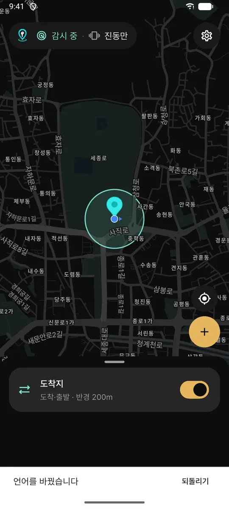
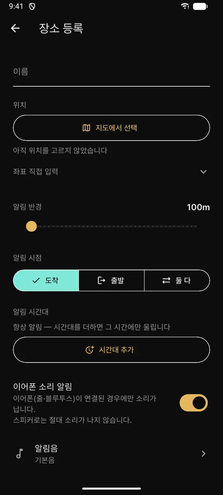

# EarLocAlert

[English](README.md) · **한국어** · [日本語](README.ja.md) · [简体中文](README.zh-CN.md)

[](https://flutter.dev)
[](https://flutter.dev/multi-platform)
[](LICENSE)

**이어폰위치알림 — 조용한 위치 기반 알림 앱**

목적지에 도착하거나 특정 장소를 떠날 때, 주변을 방해하지 않으면서 확실하게 알립니다.


<p align="center">
  
  &nbsp;&nbsp;
  
</p>

---

## 이런 경험 있으신가요

- 셔틀버스에서 졸다가 목적지를 지나쳐 버렸다
- 도서관이나 사무실에서 알람이 울려 민망했다
- 이어폰을 끼고 있는데 알림이 **스피커로** 나가서 당황했다

## 핵심 동작

```
이어폰(블루투스 · 줄 · USB-C)이 연결되어 있으면  →  이어폰으로만 소리
연결되어 있지 않으면              →  진동만.  스피커는 무음
```

**어떤 경우에도 기기 스피커로 소리를 내지 않습니다.** 이것이 이 앱의 존재 이유입니다.

| 기능 | 설명 |
|---|---|
| 위치 등록 | 지도에서 찍고 이름·반경(50m~2km)·알림 유형 지정 |
| 백그라운드 감시 | 앱을 열어두지 않아도 동작 |
| 진입 / 이탈 알림 | 도착할 때, 떠날 때, 또는 둘 다 |
| 조용한 알림 | 진동 반복. 해제할 때까지 지속 |
| 이어폰 자동 감지 | 연결 상태를 발화 시점에 확인 |
| 로컬 저장 | **위치 정보는 기기 밖으로 나가지 않습니다** |
| 다국어 | 한국어, 영어, 일본어, 중국어 |

---

## 개발 상태

앱 기능은 모두 구현됐고 Google Play 출시를 준비하고 있습니다. 아직 공식 출시 전입니다. 진행 현황은 [11-ROADMAP](docs/11-ROADMAP.md) 을 보세요.

---

## 문서

설계 판단과 근거는 전부 `docs/` 에 있습니다. 처음 보신다면 01 부터 순서대로 읽으시면 됩니다.

| 문서 | 담는 것 |
|---|---|
| [01-REQUIREMENTS](docs/01-REQUIREMENTS.md) | 기능 명세, 개발 범위, 인수 조건 |
| [02-ARCHITECTURE](docs/02-ARCHITECTURE.md) | 스택, feature 구성, 의존 규칙 |
| [03-DOMAIN](docs/03-DOMAIN.md) | 지오펜스 판정, 중복 알림 방지 |
| [04-CONVENTIONS](docs/04-CONVENTIONS.md) | 코드 규약, 테스트 |
| [05-PLATFORM](docs/05-PLATFORM.md) | Android · iOS 백그라운드 제약, 오디오 라우팅 |
| [06-UX](docs/06-UX.md) | 화면 흐름, 알림 화면 설계 |
| [07-MONETIZATION](docs/07-MONETIZATION.md) | 광고 배치, 빈도, 정책 경계 |
| [08-OPERATIONS](docs/08-OPERATIONS.md) | CI/CD, 버전 관리, 시크릿 |
| [09-RELEASE](docs/09-RELEASE.md) | 개인정보, 스토어 심사 대응 |
| [10-DECISIONS](docs/10-DECISIONS.md) | **결정 기록 — 무엇을 왜 그렇게 했나** |
| [11-ROADMAP](docs/11-ROADMAP.md) | 개발 단계, 검증 항목, 리스크 |

---

## 기술 스택

| 영역 | 사용 |
|---|---|
| 프레임워크 | Flutter 3.35.5 / Dart 3.9+ |
| 상태 관리 | Riverpod (code generation) |
| 라우팅 | go_router |
| 모델 | Freezed + json_serializable |
| 로컬 저장소 | Drift (SQLite) |
| 지도 | Google Maps |
| 위치 | geolocator + 플랫폼 지오펜스 |
| 오디오 | audio_session + just_audio |
| 광고 | Google Mobile Ads |

선택 근거는 [10-DECISIONS](docs/10-DECISIONS.md) 에 있습니다.

## 지원 환경

- Android 8.0 (API 26) 이상
- iOS 13.0 이상

> **플랫폼별로 동작이 다릅니다.** Android 는 포그라운드 서비스로 정밀 감시하고, iOS 는 OS 지오펜스에 위임합니다. iOS 는 감시 지점이 20개로 제한되며 진입 감지가 지연될 수 있습니다 → [05-PLATFORM](docs/05-PLATFORM.md)

---

## 개발

```bash
flutter pub get      # 의존성 설치
dart format .        # 포매팅
flutter test         # 테스트
flutter run          # 실행
```

빌드·배포는 GitHub Actions 가 처리합니다 → [08-OPERATIONS](docs/08-OPERATIONS.md)

### 버전 관리

`version.yml` 이 단일 출처입니다. **`pubspec.yaml` 의 버전을 직접 수정하지 마세요** — 워크플로우가 덮어씁니다.

변경 이력은 [CHANGELOG.md](CHANGELOG.md) 에 자동 기록됩니다.

기여하기 전에 [CONTRIBUTING.ko.md](CONTRIBUTING.ko.md) 를 읽어 주세요. 취약점은 공개 이슈 대신 [SECURITY.md](SECURITY.md) 로 알려 주세요.

---

## 개인정보

- **위치 정보는 기기에만 저장되며 외부로 전송되지 않습니다**
- 광고 식별자는 광고 제공자(Google AdMob)가 수집합니다
- 회원가입이 없으며 계정 정보를 수집하지 않습니다

상세는 [09-RELEASE](docs/09-RELEASE.md) 를 참조하세요.

---

## 라이선스

**소스 공개(source-available)** 입니다. OSI 가 인증한 오픈소스 라이선스는 아닙니다.

[PolyForm Noncommercial 1.0.0](LICENSE) — 읽기 · 학습 · 수정 · 포크는 **비상업 목적**에 한해 허용되고, 상업적 이용(스토어 배포, 유료 서비스, 광고 수익화 등)은 허용되지 않습니다.

이 저장소를 공개한 이유는 이 앱이 위치 정보를 외부로 전송하지 않는다는 점을 누구나 확인할 수 있게 하기 위해서입니다 → [NOTICE](NOTICE)

## 문의

- 개발자: Cassiiopeia
- 이슈: [GitHub Issues](https://github.com/Cassiiopeia/EarLocAlert/issues)
