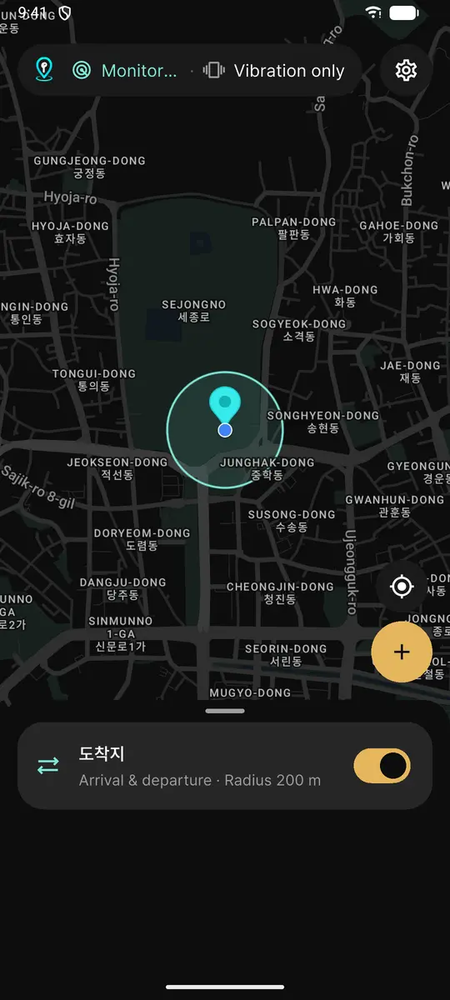
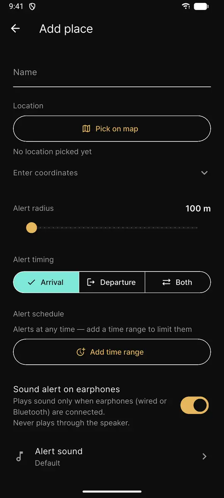
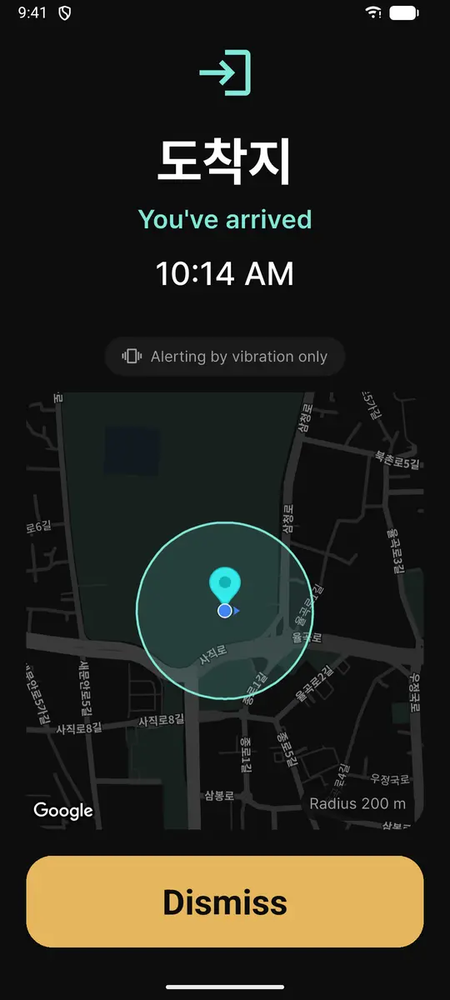

# EarLocAlert

<!-- Do not edit: synced automatically (수정하지마세요 자동으로 동기화 됩니다) -->
<!-- AUTO-VERSION-SECTION: DO NOT EDIT MANUALLY -->
## Latest Version : v1.23.0 (2026-10-06)

**English** · [한국어](README.ko.md) · [日本語](README.ja.md) · [简体中文](README.zh-CN.md)

[](https://flutter.dev)
[](https://flutter.dev/multi-platform)
[](LICENSE)

**A quiet, location-based alert app: it tells you you've arrived by vibration, or through your earphones only.**

When you reach a destination or leave a place, it lets you know without disturbing the people around you.

<p align="center">
  
  &nbsp;
  
  &nbsp;
  
</p>

---

## Sound familiar?

- You dozed off on the shuttle bus and missed your stop
- An alarm went off in a library or an office and you wanted to disappear
- You were wearing earphones, yet the alert came out of the **speaker**

## How it works

```
Earphones connected (Bluetooth, wired or USB-C)  →  sound through the earphones only
Not connected                                    →  vibration only. The speaker stays silent
```

**The app never plays sound through the device speaker.** That is the reason it exists.

| Feature | Description |
|---|---|
| Places | Pick a spot on the map, then set a name, radius (50 m to 2 km) and alert type |
| Background monitoring | Works without keeping the app open |
| Arrive / leave alerts | When you arrive, when you leave, or both |
| Quiet alert | Repeating vibration until you dismiss it |
| Earphone detection | Checks the connection at the moment the alert fires |
| Local storage | **Your location data never leaves the device** |
| Languages | English, Korean, Japanese, Chinese |

---

## Status

The app is feature-complete and is being prepared for release on Google Play. It is not officially released yet. Progress details: [11-ROADMAP](docs/11-ROADMAP.md) (Korean).

---

## Tech stack

| Area | Used |
|---|---|
| Framework | Flutter 3.35.5 / Dart 3.9+ |
| State management | Riverpod (code generation) |
| Routing | go_router |
| Models | Freezed + json_serializable |
| Local storage | Drift (SQLite) |
| Map | Google Maps |
| Location | geolocator + platform geofencing |
| Audio | audio_session + just_audio |
| Ads | Google Mobile Ads |

## Supported platforms

- Android 8.0 (API 26) or later
- iOS 13.0 or later

> **Behavior differs by platform.** Android watches precisely with a foreground service, while iOS delegates to the OS geofencing. iOS limits monitored places to 20, and arrival detection may be delayed → [05-PLATFORM](docs/05-PLATFORM.md) (Korean)

---

## Development

```bash
flutter pub get      # install dependencies
dart format .        # format
flutter test         # test
flutter run          # run
```

Builds and releases are handled by GitHub Actions. The design docs in `docs/` are written in Korean; start with [01-REQUIREMENTS](docs/01-REQUIREMENTS.md) and [10-DECISIONS](docs/10-DECISIONS.md) (why things are the way they are).

See [CONTRIBUTING.md](CONTRIBUTING.md) before opening a pull request. Version history: [CHANGELOG.md](CHANGELOG.md).

---

## Privacy

- **Location data is stored on the device only and is never sent anywhere**
- The advertising identifier is collected by the ad provider (Google AdMob)
- There is no sign-up and no account data is collected

Details: [09-RELEASE](docs/09-RELEASE.md) (Korean).

---

## License

This repository is **source-available**. It is not an OSI-approved open source license.

[PolyForm Noncommercial 1.0.0](LICENSE): reading, studying, modifying and forking are allowed for **noncommercial purposes**. Commercial use (store distribution, paid services, ad monetization, and so on) is not allowed.

The source is public so that anyone can verify that the app does not transmit location data off the device → [NOTICE](NOTICE)

## Contact

- Developer: Cassiiopeia
- Issues: [GitHub Issues](https://github.com/Cassiiopeia/EarLocAlert/issues)
- Security reports: see [SECURITY.md](SECURITY.md)
