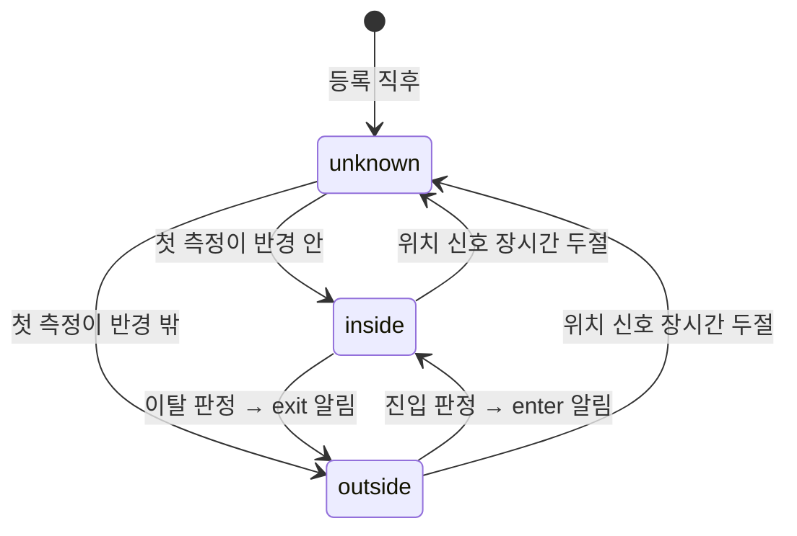
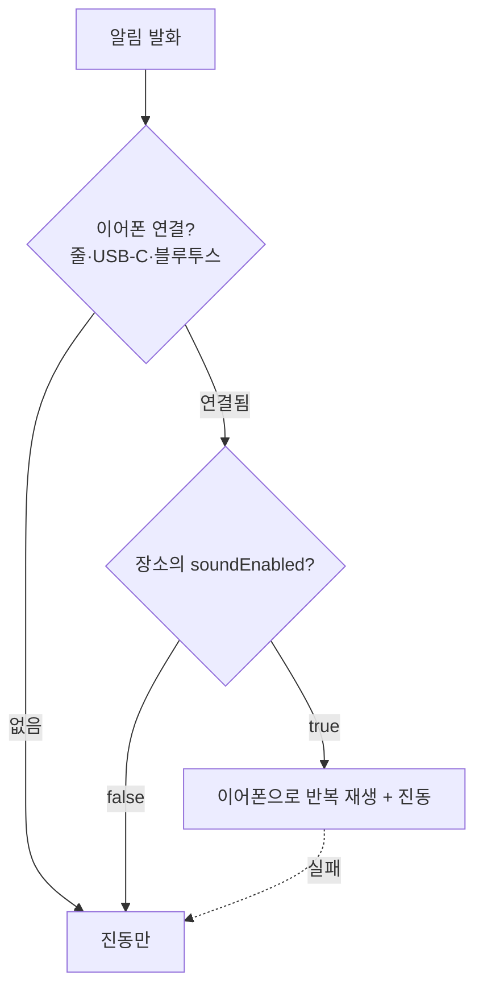

# 03. 도메인

이 앱의 도메인은 작다. 엔티티 셋뿐이다. 그런데 **판정 규칙이 어렵다** — GPS 는 흔들리고, OS 는 이벤트를 늦게 주거나 중복으로 준다.

여기 적힌 규칙은 전부 `features/*/domain/` 안에 있고, **Flutter 없이 단위 테스트로 검증한다.** 실기기에서만 확인할 수 있는 로직을 만들지 않는 것이 이 문서의 목적이다.

## 모델

### AlertPlace — 알림을 걸어둔 장소

| 필드 | 타입 | 설명 |
|---|---|---|
| `id` | `String` (UUIDv7) | 애플리케이션에서 생성 |
| `name` | `String` | "회사", "집" |
| `latitude` / `longitude` | `double` | |
| `radiusMeters` | `int` | 50 ~ 2000 |
| `direction` | `AlertDirection` | `enter` / `exit` / `both` |
| `enabled` | `bool` | 삭제하지 않고 끄는 수단 (F1.7) |
| `soundEnabled` | `bool` | 이어폰(줄·블루투스) 연결 시 소리를 낼지 |
| `schedules` | `List<AlertSchedule>` | 알림이 활성인 시간 창. **빈 목록이면 항상** (F1.8) |
| `createdAt` | `DateTime` (UTC) | |

**`id` 는 저장 전에 앱이 만든다.** DB 자동 증가를 쓰지 않는다 — 플랫폼 지오펜스에 등록할 때 식별자가 먼저 필요하고, 나중에 기기 간 동기화를 붙일 여지를 남긴다.

**시각은 전부 UTC 로 저장한다.** 표시 직전에만 로컬 시각으로 바꾼다 → [04-CONVENTIONS](04-CONVENTIONS.md)

### GeofenceEvent — 진입/이탈 판정 결과 (이력)

| 필드 | 타입 | 설명 |
|---|---|---|
| `id` | `String` (UUIDv7) | |
| `placeId` | `String` | **값 참조.** `AlertPlace` 객체를 들고 있지 않는다 |
| `type` | `GeofenceEventType` | `entered` / `exited` |
| `occurredAt` | `DateTime` (UTC) | |
| `latitude` / `longitude` | `double` | 판정 시점의 실제 위치 |
| `accuracyMeters` | `double` | 판정 시점의 GPS 정확도 |
| `notified` | `bool` | 실제로 알림을 띄웠는지 |

F7(이력 조회)은 Phase 2 지만 **이 테이블은 MVP 부터 기록한다.**

이유는 기능이 아니라 디버깅이다. "어제 회사 도착했는데 안 울렸다"는 문제가 들어왔을 때, 기록이 없으면 조사할 방법이 전혀 없다. **판정이 안 된 것인지, 판정은 됐는데 알림이 실패한 것인지** 구분할 수 있어야 한다. `notified` 필드가 그 구분이다.

`accuracyMeters` 를 함께 남기는 이유도 같다. 오작동 대부분은 GPS 정확도가 나쁠 때 발생한다.

### AlertSession — 지금 울리고 있는 알림

DB 에 저장하지 않는다. 앱이 죽으면 사라지는 것이 맞다.

| 필드 | 설명 |
|---|---|
| `placeId` / `placeName` | 표시용 (feature 간 값 전달, 02-ARCHITECTURE 규칙 1) |
| `direction` | 진입인지 이탈인지 |
| `startedAt` | 발화 시각 |
| `audioRoute` | `headphones` / `silent` — 판정 결과 |

---

## 지오펜스 상태 전이

각 `AlertPlace` 는 독립적으로 아래 상태를 갖는다.



**`unknown` 상태가 핵심이다.** 이게 없으면 앱을 처음 켠 순간 이미 회사 안에 있어도 "방금 진입했다"고 판정해 알림이 터진다.

`unknown → inside` 전이에서는 **알림을 발생시키지 않는다.** 알림은 `outside → inside` 전이에서만 나간다. 즉 **밖에 있었다는 사실이 확인된 적이 있어야** 진입 알림이 의미를 갖는다.

같은 이유로 `unknown → outside` 도 알림 없이 조용히 넘어간다.

---

## 규칙 1 — 히스테리시스: 나가는 반경이 더 크다

반경 경계에 서 있으면 GPS 오차만으로 안팎이 계속 뒤집힌다. 그대로 두면 알림이 수십 번 터진다 (A-11 위반).

**진입 판정과 이탈 판정에 서로 다른 반경을 쓴다.**

```
진입 판정:  거리 <  radius
이탈 판정:  거리 >  radius + EXIT_MARGIN
```

경계 근처(`radius` ~ `radius + EXIT_MARGIN`)에서는 **현재 상태를 유지한다.** 들어와 있었으면 계속 들어와 있는 것으로 본다.

`EXIT_MARGIN` 은 반경에 비례하되 하한을 둔다 — 반경 50m 에 고정 마진 100m 를 쓰면 이탈이 영영 판정되지 않는다. 구체적 수치는 실측으로 정하고 이 문서에 확정 기록한다.

## 규칙 2 — 정확도가 나쁘면 판정하지 않는다

GPS 정확도가 반경보다 크면 그 측정으로는 안팎을 알 수 없다.

```dart
// accuracy 100m 인 측정으로 반경 50m 진입을 판정할 수 없다
if (position.accuracy > place.radiusMeters) {
  return GeofenceDecision.insufficientAccuracy;   // 상태를 바꾸지 않는다
}
```

**판정을 보류하는 것이지 이벤트를 버리는 것이 아니다.** 상태는 그대로 두고 다음 측정을 기다린다.

지하·실내·터널에서 정확도가 급격히 나빠지는데, 이걸 무시하면 지하철을 타고 가다 엉뚱한 곳에서 알림이 울린다.

## 규칙 3 — 같은 진입에 알림은 한 번

상태 전이가 일어난 순간에만 알림이 나간다. **같은 상태가 유지되는 동안에는 아무리 많은 위치 갱신이 들어와도 알림이 없다.**

```dart
// O — 전이가 있을 때만
final next = decide(place, currentState, position);
if (next != currentState && shouldNotify(place, currentState, next)) {
  emit(...);
}

// X — 매 측정마다 "안에 있으니 알린다"
if (distance < place.radiusMeters) { emit(...); }
```

## 규칙 4 — 알림 발화 중에는 재발화하지 않는다

이미 울리고 있는 `AlertSession` 이 있으면 같은 장소의 새 이벤트는 무시한다. 다른 장소의 이벤트는 **대기열에 넣고**, 현재 알림이 해제된 뒤에 처리한다.

알림 두 개가 동시에 진동·소리를 내면 사용자는 무엇을 해제해야 하는지 알 수 없다.

## 규칙 4.5 — 알림 시간대 밖에서는 알리지 않는다 (상태는 계속 추적한다)

장소에 **활성 시간 창**을 0개 이상 붙일 수 있다 (F1.8, [10-DECISIONS](10-DECISIONS.md) 020).

```
빈 목록          → 항상 활성 (기존 장소의 동작이 바뀌지 않는다)
창이 하나 이상   → OR. 하나라도 열려 있으면 활성
```

**창 밖이어도 OS 지오펜스 등록은 유지하고, 상태 전이와 이력도 정상 기록한다. 알림만 나가지 않는다.**

```
평일 08:00~10:00 창이 걸린 장소

07:50   진입 → 상태 inside ✓   이력 ✓ (notified=false)   알림 ✗
09:10   진입 → 상태 inside ✓   이력 ✓ (notified=true)    알림 ✓
```

**상태 추적을 끊지 않는 것이 핵심이다.** 창 밖이라고 일찍 `return` 하면 상태가 어긋나 창이 열린 뒤 첫 진입을 영영 놓친다 — 등록을 해제하는 방식을 기각한 이유와 같다.

**경계 동작** — 창이 열릴 때 이미 반경 안에 있어도 알리지 않는다. **창 안에서 일어난 전이만** 알림이 된다.

시각은 **로컬 시각**으로 판정한다. 창은 "그곳의 아침 8시"라는 벽시계 규칙이라 UTC 로 다루면 시간대·서머타임에서 어긋난다 ([10-DECISIONS](10-DECISIONS.md) 021).

## 규칙 5 — 오디오 경로는 발화 시점에 결정한다



**어떤 분기로 가도 스피커 출력은 없다** (F3.7). 오디오 세션 설정이 실패하면 소리를 포기하고 진동으로 떨어진다 — 스피커로 나갈 위험을 감수하느니 소리를 안 내는 게 낫다.

판정 기준은 **연결 방식이 아니라 "소리가 본인 귀로만 들어가는가"** 다. 줄이어폰·USB-C 이어폰·블루투스 이어폰·보청기가 포함되고, 차량 오디오·AirPlay·HDMI·라인아웃은 주변에 들릴 수 있어 제외된다. 허용 목록이라 **모르는 장치는 자동으로 제외된다** → [10-DECISIONS](10-DECISIONS.md) 018

미리 판정해두지 않고 **발화하는 그 순간에** 확인한다. 사용자가 이어폰을 방금 빼거나 꽂았을 수 있다.

이 판정 함수는 `bool isHeadphoneConnected` 하나를 입력으로 받는 순수 함수로 만든다. 실기기 없이 네 가지 경우를 모두 테스트할 수 있어야 한다. 장치 목록 자체는 데이터 계층에 두고, 목록의 포함/제외는 따로 테스트한다.

소리는 **해제할 때까지 반복 재생**한다. 진동은 반복되는데 소리만 한 번 나고 마는 것은 졸다 깬 사용자에게 약하다. 반복 재생의 완료를 기다리면 안 된다 — 끝나지 않는 Future 라 알림 화면 표시가 막힌다.

---

## 저장소 경계

| 데이터 | 저장 위치 | 이유 |
|---|---|---|
| `AlertPlace` | Drift | 조회·수정이 잦고 관계가 생길 여지가 있다 |
| `GeofenceEvent` | Drift | 시간순 조회·기간 삭제가 필요하다 |
| 지오펜스 현재 상태 | Drift | **재부팅 후에도 살아 있어야 한다** |
| 앱 설정 (진동 강도, 간격, 알림음 크기) | SharedPreferences | 단일 값들이다 |
| 사용자 알림음 메타데이터 | Drift | 목록·삭제가 필요하다 (이슈 #121) |
| 사용자 알림음 **파일** | 앱 전용 디렉토리 | 경로는 저장하지 않고 id 로 조립한다 |
| `AlertSession` | 메모리 | 앱이 죽으면 사라지는 게 맞다 |
| 광고 노출 시각·횟수 | SharedPreferences | 빈도 제어용 → [07-MONETIZATION](07-MONETIZATION.md) |

**지오펜스 현재 상태를 메모리에 두지 않는 것이 중요하다.** 재부팅하면 전부 `unknown` 이 되고, 그러면 규칙 1의 "밖에 있었다는 사실"이 사라져 첫 진입 알림을 놓친다.

## 이력 보관 기간

`GeofenceEvent` 는 무한히 쌓인다. **90일 넘은 기록은 삭제한다.**

기기 저장소를 계속 잠식하면 안 되고, 90일 전 진입 기록이 필요한 사용자는 없다. 삭제 시점은 앱 시작 시 1회.
