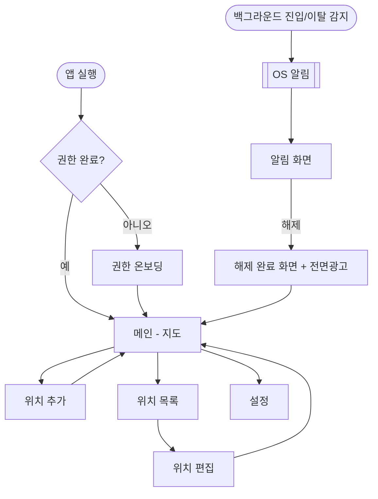

# 06. UX / 화면 설계

## 설계의 출발점

이 앱의 사용 시간은 **99% 가 알림 화면**이다. 나머지 화면은 위치를 등록할 때 한두 번 열리고 끝난다 ([01-REQUIREMENTS](01-REQUIREMENTS.md) 1.4).

그래서 화면마다 들이는 노력이 균등하면 안 된다.

| 화면 | 열리는 빈도 | 설계 난이도 |
|---|---|---|
| **알림 화면** | 매일, 여러 번 | **최고 — 여기가 앱이다** |
| 지도 (메인) | 초기 등록 시 | 중 |
| 위치 추가/편집 | 초기 1~2회 | 중 |
| 권한 온보딩 | 최초 1회 | **높음 — 여기서 이탈하면 앱이 동작 자체를 못 한다** |
| 위치 목록 · 설정 | 가끔 | 낮음 |

---

## 화면 흐름



**`BG` 로 시작하는 경로가 이 앱의 주 동선이다.** 왼쪽 흐름은 준비 과정일 뿐이다.

---

## 알림 화면 — 가장 중요한 화면

### 사용 상황을 먼저 정한다

- 버스 안, **서 있거나 앉아서 한 손으로**
- 졸다 깬 직후. 눈이 반쯤 감겨 있다
- 주변에 사람이 있어 **소리를 낼 수 없다**
- **몇 초 안에** 꺼야 한다는 압박

이 조건에서 실패하지 않는 화면이 목표다.

### 설계 규칙

| 규칙 | 이유 |
|---|---|
| 해제 버튼이 화면 **하단 절반**을 차지한다 | 한 손 엄지로 보지 않고도 누를 수 있어야 한다 |
| 해제 버튼 외에 **누를 수 있는 것을 두지 않는다** | 잘못 누를 여지를 없앤다 |
| 장소 이름을 가장 크게 | 여러 곳을 등록했으면 "어디 도착인지"가 첫 정보다 |
| 진입 / 이탈을 **글자와 아이콘 둘 다로** 구분 | 반쯤 감긴 눈으로 글자를 읽지 않는다 |
| 어두운 배경 기본 | 버스·지하철·밤이 주 사용 환경이다 |
| **광고를 여기 두지 않는다** | 우발적 클릭 = 계정 정지 → [07-MONETIZATION](07-MONETIZATION.md) |

### 화면 구성

```
┌─────────────────────────┐
│                         │
│      [진입 아이콘]       │
│                         │
│        회 사             │   ← 가장 큰 글자
│      도착했습니다         │
│                         │
│       오후 8:42          │
│                         │
│  🎧 이어폰으로 알림 중     │   ← 오디오 경로 표시
│                         │
├─────────────────────────┤
│                         │
│                         │
│      알 림  끄 기         │   ← 화면 하단 절반
│                         │
│                         │
└─────────────────────────┘
```

**"🎧 이어폰으로 알림 중" 표시가 중요하다.** 이 앱을 쓰는 이유가 그것이고, 사용자는 소리가 스피커로 새지 않았다는 것을 확인하고 싶어 한다. 이어폰(줄·USB-C·블루투스)이 없으면 "진동으로만 알림 중"을 표시한다.

### 해제 동작

```
해제 버튼 누름
  ├─ 즉시: 진동 중단 · 소리 중단 · 알림 제거     ← 여기서 끝나야 한다
  └─ 그 다음: 해제 완료 화면으로 이동 (광고)
```

**두 단계 사이에 어떤 대기도 없다.** 광고가 로딩 중이면 광고 없이 넘어간다 ([02-ARCHITECTURE](02-ARCHITECTURE.md) 규칙 4).

### 알림을 놓친 경우

사용자가 알림을 무시하고 앱을 나중에 열면, 마지막 알림 기록을 보여준다. **"울렸는데 못 봤다"와 "안 울렸다"를 사용자가 구분할 수 있어야 한다** — 이게 없으면 앱을 못 믿는다.

---

## 권한 온보딩 — 두 번째로 중요한 화면

여기서 이탈하면 **앱이 아무것도 못 한다.** 그런데 요구하는 권한이 하필 사용자가 가장 경계하는 것(항상 위치 허용)이다.

### 원칙: 요청하기 전에 이유를 말한다

시스템 다이얼로그를 바로 띄우지 않는다. **앱이 직접 그린 설명 화면을 먼저 보여준다.**

```
1. 이 앱이 무엇을 하는지 (1문장)
2. 왜 "항상 허용"이 필요한지
   "앱을 열지 않아도 도착을 알려드리려면 필요합니다"
3. 위치를 어디에도 보내지 않는다는 사실
4. [계속] 버튼 → 시스템 다이얼로그
```

3번을 반드시 넣는다. 사용자가 "항상 위치"를 꺼리는 진짜 이유는 추적당하는 것이고, **이 앱은 실제로 위치를 보내지 않는다.** 사실을 말하는 것이 가장 효과적이다.

이 화면들은 그대로 **스토어 심사 자료가 된다** → [09-RELEASE](09-RELEASE.md)

### 거부당했을 때 앱을 막지 않는다

권한을 거부해도 앱은 정상적으로 열린다 (A-12). 대신 **무엇이 안 되는지와 어떻게 켜는지**를 화면에 상시 표시한다.

"권한이 없습니다" 만 띄우고 끝내면 사용자는 무엇을 해야 할지 모른다. 설정 화면으로 가는 버튼을 함께 둔다.

**완료 화면을 뺀 모든 단계에 "나중에 하기"가 있다** (이슈 #90). 필수 권한이든 선택 권한이든, 거부 상태든 아직 안 물어본 상태든 사용자는 홈에 닿는다. iOS 는 한 번 거부하면 다이얼로그를 다시 띄우지 않으므로, 나갈 길이 없으면 버튼이 아무 일도 하지 않는 화면에 갇힌다. 권한 없이도 기본 화면에 닿아야 한다는 App Store 심사 방침과도 이 방향이 맞다.

### 건너뛸 수 있게 하되, 묻긴 한다

**모든 단계는 최소 한 번 화면에 나타난다.** 건너뛸 수 있다는 것과 보여주지 않는다는 것은 다르다.

판정에 쓰는 값이 전부 준비되기 전에는 단계를 결정하지 않는다. 아직 읽지 못한 값을 "아마 이랬을 것"으로 추측하면, 하필 그 추측이 맞는 순간 안내가 통째로 사라진다 — 실제로 신뢰성 권한 안내가 그렇게 사라졌다 → [10-DECISIONS](10-DECISIONS.md) 023

모르는 값의 기본은 **"한 번 더 묻는다"**로 통일한다. 한 번 덜 묻는 쪽을 택하면 영영 묻지 않는 경로가 생긴다.

### 플랫폼별 흐름 차이

Android 와 iOS 는 요청 순서와 방식이 다르다 → [05-PLATFORM](05-PLATFORM.md). 화면 문구도 달라야 한다 — Android 는 설정 앱으로 이동하는 안내가 필요하고, iOS 는 그렇지 않다.

---

## 메인 화면 (지도)

| 요소 | 내용 |
|---|---|
| 지도 | 전체 화면 |
| 등록 위치 | 마커 + 반경 원. 알림 유형별 색상 (F4.4) |
| 현재 위치 | 표준 표시 |
| **상태 바** | 감시 동작 여부 · 이어폰 연결 여부 (F4.5) |
| FAB | 위치 추가 |

**상태 바가 이 화면의 존재 이유다.** 지도는 예쁘라고 있는 게 아니라 "내가 등록한 게 여기 있고, 지금 감시 중이구나"를 확인시키기 위해 있다.

감시가 꺼져 있으면(권한 없음·서비스 종료·배터리 최적화) **눈에 띄게** 표시하고 해결 경로를 준다.

---

## 위치 추가 / 편집

| 입력 | 방식 | 단계 |
|---|---|---|
| 위치 | 지도 이동 → 중앙 핀 고정 | MVP |
| 위치 | 주소·상호 검색 | Phase 2 |
| 이름 | 텍스트 | MVP |
| 반경 | 슬라이더 + **지도에 원이 실시간 반영** | MVP |
| 알림 유형 | 진입 / 이탈 / 양방향 | MVP |
| 소리 사용 | 스위치 | MVP |

**반경 슬라이더를 움직이면 지도 위 원이 같이 커져야 한다.** "100m 가 어느 정도인지"를 숫자로 아는 사람은 없다.

지도 중앙 고정 핀 방식을 쓰는 이유는 한 손 조작 때문이다. 지도를 움직여 위치를 맞추는 것이 핀을 끌어다 놓는 것보다 정확하고 쉽다.

---

## 디자인 시스템

### 지향하는 결

**다크 핀테크 계열의 절제된 미감**을 기준으로 한다. 구체적으로는 이런 특징이다.

| 특징 | 내용 |
|---|---|
| 배경 | 거의 검정. 표면은 **명도 차이로만** 구분한다 |
| 타이포 | 핵심 정보를 **초대형**으로. 나머지는 회색으로 눌러 위계를 만든다 |
| 여백 | 요소 사이가 아니라 **덩어리 사이**에 넉넉하게 |
| 그림자 | **쓰지 않는다.** 다크에서는 보이지도 않는다 |
| 색 | 무채색 + 포인트 2색. 그 이상 늘리지 않는다 |
| 버튼 | 하단, 전체 폭, pill 형태 |
| 활성 상태 | **한 층 밝은 배경 + 유색 아이콘.** 흰색 반전은 쓰지 않는다 — 활성이 기본 상태라 화면 대부분이 반전되어 다크 톤이 깨진다 (#88) |

밀도를 높이지 않는다. 화면이 6개뿐인 앱에서 정보를 빽빽하게 채우면 오히려 싸구려로 보인다.

### 색

`core/` 에 정의하고 화면에서 직접 색 값을 쓰지 않는다.

| 토큰 | 값 | 용도 |
|---|---|---|
| `bgBase` | `#0D0D0D` | 화면 배경 |
| `bgSurface` | `#1A1A1A` | 카드·시트 |
| `bgElevated` | `#262626` | 카드 위의 요소 |
| ~~`bgInverse`~~ | — | 제거 (#88) — 활성 카드는 `bgElevated` 를 쓴다 |
| `textPrimary` | `#FFFFFF` | 주요 텍스트 |
| `textSecondary` | `#9E9E9E` | 보조·설명 |
| **`colorPrimary`** | `#E5B65C` | **주 색.** 브랜드, 주요 버튼, 강조 |
| **`colorSecondary`** | `#7FE8D8` | **보조 색.** 긍정·활성 상태 |

**값은 참조 이미지에서 추출한 시작점이다.** 실제 화면에서 대비를 측정해 조정하고, 조정하면 이 표를 고친다.

### 의미 색은 두 주색에서 파생한다

| 토큰 | 매핑 | 용도 |
|---|---|---|
| `alertEnter` | `colorSecondary` | 진입 알림 (마커·원·아이콘) |
| `alertExit` | `colorPrimary` | 이탈 알림 |
| `alertBoth` | 두 색 병기 | 양방향 |
| `statusActive` | `colorSecondary` | 감시 중 |
| `statusInactive` | `colorPrimary` | 감시 중지 — 경고로 보여야 한다 |
| `audioBluetooth` | `colorSecondary` | 이어폰 연결됨 |

**주색 2개가 이 앱에 필요한 개수와 정확히 맞는다.** 진입/이탈이라는 대립 개념에 하나씩 주면 끝이고, 새 색을 만들 이유가 없다.

`colorPrimary` 를 바꾸면 브랜드 전체가 한 번에 바뀌고, 파생 토큰이 따라온다. **화면에서 `#E5B65C` 를 직접 쓰면 이 연결이 끊어진다.**

### 이름 규칙 — 역할로 짓고 색상명을 넣지 않는다

```
colorPrimary       O — 역할
alertEnter         O — 용도
primaryAmber       X — 색을 바꾸면 이름이 거짓말이 된다
goldButton         X — 같은 이유
```

`primary` · `secondary` 는 역할명이라 괜찮다. 문제는 **`Blue`·`Amber` 같은 색상명이 이름에 박히는 것**이다.

진입/이탈 구분은 **색만으로 하지 않는다.** 아이콘과 텍스트를 함께 쓴다 (색각 이상 대응).

### 타이포

한글 UI 기준으로 **Pretendard** 를 쓴다.

| 역할 | 크기 | 용도 |
|---|---|---|
| `alertPlaceName` | 48 Bold | **알림 화면 장소명.** 가장 큰 글자 |
| `displayLarge` | 32 Bold | 화면 대표 수치 |
| `screenTitle` | 24 SemiBold | 화면 제목 |
| `body` | 16 Regular | 본문 |
| `caption` | 14 Regular | 보조 설명 — `textSecondary` 와 함께 |

**위계는 크기보다 굵기와 명도로 만든다.** 큰 흰 글자 옆에 작은 회색 글자를 두면 크기를 크게 벌리지 않아도 위계가 선다.

### 형태와 간격

| 토큰 | 값 |
|---|---|
| `radiusCard` | 24 |
| `radiusSmall` | 16 |
| `radiusPill` | 999 (버튼) |
| 간격 | 8 · 16 · 24 · 40 — **이 네 개만 쓴다** |

간격 값을 네 개로 제한하는 것이 통일감의 대부분을 만든다. 12나 18 같은 중간값을 허용하면 화면마다 달라진다.

`flutter_screenutil` 로 화면 비례 대응 → [04-CONVENTIONS](04-CONVENTIONS.md).

**터치 타겟은 최소 48dp.** 알림 화면 해제 버튼은 그 몇 배다.

### 아이콘 — Material outlined 로 통일

Flutter 기본 `Icons` 를 쓴다. 별도 아이콘 패키지를 넣지 않는다.

```dart
Icon(Icons.place_outlined)      // O
Icon(Icons.place)               // X — filled 는 이 톤에 맞지 않는다
Icon(Icons.place_rounded)       // X — 변형을 섞지 않는다
```

**`_outlined` 변형 하나만 쓴다.** 한 화면에 filled 와 outlined 가 섞이면 그 순간 어설퍼 보인다. 아이콘이 어설픈 앱은 나머지가 아무리 좋아도 완성도가 낮아 보인다.

더 얇은 선이 필요하면 `material_symbols_icons` 로 굵기를 조절할 수 있다. 실물을 보고 판단한다.

#### 크기 — 세 단계만 쓴다 (Material 3 기준)

| 토큰 | 값 | 쓰는 자리 |
|---|---|---|
| `AppIconSize.inline` | 18 | 글자 옆 — 알약·칩·버튼 안 |
| `AppIconSize.standard` | 24 | 아이콘 버튼·목록 앞뒤·FAB. `Icon` 기본값과 같다 |
| `AppIconSize.hero` | 56 | 화면 한가운데의 상징 — 빈 화면·알림 방향 |

**숫자로 크기를 쓰지 않는다.** 한때 14·16·18·20·22·24·56·64 여덟 가지가 섞여 같은 꺾쇠가 화면마다 14·20·24 로 달랐다 (#155 QA). 간격을 네 개로 묶은 것과 같은 이유다.

**로고는 여백 없는 판을 쓴다** — `assets/icon/app_logo_mark.png`. 스플래시 판은 768 판에 핀이 468 뿐이라 작게 넣으면 핀이 7dp 로 쪼그라든다. 둘 다 `tool/gen_splash_logo.py` 가 아이콘에서 파생한다.

#### 지도 위에 떠 있는 조작 요소

| 토큰 | 값 | |
|---|---|---|
| `AppControlSize.floating` | 40 | 보이는 높이 — 상단 알약·설정 버튼·내 위치 버튼이 모두 이 높이로 선다 |
| `AppControlSize.minTouch` | 48 | 눌리는 최소 범위. 보이는 것이 작으면 **바깥 여백까지 탭을 받는다** (알림 해제 버튼과 같은 방식) |

**지도 위 떠 있는 버튼은 보이는 모양보다 8dp 넓게 눌린다** (`HitSlop`). 머티리얼 FAB 는 보이는 원 그대로만 눌려, 에뮬레이터에서 테두리 5dp 바깥이 반응하지 않았다. 넓힌 만큼 배치 여백에서 빼 보이는 자리는 그대로이고, 두 버튼 사이 틈은 반씩 나눠 범위가 겹치지 않는다 (#155 QA).

### 지도는 반드시 다크 스타일을 적용한다

**Google Maps 기본은 흰 지도다.** 다크 앱 안에 하얀 판이 박히면 그것만으로 디자인이 무너진다.

Maps 스타일 JSON 으로 다크 테마를 적용하고, 마커·반경 원의 색을 위 팔레트에서 가져온다. **화면을 만들기 전에 정한다** — 나중에 바꾸면 마커 가시성을 전부 다시 확인해야 한다.

**타일이 뜨기 전 밝은 바탕을 보여주지 않는다.** 스타일은 타일에만 먹어서, 콜드 스타트에 2~3초 베이지가 보였다. 지도는 `MapRevealCover` 로 감싸 다크 타일이 그려질 때까지 덮는다 (결정 038). 알림 화면 지도는 제외 — 늦추지 않는다.

**지도 선택 화면은 반경에 맞춰 줌을 맞춘다** — 원 지름이 화면 폭의 70%. 슬라이더에서 손을 뗄 때 한 번 맞춘다 (끄는 동안 옮기면 흔들린다).

### 조작 규칙 — 시트는 성격에 따라 확정한다

**정적인 규칙(색·간격·아이콘)은 통일돼 있었는데 조작이 화면마다 갈렸다** (이슈 #153). 시트 넷이 확정 방식을 넷으로 쓰고 있었다.

> **한 값을 고르는 시트 → 즉시 적용, 하단 확정 버튼 없음**
> **여러 값을 편집하는 시트 → 하단 주 버튼으로 확정**

| 시트 | 성격 | 확정 |
|---|---|---|
| 진동 세기 | 한 값 | 고르는 순간 |
| 알림음 크기 | 한 값(슬라이더) | 조작이 끝나는 순간 |
| 알림음 선택 | **관리 화면** | 하단 `완료` |
| 알림 시간대 | 여러 값 | 하단 `저장` |

알림음 선택에서 **행 탭은 고르기, ▶ 는 들어보기**다. 예전에는 탭 하나가 둘을 동시에 해서 무엇이 일어난 것인지 모호했다.

**알림음 선택은 한 값을 고르는 시트처럼 보이지만 관리 화면이다** — 추가·삭제·미리듣기가 함께 있고, 여러 개를 들어보며 고른다. 탭 즉시 적용·닫기로 만들었더니 스크롤 중 잘못 눌린 것이 그대로 저장되고 되돌리려면 다시 열어야 했다. **확정 지점이 있어야 하는 쪽**이다.

### 주 액션 — 하단은 한 자리

하단 전체폭 버튼은 **그 화면에서 사용자가 지금 하려는 일** 하나만 쓴다.

판별 기준: **그 동작을 안 하고 화면을 나가면 목적이 달성되지 않는가.**

| 이 자리에 오는 것 | 오면 안 되는 것 |
|---|---|
| 저장 · 이 위치로 선택 · 알림 끄기 · 계속 | 추가 · 미리듣기 · 내보내기 |

`음원 추가` 는 열 번에 한 번 쓰고 안 해도 알림음 선택은 끝난다 → 보조다. `OutlinedButton` 으로 목록 안에 둔다.

### 같은 기능은 같은 자리

**지도 위에 떠 있는 버튼은 오른쪽 가장자리에 세로로 쌓는다** (이슈 #155).

| 화면 | 위 | 아래 |
|---|---|---|
| 홈 | 내 위치 | 장소 추가 |
| 지도에서 선택 | 내 위치 | — |

예전에는 내 위치가 왼쪽, 장소 추가가 오른쪽으로 갈려 있었다. 그건 "오른쪽 아래를 장소 추가가 이미 쓰고 있어서" 밀려난 결과지 그 자리가 나아서가 아니었다.

한쪽에 모으는 이유는 **엄지가 닿는 쪽**이기 때문이다. 이 앱은 버스에서 한 손으로 쓴다 — 오른손잡이가 왼쪽 버튼을 누르려면 화면을 가로질러야 하고, 그 동작이 그대로 지도를 건드려 카메라를 움직인다. 왼쪽을 비우면 지도도 그만큼 넓게 열린다.

**로고는 상태 알약 안에 둔다.** 따로 띄우면 지도 위 덩어리가 하나 늘고 그만큼 지도가 안 보인다. 구글 지도가 검색창 **안쪽** 왼쪽 끝에 G 를 넣은 것과 같은 구조다. 앱 아이콘에서 딴 그림을 쓴다 — 따로 그리면 아이콘을 바꿨을 때 또 어긋난다(#150).

**상태 알약에는 라벨만 쓴다 — 문장을 넣지 않는다.**

예전에는 `감시 대기 · 장소를 켜면 시작됩니다` 같은 문장이었다. 폭이 40px ~ 192px 로 **4.8배까지 벌어져** 알약 안에서 잘렸고, 남은 `장소를 켜면…` 은 아무것도 알려주지 못했다.

| 상태 | 라벨 | 폭 |
|---|---|---|
| 감시 중 | `감시 중` | 40px |
| 대기 | `감시 대기` | 52px |
| 고장 | `감시 꺼짐` + 꺾쇠 `›` | 52px |

**설명이 필요한 말은 빈 화면이 이미 하고 있다** (`첫 장소를 등록해보세요`). 같은 말을 두 곳에서 하지 않는다. `눌러서 확인` 도 글자 대신 꺾쇠로 — 누를 수 있다는 것은 글자보다 모양이 빠르다.

**구분선을 늘어놓지 않는다.** 세로선 둘을 가운뎃점 하나로 바꿔 요소를 일곱에서 여섯으로 줄였다.

**로고는 16, 아이콘도 16.** 로고는 채워진 핀이라 선 아이콘과 같은 크기면 시각적으로 더 무겁다.

**설정은 상태 알약 밖, 오른쪽 끝에 둔다.** 알약은 "감시 고장 시 권한 화면"으로 가는 탭 대상이라 성격이 다른 버튼을 그 안에 두면 무엇을 누르는지 모호해진다.

> `Spacer` 로 밀지 않는다. flex 공간을 먼저 가져가 알약이 눌리고, 로고가 들어온 뒤로는 넘쳤다(실기기 22px). `mainAxisAlignment: spaceBetween` 을 쓴다.

**지도 SDK 의 기본 버튼을 쓰지 않는다.** 우상단 고정이라 검색창·상태 알약과 부딪힌다 (#98·#152).

피하려고 `GoogleMap.padding` 을 주면 **카메라 중심이 함께 옮겨진다.** 중앙 고정 핀이 있는 화면에서는 핀과 저장 좌표가 갈라져, 사용자가 찍은 곳이 아닌 데가 등록된다. #152 가 정확히 그렇게 났다.

### 용어 사전

| 말 | 가리키는 것 | 쓰는 자리 |
|---|---|---|
| **알림음** | 알림이 울릴 때 나는 소리 전체 | 화면 제목, 설정 항목 |
| **기본 알림음** | 앱이 들고 있는 다섯 가지 | 목록 머리말 |
| **내 음원** | 사용자가 등록한 파일 | 목록 머리말, 개수 |
| **소리** | 소리가 나는지 여부(on/off) | 토글 라벨, 설명문 |

**목적어 없는 라벨을 쓰지 않는다.** `기본 제공` 은 무엇이 기본 제공인지 말하지 않아 옆의 `내 음원` 과 짝이 맞지 않았다.

### 이 규칙들은 테스트가 지킨다

`test/design_system_test.dart` 가 소스를 읽어 센다. **문서만으로는 이미 한 번 실패했다** — 바로 위 "버튼은 하단, 전체 폭"이 적혀 있는데도 알림음 시트가 어긴 채 배포됐다.

| 검사 | 막는 것 |
|---|---|
| 위젯 클래스당 `FilledButton` 2개 이상 | 주 액션이 둘로 갈리는 것 |
| 주 버튼 라벨에 보조 동작 낱말 | 자리를 뺏기는 것 |
| 금지 용어 | 용어 사전 위반 |
| `myLocationButtonEnabled: true` | SDK 버튼 복귀 |
| 중앙 핀 + `GoogleMap.padding` 동거 | #152 재발 |
| 아이콘 `size:` 에 숫자 | 크기가 화면마다 제각각이 되는 것 |
| `_outlined` 가 아닌 `Icons.*` | 아이콘 변형 혼용 |
| 15자·세 낱말 이상 한글 문장을 `.keepAll` 없이 `Text` 에 | 낱말 중간 줄바꿈 ("알립니 / 다") — [10-DECISIONS](10-DECISIONS.md) 037 |

### 하지 않는 것

| 금지 | 이유 |
|---|---|
| 그림자 (`elevation`) | 다크에서 보이지 않는다. 층은 배경 명도로 |
| 포인트 색 추가 | 2개로 충분하다. 늘리는 순간 규칙이 무너진다 |
| 아이콘 변형 혼용 | 위 참조 |
| 간격 중간값 (12, 18, 32…) | 네 개 스케일만 |
| **스와이프로 알림 해제** | 아래 참조 |

**스와이프 해제를 쓰지 않는다.** 참조 미감의 핀테크 앱들이 송금 확정에 스와이프를 쓰는데, 그건 **되돌릴 수 없는 동작을 신중하게** 만들려는 것이다. 알림 해제는 정반대다 — 버스에서 졸다 깨서 몇 초 안에 꺼야 한다. 미감은 가져오되 **큰 탭 버튼**으로 간다.

---

## 접근성

| 항목 | 기준 |
|---|---|
| 대비 | 알림 화면은 특히 높게 — 어두운 환경에서 반쯤 감긴 눈으로 본다 |
| 터치 타겟 | 최소 48dp |
| 색 단독 의존 | 금지 (아이콘·텍스트 병행) |
| 스크린 리더 | 알림 화면 해제 버튼에 명확한 레이블 |
| 글자 크기 확대 | 알림 화면이 깨지지 않아야 한다 |

**시스템 글자 크기를 최대로 키운 상태에서 알림 화면이 깨지지 않는지 확인한다.** 이 앱의 사용자 중에는 큰 글자 설정을 쓰는 사람이 많을 가능성이 있다 (졸음·시야 문제).

---

## 스토어 스크린샷과의 관계

스토어 등록에 필요한 스크린샷은 **이 화면들에서 나온다.** 특히 알림 화면이 대표 이미지가 된다.

화면을 만들 때 "이게 스토어 첫 스크린샷이 될 수 있는가"를 기준으로 본다. 심사 제출 직전에 스크린샷용 화면을 급조하는 상황을 피한다 → [09-RELEASE](09-RELEASE.md)
