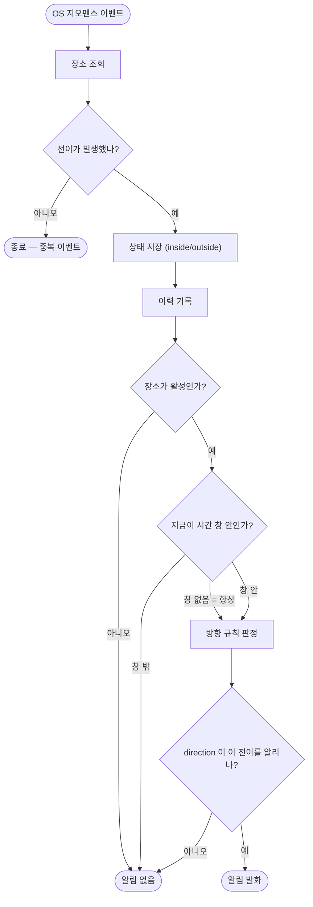

# 알림 시간대 스케줄 — 장소별 활성 시간 창

## 개요

등록한 장소에 들어가기만 하면 언제든 알림이 울리던 문제를 해결했다. 장소마다 **알림이 활성인 시간 구간(창)** 을 0개 이상 붙일 수 있고, 창이 하나도 없으면 기존과 똑같이 항상 울린다. 요일 + 시각 구간으로 표현하며 자정 넘김과 복수 창(OR)을 지원한다.

핵심 설계 판단은 **어디서 억제하느냐**였다. OS 지오펜스 등록을 창 밖에서 해제하는 방식은 배터리를 아끼지만 알림을 유실하므로 쓰지 않았다. 대신 `GeofenceEvaluator.shouldNotify` 에서 로컬 시각으로 거른다 — 창 밖에도 OS 등록과 상태 추적은 그대로 유지된다.

## 기능 흐름



상태 저장과 이력 기록이 **시간 창 판정보다 앞에** 있는 것이 이 흐름의 핵심이다. 창 밖이라고 일찍 빠져나가면 상태 추적이 끊겨, 창이 열린 뒤 첫 진입을 영영 놓친다.

## 변경 사항

### 도메인 모델

- `lib/core/domain/alert_schedule.dart` (신규): `AlertSchedule` (요일 집합 + 시작/종료 분) 과 `isActiveAt`, 목록 판정 함수 `isScheduleActive`. `places/domain` 이 아니라 `core/domain` 에 둔 것은 geofence 가 places 를 import 하지 않게 하기 위함이다 (아키텍처 규칙 1).
- `lib/features/places/domain/alert_place.dart`: `schedules` 필드 추가, 기본값 빈 목록.
- `lib/features/geofence/domain/geofence_target.dart`: `schedules` 전달용 필드 추가.

### 판정 로직

- `lib/features/geofence/domain/geofence_evaluator.dart`: `shouldNotify` 에 `localNow` 파라미터를 더하고 `isScheduleActive` 로 거른다. `enabled` 검사 바로 다음, 방향 규칙 앞에 놓았다.
- `lib/app/background/geofence_background_processor.dart`: 같은 `_clock()` 에서 이력은 `.toUtc()`, 스케줄 판정은 `.toLocal()` 로 갈라 넘긴다.
- `lib/app/geofence_registration_sync.dart`: 스케줄을 값으로만 실어 보낸다 — **OS 등록 여부는 스케줄과 무관**하다.

### 저장

- `lib/core/database/alert_schedule_converter.dart` (신규): 목록 ↔ JSON 문자열 `TypeConverter`. 요일은 정렬해 저장해 같은 값이 항상 같은 문자열이 되게 했다.
- `lib/core/database/tables.dart`: `alert_places.schedules` 컬럼, 기본값 `'[]'`.
- `lib/core/database/app_database.dart`: `schemaVersion` 1 → 2, `addColumn` 마이그레이션.
- `lib/features/places/data/drift_place_repository.dart`: 매핑 추가.

### 검증

- `lib/features/places/domain/place_validator.dart`: `emptyScheduleWindow`(시작 == 종료), `scheduleWithoutDays`(요일 미선택) 두 오류 추가.

### 화면

- `alert_schedule_editor.dart` (신규): 폼 안의 창 목록 + 추가/삭제.
- `alert_schedule_sheet.dart` (신규): 창 하나를 편집하는 바텀시트. 요일 칩 + 빠른 선택(평일/주말/매일) + 시각 선택 2개.
- `alert_schedule_summary.dart` (신규): 요약 문자열을 만드는 순수 함수.
- `place_form_screen.dart` · `place_card.dart` · `place_list_controller.dart`: 편집기 삽입, 목록 카드 요약 한 줄, 저장 경로 연결.

### 문서

- `docs/01-REQUIREMENTS.md`(F1.8) · `docs/03-DOMAIN.md` · `docs/10-DECISIONS.md`(결정 2건) · `docs/11-ROADMAP.md`.

## 주요 구현 내용

### 억제 지점을 `shouldNotify` 로 정한 이유

"창 밖이면 OS 등록에서 빼자"는 접근을 검토했으나 **알림을 유실한다.** 등록에서 빠지면 상태가 `unknown` 으로 되돌아가는데, 이건 재활성화 때 묵은 `outside` 와 `initialTrigger(ENTER)` 가 만나 가짜 진입 알림이 터지는 것을 막는 의도된 방어 장치다. 그 결과 창이 열려 재등록되면 `unknown → inside` 가 되고, "`unknown` 첫 판정은 알리지 않는다"는 규칙에 걸려 조용해진다. 창 경계마다 앱을 깨울 타이머와 재부팅 복구까지 필요해진다.

`AlertController` 에서 막는 것도 늦다 — 백그라운드에서는 네이티브 `AlertWatchService` 가 진동과 화면 띄우기를 먼저 하므로 이미 울린 뒤다.

### 반복 규칙에 UTC 를 쓰지 않는다

프로젝트의 UTC 저장 규칙은 **일어난 사건의 시점**(`createdAt`, `occurredAt`)에 적용된다. "평일 08:00" 은 시점이 아니라 벽시계 규칙이라, UTC 로 저장하면 시간대 이동·서머타임에서 08:00 이 07:00 으로 밀린다. 사용자가 원한 것은 "그곳의 아침 8시"다. 그래서 자정 기준 분(0~1439)으로 담고 판정은 로컬 시각으로 한다.

### 자정 넘김은 창이 시작된 날 기준

`start > end` 이면 자정을 넘긴 창이다. 요일은 **창이 시작된 날**로 본다 — 금 23:00~02:00 이면 토요일 01:30 도 "금요일에 시작한 창" 안이다. 막차·야근 귀가가 이 앱의 핵심 사용 상황이라 빼놓을 수 없었다.

### 경계는 `[start, end)`

시작은 포함, 끝은 제외다. 08:00~10:00 과 10:00~12:00 을 나란히 두었을 때 10:00 이 양쪽에 걸치지 않는다.

### 창이 열릴 때 이미 안에 있으면 조용하다

07:50 에 도착하고 08:00 에 창이 열려도 알리지 않는다. **창 안에서 발생한 전이만** 알린다. 도착한 지 10분 지나 갑자기 울리는 것은 쓸모가 없고, 집이 창 안에 있으면 매일 아침 알람처럼 울린다.

### 별도 테이블로 쪼개지 않았다

창이 장소 없이 조회되는 경우가 없어 항상 함께 읽고 함께 쓴다. 테이블을 나누면 백그라운드의 `findById(placeId)` 마다 조인이 붙는데, 그 대가로 얻는 쿼리 능력을 쓸 데가 없다.

### 마이그레이션은 재생성하지 않는다

`deleteEverything` 대신 `addColumn` 을 썼다. 장소를 잃으면 사용자가 앱을 다시 설정해야 하고 지오펜스 상태까지 날아가 첫 진입 알림을 놓친다. 컬럼 기본값이 `'[]'` 라 **기존 장소는 전부 "항상 활성"으로 올라온다** — 동작이 바뀌지 않는다.

### 저장값이 깨져도 앱을 죽이지 않는다

`fromSql` 은 파싱 실패 시 빈 목록을 돌려준다. 스케줄을 잃는 것은 "항상 알림"으로 떨어지는 것이라 안전한 쪽이다 — 조용히 안 울리는 것보다 낫다.

## 검증

테스트 파일 6개를 추가·보강했다.

| 파일 | 검증 |
|---|---|
| `test/core/alert_schedule_test.dart` | 일반 구간 · 자정 넘김(시작일 요일 기준) · 경계 `[start, end)` · 요일 불일치 |
| `test/core/alert_schedule_converter_test.dart` | JSON 왕복 · 깨진 값 방어 · 요일 정렬 |
| `test/features/geofence/geofence_evaluator_test.dart` | 창 밖 `shouldNotify == false`, 창 안은 기존 direction 규칙 그대로 |
| `test/app/geofence_background_processor_test.dart` | 핵심 회귀 가드 (아래) |
| `test/features/places/alert_schedule_summary_test.dart` | 평일/주말/매일/개별 · 익일 표기 |
| `test/features/places/place_validator_test.dart` | 시작 == 종료 거부 · 요일 미선택 거부 |
| `test/features/places/place_repository_contract_test.dart` | 스케줄 왕복 저장(순서 포함) · 빈 목록 기본값 |

CI(Flutter analyze + test) 통과를 확인했다.

## 주의사항

### 핵심 회귀 가드를 깨지 말 것

`geofence_background_processor_test.dart` 가 지키는 것은 세 가지다.

```
창 밖 진입 이벤트 →
  ① 상태는 inside 로 저장된다
  ② 이력이 notified=false 로 남는다
  ③ alertPort.notify 는 호출되지 않는다
```

①이 가장 중요하다. 이 설계의 전제가 "상태 추적은 끊기지 않는다"인데, 나중에 "창 밖이면 일찍 return 하자"고 최적화하면 조용히 깨진다. 그러면 창이 열려도 영영 울리지 않는다.

### Drift 생성 코드가 부모 파일의 import 스코프를 쓴다

구현 직후 CI 가 통과했는데 컴파일이 깨지는 상황을 겪었다. `app_database.g.dart` 는 `part` 파일이라 부모 파일의 import 스코프를 쓰는데, `analysis_options` 가 `*.g.dart` 를 분석 대상에서 제외하고 있어 `flutter analyze` 로는 잡히지 않았다. `AlertSchedule` · `AlertScheduleListConverter` import 를 부모 파일에 추가해 해결했다. **`TypeConverter` 를 새로 만들 때 부모 파일 import 를 함께 확인해야 한다.**

### 아직 실기기에서 확인되지 않았다

스케줄 판정 자체는 순수 로직이라 테스트로 지켜지지만, 백그라운드에서 창 경계를 넘나들 때의 실동작은 실기기 검증(#74)에 묶여 있다.

### 범위 밖으로 둔 것

전역 기본 스케줄 · 창별 알림 방향 · cron 표현식 · 공휴일 제외 · 날짜 범위 한정. 필요가 실제로 확인되면 그때 더한다. 특히 cron 은 시점을 표현하는 문법이라 구간을 담지 못한다 — 시작/종료를 쌍으로 관리해야 하고 "짝이 맞는가"를 검증하는 문제가 새로 생긴다.
