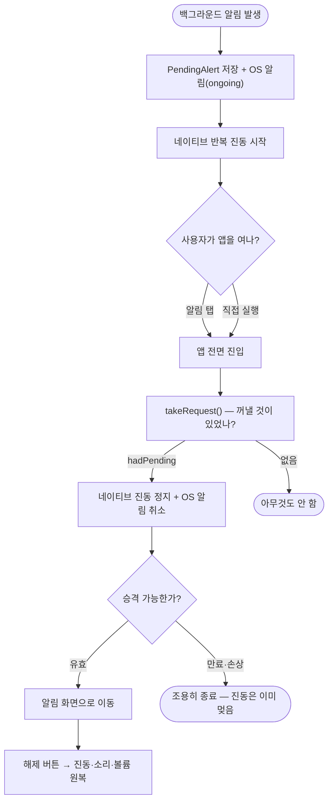

# 알림 안정화·볼륨 제어·카드 색 통일 — 2026-08-11 작업 보고

## 개요

실사용 첫날 발견된 치명 버그 3건을 잡고(v1.3.1), 볼륨 제어 기능과 카드 색 통일을 더해(v1.4.0) 두 차례 배포했다. 가장 심각했던 것은 **알림이 울리는데 끌 방법이 없어 강제종료가 유일한 수단**이던 상태(#83·#84)였다. 세 버그 모두 코드가 아니라 *조합*에서 나왔다 — 테마와 레이아웃, 만료 정책과 진동 정리, 권한과 알림 표시가 각자는 멀쩡한데 만나는 지점이 비어 있었다.

| 이슈 | 내용 | 릴리스 |
|---|---|---|
| #85 | 시간대 추가 버튼이 화면 밖으로 밀려남 | v1.3.1 |
| #83 | 만료·손상된 알림의 네이티브 진동이 정리되지 않음 | v1.3.1 |
| #84 | 알림이 스와이프로 지워지면 해제 경로 소실 | v1.3.1 |
| #86 | 알림음 볼륨 설정 + Android 시스템 볼륨 상향/원복 | v1.4.0 |
| #88 | 활성 카드 흰색 반전 제거 → 다크 명도 문법 | v1.4.0 |

## 기능 흐름 — 알림 해제 경로 (#83·#84 수정 후)

수정 전에는 F에서 만료·손상이면 **G를 건너뛰고 바로 종료**했다 — 진동은 계속되는데 화면이 없었다.

## 변경 사항

### 알림 해제 보장 (#83, `238dd98`)

- `lib/app/background/pending_alert_store.dart`: `take()` 반환을 `({alert, hadStored})` 레코드로 — 값이 깨져 있어도 "꺼낼 것이 있었다"는 사실을 전달
- `lib/app/pending_alert_launcher.dart`: `takeRequest()` 도 동일하게 `hadPending` 분리. 만료·손상·미래시각 전부 `hadPending: true`
- `lib/app/app.dart`: `hadPending` 이면 승격 실패와 무관하게 `stopNativeAlert()` 호출

### 해제 경로 소실 방지 (#84, `592e570` · `15acbe7`)

- `lib/app/background/background_alert_notifier.dart`: 백그라운드 알림을 `ongoing: true` 로 — 스와이프로 지워지지 않는다. `notificationId` 공개
- `lib/app/app.dart`: 승격 시·앱 시작 시 알림을 반드시 취소 — `ongoing` 을 앱이 안 지우면 영영 남는 알림이 된다
- `lib/features/permission/presentation/permission_copy.dart`: 온보딩 문구 정정 — "건너뛰어도 그대로 동작"(거짓) → "건너뛰면 알림 화면이 저절로 뜨지 않아 알림을 눌러 열어야 함"(사실)

### 시간대 추가 버튼 (#85, `36acbd7` · `c368906`)

- `lib/features/places/presentation/alert_schedule_sheet.dart`: 버튼 두 개를 `Row` 에서 세로 쌓기로 — 테마의 `minimumSize: Size.fromHeight(56)` 은 **최소 너비 무한대**라, 폭 제한 없는 `Row` 안에서 버튼이 화면 밖으로 밀려났다
- `test/features/places/alert_schedule_sheet_test.dart` (신규): 버튼 **사각형이 화면 폭 안에 있는지** 단언 + 반환값 검증(추가·취소·편집·요일 변경·저장 불가 2조건)
- `test/features/places/place_card_test.dart`: 손으로 만든 `ThemeData` → 실제 앱 테마(`AppTheme.dark()`) — 가짜 테마로는 이 버그가 재현되지 않아 테스트가 통과했었다

### 볼륨 제어 (#86, `7d180a1`)

- `lib/features/alert/domain/alert_effects.dart`: `play(volume:)` 시그니처 + `AlertVolumeStore`(전역, 기본 80%) + `SystemVolumeService` 인터페이스
- `lib/features/alert/data/prefs_alert_volume_store.dart` (신규): SharedPreferences 저장, 범위 clamp
- `lib/features/alert/data/system_volume_channel.dart` (신규): 네이티브 채널, 모든 실패 무시(iOS 채널 없음·방해금지 SecurityException 이 정상 경로)
- `lib/features/alert/domain/alert_controller.dart`: 이어폰 경로 확정 → 시스템 볼륨 상향 → 재생. `_silence()` 에 볼륨 원복 추가
- `lib/features/alert/presentation/alert_volume_sheet.dart` (신규): 슬라이더(놓을 때 저장) + 미리듣기(이어폰 없으면 거부)
- `android/.../MainActivity.kt`: `system_volume` 채널 — 설정값 수준까지만 올리고(이미 크면 무시) 이전 값을 네이티브가 보관, 볼륨 UI 팝업 없이 조정
- `lib/features/places/presentation/place_map_home_screen.dart` · `lib/app/router.dart`: 홈 상태 바(이어폰 표시 옆)에 진입 아이콘, app 계층이 콜백으로 연결(규칙 1)
- `docs/10-DECISIONS.md`: 결정 022 추가

### 카드 색 통일 (#88, `a1383da`)

- `lib/features/places/presentation/place_card.dart`: 활성 = `bgElevated` + 유색 아이콘, 비활성 = `bgSurface` 에 회색으로 가라앉음. 전환은 기존 정의된 200ms `easeOut`(`AnimatedContainer`)
- `lib/core/theme/app_colors.dart`: `bgInverse` · `textOnInverse` 토큰 제거
- `docs/06-UX.md`: 색 표·미감 표 갱신

## 주요 구현 내용

### "꺼낼 것이 있었는가"와 "승격할 수 있는가"의 분리 (#83)

기존 `takeRequest()` 는 만료·손상이면 그냥 `null` 이었고, 호출자는 null 이면 일찍 반환했다. 문제는 **null 의 의미가 두 가지**였다는 것 — "아무것도 없다"(네이티브 건드리면 안 됨)와 "있었는데 못 쓴다"(네이티브가 그 알림으로 울리는 중)를 구분할 수 없었다. 게다가 `take()` 가 만료 값도 지우므로 두 번째 시도부터는 진짜로 "아무것도 없음"이 되어, 앱을 몇 번 열어도 진동이 멎지 않았다. 레코드 반환으로 두 의미를 분리하고, 빈 저장소일 때는 여전히 네이티브를 건드리지 않는다 — 폴링(#74)마다 정지를 부르면 방금 시작된 알림을 지워버리기 때문이다.

### ongoing 알림은 지우는 책임이 따라온다 (#84)

오버레이·전체화면 권한이 둘 다 없으면(온보딩에서 건너뛰기 가능, Android 14+ 는 전체화면 인텐트 자동 부여 없음) 알림 화면을 띄울 방법이 OS 알림 탭뿐이다. 그 알림이 스와이프로 지워지면 해제 경로가 완전히 사라진다. `ongoing` 으로 막되, **앱이 지우지 않으면 이번엔 영영 남는 알림**이 되므로 승격 시와 앱 시작 시 두 곳에서 반드시 취소한다.

### 시스템 볼륨 상향은 이어폰 확정 뒤에만 (#86)

"시스템 볼륨이 0이면 무조건 설정 수준으로 올린다"는 요구를 그대로 구현하되 순서를 지켰다 — 이어폰 경로가 확정된 뒤에만 올린다. 이어폰이 없으면 볼륨을 건드리지 않는다(재생도 없는데 올리면 다른 앱 소리가 갑자기 커진다). 원복용 이전 값은 네이티브가 보관한다 — Dart 에 두면 프로세스 재시작에서 유실된다. 방해금지 모드는 뚫지 않았다 — 사용자의 명시적 의사라 앱이 우회하면 안 된다(결정 022). iOS 는 시스템 볼륨 공개 API 가 없어 재생 볼륨만 적용된다.

### 흰색 반전이 틀린 이유 (#88)

참조 미감의 "선택 반전"은 예외 상태 표현인데, 이 앱에서 활성은 **기본 상태**다. 등록한 장소는 대부분 켜져 있어 화면 하단이 통째로 하얗게 떴다. 명도 한 층 차이 + 아이콘 채도로 바꿨다 — 앱의 기존 문법("층은 배경 명도로", 그림자 금지)과 같은 언어다.

## 검증

- 추가·갱신 테스트: `pending_alert_launcher_test`(hadPending 회귀 가드 3건), `alert_schedule_sheet_test`(신규 8건), `alert_controller_test`(볼륨 4건 + fake 갱신), `prefs_alert_volume_store_test`(신규 4건), `place_card_test`(색 2건 + 실제 테마 전환)
- v1.3.1 은 CI 통과 후 배포. **v1.4.0 은 CI 완주 전에 배포** — 릴리스 파이프라인 자체 빌드는 성공해 APK 가 나왔으나 마지막 두 커밋의 테스트 결과는 미확인이다

## 주의사항

### 실기기 미검증 — 저녁 작업 시 확인 목록

1. **볼륨**: 알림 시 시스템 볼륨이 실제로 오르는지, 해제 후 원복되는지, 미리듣기가 이어폰 없이 거부되는지
2. **#83**: 만료된 알림(10분 경과)을 두고 앱을 열었을 때 진동이 즉시 멎는지
3. **#84**: 오버레이·전체화면 권한 없는 상태에서 알림 탭 → 해제 화면 도달, 그리고 해제 후 `ongoing` 알림이 트레이에 남지 않는지
4. **CI**: `7d180a1`(볼륨)·`a1383da`(색) 커밋의 Flutter CI 결과 — 실패면 다음 배포 전에 수정 필요

### 건드릴 때 위험한 지점

- `_silence()` 의 `_systemVolume.restore` — 해제 경로를 고치며 이 호출을 빼면 알림이 끝나도 볼륨이 올라간 채 남는다
- `_resumePendingAlert()` 의 `hadPending` 분기 — "null 이면 일찍 return" 으로 되돌리면 #83 이 재발한다
- `ongoing` 알림의 취소 두 곳(승격·앱 시작) — 하나라도 빼면 영영 남는 알림이 된다
- 위젯 테스트의 `AppTheme.dark()` — 편의로 기본 ThemeData 로 되돌리면 #85 류 버그가 다시 침묵한다

### 남은 논의

앱스토어 출시 전 게이트는 실기기 검증(S-4·S-5 이어폰 계약이 최우선)이고, 수익 모델은 무료 + 전면광고 + 광고 제거 IAP 방향을 검토 중이다. 광고 실 ID 전환은 프로덕션 공개 후가 안전하다(무효 트래픽 방지).
