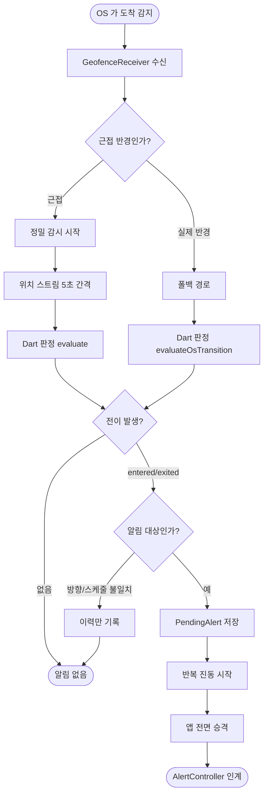

# 앱을 켜지 않으면 도착 알림이 발화되지 않음

## 개요

앱을 실행하지 않으면 등록한 장소에 도착해도 알림이 오지 않고, 도착 후 앱을 켜는 순간에야 울리던 문제를 고쳤다. 원인은 `native_geofence` 가 Android 지오펜스 이벤트를 WorkManager 로 넘기는 구조였다. 즉시 실행 쿼터가 소진되면 일반 작업으로 강등되어 Doze 제한을 받고, 작업 체인이 한 번 실패하면 이후 모든 이벤트가 실행되지 않는다. **앱을 쓰지 않을수록 알림이 오지 않는 구조**라 이 앱의 존재 이유와 정면으로 어긋났다.

Android 를 하이브리드 감시로 전환했다. 앱이 `GeofencingClient` 에 직접 등록하고, 앱 소유 리시버가 이벤트를 받아 이미 상시 실행 중이던 감시 서비스로 곧바로 넘긴다. **가장 중요한 변경은 감시 서비스가 Flutter 엔진을 상시 보유하는 것**이다 — 실패 가능한 엔진 부팅을 이벤트마다 반복하던 것이 결함의 뿌리였다.

## 기능 흐름



두 판정 경로가 **같은 함수와 같은 상태 저장소로 수렴**한다. 어느 쪽이 먼저 도착하든 두 번째는 전이가 없어 조용히 넘어가므로, 중복 발화가 구조적으로 불가능하다.

## 변경 사항

### Dart — 판정 계층 (전부 테스트됨)

- `lib/features/geofence/domain/proximity_radius.dart`: 근접 반경 계산. `max(반경 × 3, 500m)` — 60km/h 기준 약 30초 여유
- `lib/app/background/geofence_background_processor.dart`: 진입점을 셋으로 늘리되(`handle`·`handleTransition`·`handlePosition`) 판정 이후는 `_recordAndDecide` 하나로 모았다
- `lib/app/background/watch_engine_host.dart`: 감시 서비스 엔진의 Dart 진입점. 채널 원시값을 도메인 타입으로 바꾸고 판정을 위임한다
- `lib/app/background/alert_decision.dart`: 채널 경계 전송 형태. 키 이름이 Kotlin 과 계약이다
- `lib/features/geofence/data/android_geofence_monitor.dart`: Android 등록을 자체 채널로 돌린다
- `lib/app/geofence_providers.dart`: 플랫폼 분기 — Android 는 자체 구현, iOS 는 기존 유지

### Kotlin — 이벤트 수신과 발화

- `GeofenceRegistrar.kt`: `GeofencingClient` 직접 등록. **장소마다 2개**(실제 반경·근접 반경)
- `GeofenceReceiver.kt`: PendingIntent 수신 → 감시 서비스로 직행. **WorkManager 를 거치지 않는 것이 이 이슈의 핵심**
- `WatchEngine.kt`: Flutter 엔진 상시 보유. 준비 전 도착한 요청은 큐에 담았다 흘려보낸다
- `PreciseLocationTracker.kt`: 근접 반경 안에서만 도는 위치 스트림 (5초/10m, 30분 상한)
- `BootReceiver.kt`: 재부팅 후 서비스 복구
- `AlertWatchService.kt`: 엔진 보유·정밀 감시 제어·판정 결과로 발화. SharedPreferences 감시 제거

### 문서

- `docs/10-DECISIONS.md`: 결정 024 추가, 017 재검토 결과·019 해소 연결
- `docs/05-PLATFORM.md`, `CLAUDE.md`: 현황 갱신

## 주요 구현 내용

### 엔진 상시 보유가 근본 수정이다

기존 구조는 지오펜스 이벤트마다 FlutterEngine 을 새로 띄웠다. 그 부팅에는 실패 지점이 셋 있고(콜백 핸들 조회·콜백 정보 조회·엔진 생성), **이벤트마다 재실행되므로 실패도 반복된다.** 한 번 띄워 들고 있으면 그 실패 지점이 통째로 사라진다.

### 지오펜스를 장소마다 둘 등록한다

근접 반경만 두면 정밀 감시가 실패했을 때(위치 권한 취소·스트림 오류·엔진 부팅 실패) 도착을 판정할 수단이 사라진다. 실제 반경 지오펜스를 함께 등록해두면 **정밀 감시가 죽어도 OS 가 도착을 알려준다.** 수십 초 늦을 뿐 발화는 된다 — 이것이 결정 017 이 원래 사려던 보장이다.

Android 지오펜스 상한은 앱당 100개라 장소 20개 × 2 = 40개로 여유가 있다.

### 판정은 Dart 에 그대로 뒀다

`GeofenceEvaluator` 를 한 줄도 건드리지 않았다. Kotlin 으로 포팅하면 규칙 3(`unknown` 무알림)·스케줄·방향 판정이 이중화되어 반드시 어긋난다. 네이티브는 채널로 값을 옮길 뿐 어떤 판정도 하지 않는다.

### 결정 017 의 근거가 이미 무효였다

017 은 "FGS 는 제조사 절전에 죽는다"는 이유로 004 의 Android 정밀 감시 원안을 뒤집었다. 그런데 019 에서 상시 FGS(`AlertWatchService`)를 도입했고, **실기기에서 살아있음이 확인됐다.** 죽을까 봐 피했던 것이 이미 돌고 있었다.

## 검증 결과

| 항목 | 결과 |
|---|---|
| `flutter analyze` | 무경고 |
| `flutter test` | **275건 전부 통과** (신규 25건 포함) |
| `flutter build apk --debug` | 성공 |

원인 진단 근거가 된 실기기 관찰:

| 확인 | 결과 |
|---|---|
| 감시 서비스 생존 | 살아있음 (상시 알림 표시) |
| 배터리 최적화 예외 | 허용됨 |
| 도착 시점 알림 | **없음** |
| 앱 실행 직후 | **즉시 발화** |

서비스도 살아있고 Doze 예외도 받은 상태에서 발화가 없었다는 것이 "발화 주체가 아니라 이벤트 전달이 문제"라는 판단의 근거가 됐다.

## 주의사항

### Kotlin 계층은 자동 테스트가 없다

이 프로젝트에 Android 단위 테스트 인프라가 없어 **네이티브 계층은 빌드 통과까지만 보장된다.** 엔진이 실제로 뜨는지, 리시버가 이벤트를 받는지, 진동이 걸리는지는 실기기에서만 확인된다. 아래가 닫히기 전까지 이 이슈는 완료가 아니다.

1. 앱 완전 종료 상태에서 도착 → 발화되는가
2. 재부팅 후 앱 미실행 상태에서 도착 → 발화되는가
3. 화면 꺼짐 장시간 방치 후 도착 → 발화되는가
4. 한 번 도착에 알림 1회인가 (두 경로 중복 없음)
5. 제조사 절전(삼성) 환경에서 서비스 생존
6. 하루 배터리 소모 (파라미터 확정 근거)

진단 명령:

```
adb logcat -s GeofenceReceiver AlertWatchService WatchEngine
```

### 파라미터가 전부 추정치다

근접 반경(반경×3, 최소 500m)·정밀 갱신(5초/10m)·상한(30분) 모두 **배터리 실측 전이다.** 코드 주석과 `docs/05-PLATFORM.md` 미검증 항목에 명시했다. 실측 후 확정해야 한다.

### 건드리면 위험한 지점

- **`AlertDecision` 의 키 이름** — Dart `toMap()` 과 Kotlin `fromMap()` 이 계약이다. 한쪽만 바꾸면 알림이 조용히 사라진다
- **지오펜스 id 규약** — 실제 반경은 `{placeId}`, 근접은 `{placeId}#proximity`. `GeofenceRegistrar` 와 `GeofenceReceiver` 가 이 규칙으로 갈라 처리한다
- **`_recordAndDecide` 공유** — 세 진입점이 이 함수 하나로 모인다. 복제하면 경로마다 규칙이 어긋나 한쪽에서만 울리거나 두 번 울린다
- **엔진 준비 전 큐** — `WatchEngine` 이 `engineReady` 전 요청을 큐에 담는다. 버리면 서비스가 막 뜬 순간의 도착이 유실된다

### iOS 는 변경하지 않았다

WorkManager 가 없고 CLLocationManager region monitoring 을 직접 쓰므로 이 결함이 존재하지 않는다. `native_geofence` 는 iOS 전용으로 유지된다.
