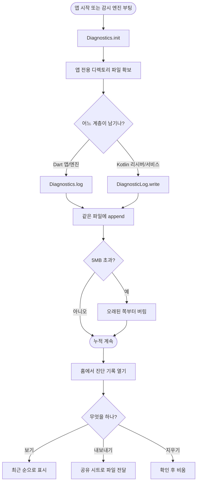

# 앱 내부 상시 로그 누적과 내보내기

## 개요

백그라운드에서 문제가 생겨도 추적할 방법이 없던 것을 고쳤다. 이 앱은 예외를 전부 조용히 삼키도록(`} on Object { }`) 설계돼 있고 — 백그라운드 크래시가 사용자에게 안 보이는 채로 감시만 죽이기 때문 — `print` 마저 금지돼 있어, 실제로 아무 기록도 남지 않았다. 예외를 삼키고 아무것도 남기지 않던 지점이 Dart 41곳, Kotlin 14곳이었다.

이슈 #93 의 원인을 찾을 때도 **로그를 보지 못했다.** 코드를 거꾸로 읽어 추론했을 뿐이다. 백그라운드 동작이 핵심인 앱에서 로그가 없다는 것은 사실상 디버깅을 포기하는 것이다.

Dart 와 Kotlin 이 같은 파일에 시간순으로 쌓고, 홈 화면에서 확인·내보낼 수 있게 했다.

## 기능 흐름

**네이티브와 Dart 가 한 파일에 섞이는 것이 핵심이다.** 지오펜스 이벤트가 네이티브까지 왔는데 Dart 판정이 안 돌았는지, 아예 안 왔는지를 가르는 것이 이 로그의 주 용도다.

## 변경 사항

### 로깅 인프라

- `lib/core/diagnostics/log_rotation.dart`: 상한 초과 시 최근 것을 남기는 순수 함수. 바이트 기준(한글은 UTF-8 에서 3바이트)
- `lib/core/diagnostics/file_diagnostic_logger.dart`: 파일 append + 회전. 쓰기를 직렬화해 줄이 섞이지 않게 한다
- `lib/core/diagnostics/diagnostics.dart`: 전역 진입점. Provider 컨테이너 밖에서도 부를 수 있다
- `lib/core/diagnostics/diagnostic_log_file.dart`: Dart·Kotlin 이 공유하는 파일 경로
- `android/.../DiagnosticLog.kt`: 네이티브 로거. 같은 파일·같은 형식·같은 회전 규칙

### 로그를 심은 지점

- `GeofenceReceiver.kt`: **브로드캐스트 수신 여부** — 알림이 안 왔을 때 가장 먼저 봐야 하는 기록
- `AlertWatchService.kt`: 서비스 생명주기, 등록 개수, 정밀 감시 시작·종료, 알림 발화
- `GeofenceRegistrar.kt`: 등록 성공/실패 (비동기 실패를 리스너로 잡는다)
- `WatchEngineHost`: 위치 측정, OS 전이 수신, 판정 결과, 판정 실패
- `GeofenceRegistrationSync`: 동기화 결과와 실패

### 화면

- `lib/features/diagnostics/presentation/diagnostics_screen.dart`: 최근 순 표시, 공유 내보내기, 지우기
- 홈 상태 바에 진입점 추가 — 감시 상태 바로 옆

### 규칙 변경

- `docs/04-CONVENTIONS.md`, `CLAUDE.md`: "릴리스에 좌표 금지" 규칙을 폐기하고 근거를 남겼다

## 주요 구현 내용

### 왜 파일인가

세 곳에서 써야 한다 — 앱 isolate, 감시 서비스가 보유한 백그라운드 엔진(별도 isolate), Kotlin 계층. Drift 는 Kotlin 에서 쓰기 어렵고, **`android.util.Log` 는 Android 4.1+ 부터 앱이 자기 프로세스 logcat 조차 읽을 수 없어** 사용자 기기에서 확인할 수단이 되지 못한다. 파일 append 가 셋 다 접근할 수 있는 유일한 공통분모다.

### 좌표를 남기는 쪽으로 규칙을 바꿨다

기존 규칙의 목적은 **좌표가 기기 밖으로 새는 것**을 막는 것이었다. 이 로그는 앱 전용 디렉토리에만 있고(다른 앱이 못 읽는다), 어디로도 전송하지 않으며, 밖으로 꺼내는 것은 사용자가 공유 시트로 직접 하는 행위다. **목적이 유지되므로 예외를 뒀다.**

반대로 좌표를 빼면 "왜 이 장소가 판정되지 않았는가"를 추적할 수 없고, 그것이 이 앱에서 가장 자주 묻게 되는 질문이다.

### 예외를 삼키되 기록은 남긴다

백그라운드에서 예외를 던지지 않는 규칙은 유지했다. 다만 삼킨 자리마다 로그를 넣었다. 이전에는 무슨 일이 있었는지 영영 알 수 없었다.

### 로깅이 앱을 멈추지 않는다

모든 로깅 경로가 예외를 삼킨다. `Diagnostics.log` 는 `await` 하지 않아도 되게 만들어, 판정 경로에서 로깅을 기다리다 알림이 늦어지지 않는다.

## 검증 결과

| 항목 | 결과 |
|---|---|
| `flutter analyze` | 무경고 |
| `flutter test` | **290건 전부 통과** (신규 15건) |
| `flutter build apk --debug` | 성공 |

신규 테스트는 회전 규칙 7건(경계값·한글 바이트·깨진 줄 방지 포함)과 파일 로거 8건(동시 기록·쓰기 실패·회전 포함)이다.

## 주의사항

### 파일 경로가 양쪽 계약이다

Dart 는 `getApplicationSupportDirectory()`, Kotlin 은 `context.filesDir` 를 쓴다. Android 에서 이 둘은 같은 곳을 가리킨다. **한쪽을 바꾸면 반대쪽도 바꿔야 하고**, 어긋나면 가장 알고 싶은 정보(네이티브가 이벤트를 받았는가)가 앱에서 안 보인다. 파일명 `diagnostic.log` 도 마찬가지다.

### 한 항목은 반드시 한 줄이어야 한다

`DiagnosticEntry.format()` 이 줄바꿈을 공백으로 바꾼다. 여러 줄이면 회전할 때 반쪽만 남아 읽을 수 없다. Kotlin 쪽도 같은 처리를 한다.

### Kotlin 로깅은 자동 테스트가 없다

Dart 계층(회전·파일 로거)은 전부 테스트했으나 네이티브는 빌드 통과까지만 확인됐다. 실기기에서 `receiver` 태그가 실제로 찍히는지 확인해야 한다 — 그것이 이 기능의 존재 이유다.

### 정밀 감시가 도는 동안 로그가 빠르게 쌓인다

5초마다 위치 측정 로그가 남는다. 근접 반경 안에서만 도므로 평소에는 조용하지만, 상한(5MB)에 닿는 속도가 상황에 따라 크게 다르다. 실사용 후 상한을 조정할 수 있다.
