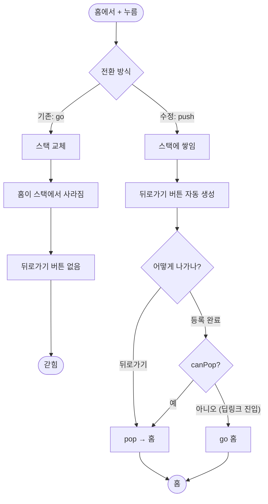

# 장소 등록 화면에서 뒤로 갈 수 없다

## 개요

장소 등록·편집 화면에 들어가면 나올 방법이 없던 문제를 고쳤다. 뒤로가기 버튼이 없었고 시스템 뒤로가기도 먹지 않아, 등록을 완료하거나 앱을 강제 종료하는 것 외에 빠져나올 길이 없었다. 진단 기록 화면도 같은 상태였다.

원인은 화면 전환에 `context.go` 를 쓴 것이다. **`go` 는 라우트 스택을 교체하므로 돌아갈 곳이 사라진다.** 그러면 `AppBar` 가 뒤로가기 버튼을 만들지 않는 것이 정상 동작이고, 시스템 뒤로가기도 pop 할 대상이 없다.

## 기능 흐름

## 변경 사항

### 라우팅

- `lib/app/router.dart`
  - `onAddPlace`·`onEditPlace`·`onOpenDiagnostics` 를 `context.go` → `context.push` 로 변경
  - `_leaveForm(context)` 헬퍼 추가 — 저장 후 복귀를 `pop` 으로 처리하되 `canPop()` 확인

## 주요 구현 내용

### 같은 파일 안에 두 방식이 섞여 있었다

지도 선택 화면은 이미 `context.push` 를 쓰고 있었고(`router.dart:115`) 뒤로가기가 정상 동작했다. 장소 폼과 진단 화면만 `go` 였다. **그 차이가 그대로 사용자에게 드러났다.**

### `canPop()` 확인이 필요한 이유

저장 후 복귀를 단순히 `pop` 으로 바꾸면 새 함정이 생긴다. 딥링크나 알림 탭처럼 **스택 없이 이 화면에 바로 진입하는 경로**가 있고, 그때 `pop` 하면 갈 곳이 없어 아무 일도 일어나지 않는다. 사용자는 저장했는데 화면이 그대로인 상태에 갇힌다 — **정확히 이 이슈에서 고치려던 증상이 다른 경로로 재발한다.**

그래서 `canPop()` 이 false 면 홈으로 보낸다.

## 검증 결과

| 항목 | 결과 |
|---|---|
| `flutter analyze` | 무경고 |
| `flutter test` | 290건 전부 통과 |
| `flutter build apk --debug` | 성공 |

## 주의사항

### 뒤로가기 버튼은 자동 생성이다

`AppBar` 에 `leading` 을 명시하지 않았다. Flutter 가 스택에 이전 화면이 있으면 자동으로 뒤로가기를 만든다. **명시적으로 넣지 않은 것이 의도다** — 스택이 없는 상황(딥링크 진입)에서 눌러도 아무 일 없는 버튼이 보이는 것보다, 그때는 안 보이는 편이 정직하다.

### 입력 중 뒤로가면 값이 사라진다

이제 뒤로갈 수 있게 되면서 **입력하던 내용을 잃을 수 있는 경로가 생겼다.** 현재는 확인 없이 그대로 나간다. 실사용에서 불편이 확인되면 "저장하지 않고 나갈까요?" 확인을 추가하는 것을 검토한다 — 다만 확인 다이얼로그는 매번 나가는 길을 막으므로 신중해야 한다.

### 이 화면들만 `push` 다

알림 화면(`alert`)·온보딩은 여전히 `go` 다. 그쪽은 **의도적으로 스택을 교체해야 한다** — 알림 화면에서 뒤로가기로 이전 화면에 돌아가면 진동이 도는 채로 앱을 헤매게 된다.
