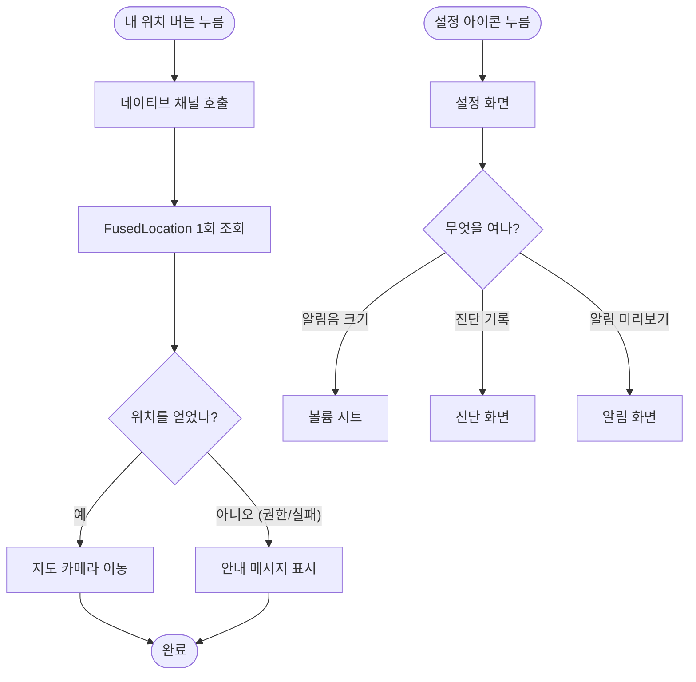

# 내 위치 버튼 위치와 진단 진입점 정리

## 개요

홈 화면 상단에 컨트롤이 몰려 생긴 두 문제를 고쳤다.

**내 위치 버튼이 보이지 않았다.** 지도 SDK 기본 버튼은 우상단 고정인데 상태 알약이 그 위를 덮어, 화면 최상단에 회색 사각형 일부만 잘려 노출됐다. 사용자가 버튼의 존재 자체를 몰랐다.

**진단 기록 버튼이 홈을 차지하고 있었다.** 상태 바 우측에 아이콘이 셋 늘어서면서 정작 중요한 감시 상태가 묻혔다.

내 위치 버튼을 좌하단 자체 버튼으로 옮기고, 설정 화면을 만들어 아이콘 셋을 하나로 모았다.

## 기능 흐름

## 변경 사항

### 내 위치 버튼

- `android/.../CurrentLocationProvider.kt`: 현재 위치 1회 조회 (신규)
- `android/.../MainActivity.kt`: `current_location` 채널 추가
- `lib/features/places/data/current_location_channel.dart`: Dart 어댑터 (신규)
- `lib/features/places/presentation/place_map_home_screen.dart`
  - `myLocationButtonEnabled: false` — SDK 기본 버튼 끔
  - `_MyLocationButton` 좌하단 배치
  - `_moveToCurrentLocation()` — 조회 실패 시 이유 안내

### 설정 화면

- `lib/features/settings/presentation/settings_screen.dart`: 신규
- `lib/app/router.dart`: `/settings` 라우트와 `_SettingsRoute` 추가
- 홈 상태 바: 아이콘 셋(알림음 크기·미리보기·진단) → 설정 아이콘 하나

## 주요 구현 내용

### 제약이 이미 사라져 있었다

기존 코드에 이런 판단이 남아 있었다.

> 지도 SDK 의 버튼을 쓴다. 직접 만들면 현재 위치를 알아낼 방법이 없어 "내 위치"라고 써놓고 확대만 하는 버튼이 된다

**이슈 #93 에서 `play-services-location` 을 넣으면서 그 제약이 없어졌다.** 새 의존성 없이 조회만 노출하면 됐다. 주석이 남아 있으면 다음 사람이 같은 제약을 가정하므로 근거와 함께 갱신했다.

### 왼쪽 아래인 이유

오른쪽 아래는 장소 추가 버튼(`+`)이 이미 쓰고, 오른쪽 위는 상태 알약이 덮는다 — 그게 원래 버튼이 잘려 보이던 자리다. 왼쪽 아래가 남은 자리이면서 한 손 조작에서 닿기 쉽다.

### `getCurrentLocation` 을 쓴다

`lastLocation` 은 오래된 값이나 null 을 준다. 버튼을 눌렀는데 어제 있던 곳으로 지도가 날아가면 고장으로 보인다. 대기 시간은 10초로 제한했다 — 더 길면 눌렸는지 의심하게 된다.

### 실패를 알린다

위치를 못 얻으면 안내 메시지를 띄운다. 아무 일도 일어나지 않으면 사용자는 버튼이 고장 났다고 생각하고 계속 누른다.

### 상태 바는 상태를 보여주는 곳이다

설정 항목을 상태 바에 늘어놓으면 "지금 감시 중인가"라는 이 화면의 존재 이유가 묻힌다. 평소에 쓸 일 없는 것부터 설정으로 내렸다 — 진단 기록은 문제가 생겼을 때만 여는 화면이다.

## 검증 결과

| 항목 | 결과 |
|---|---|
| `flutter analyze` | 무경고 |
| `flutter test` | 290건 전부 통과 |
| `flutter build apk --debug` | 성공 (Kotlin 채널 포함) |

## 주의사항

### iOS 에는 위치 채널이 없다

`CurrentLocationChannel` 은 채널이 없으면 조용히 null 을 돌려주고, 화면은 안내 메시지를 띄운다. **iOS 에서는 내 위치 버튼이 동작하지 않는다.** iOS 대응이 필요하면 `CLLocationManager` 로 같은 채널을 구현하면 된다 — Dart 쪽은 그대로 쓴다.

### 실기기 확인 필요

- 버튼을 눌러 실제로 현재 위치로 이동하는가
- 위치 권한이 없을 때 안내가 뜨는가
- 지도 시트를 올렸을 때 버튼이 가려지지 않는가 (시트 높이를 따라 올라가게 했다)

### 알림 미리보기는 임시 기능이다

설정 안으로 옮겼지만 **지오펜스 실기기 검증이 끝나면 제거 대상**이다 (`docs/11-ROADMAP.md`). 사용자에게 노출된 기능으로 굳지 않도록 주의한다.
