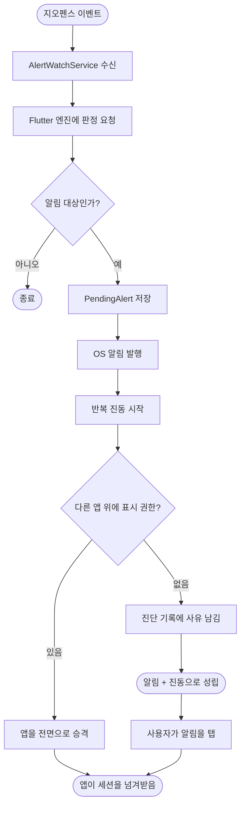

# 백그라운드 도착 시 알림이 뜨지 않고 진동만 울린다

## 개요

Android 하이브리드 감시 경로(#93)에서 **어떤 OS 알림도 발행되지 않고 있었다.** 진동만 울리고, 오버레이 권한이 없거나 백그라운드 액티비티 시작이 막히면 화면에 아무 흔적도 남지 않았다. 앱을 직접 열어야 저장된 대기 알림이 살아나 그제서야 울렸다.

발화 주체를 네이티브로 확정하고 **알림 발행을 그 자리에 넣었다.** 함께 화면 승격 실패를 진단 기록에 남기고, 온보딩에서 놓친 알림 권한을 설정 화면에서 다시 켤 수 있게 했다.

## 원인

`GeofenceBackgroundProcessor` 는 진입점마다 알림 발행 여부가 다르다.

| 진입점 | 알림 발행 | 쓰는 곳 |
|---|---|---|
| `handle` | 한다 | iOS |
| `handleTransition` | 안 한다 | Android 감시 서비스 |
| `handlePosition` | 안 한다 | Android 정밀 모드 |

Android 두 경로는 "발화 주체가 네이티브"라는 전제로 알림을 넘겼는데, `AlertWatchService.beginAlert()` 는 진동과 액티비티 시작만 했다. **전제가 코드로 옮겨지지 않았고 아무도 그 자리를 채우지 않았다.**

#74 가 만든 `BackgroundAlertNotifier`(전체화면 인텐트·알람 카테고리·스와이프 방지)는 코드에 남아 있었으나 iOS 경로에서만 호출됐다.

판정과 저장은 정상이었다 — 앱을 열면 울렸다는 것이 그 증거다. **판정의 문제가 아니라 발화 표면의 문제였다.**

## 기능 흐름

**순서가 의미를 가진다.** 뒤로 갈수록 실패 가능성이 높은 것을 뒤에 뒀다. 화면 승격이 막혀도 알림과 진동은 이미 나가 있다.

## 변경 사항

### 네이티브 발화 (Kotlin)

- `AlertWatchService.kt`
  - `beginAlert(decision)` — 판정 결과를 받아 장소 이름·방향을 알림에 담는다
  - `showArrivalNotification()` · `buildArrivalNotification()` 신설 — 전체화면 인텐트, 알람 카테고리, 잠금화면 공개, 스와이프 방지
  - `createArrivalChannel()` — 신설 채널 `ear_loc_alert_arrival`. **무음·채널 진동 없음**
  - `endAlert(timedOut)` — 시간 초과 시 알림을 지울 수 있는 형태로 다시 단다
  - `launchAlertScreen()` — 권한 없음과 백그라운드 시작 차단을 구분해 기록

### 설정 화면 권한 (Dart)

- `settings_screen.dart` — `SettingsPermissionRow` 신설, "알림 도달 권한" 섹션 추가
- `permission_controller.dart` — `requestOne(kind)` 추가. 순서를 따르지 않고 누른 항목만 요청한다
- `router.dart` — `_SettingsRoute` 를 Stateful 로 바꿔 앱 복귀 시 권한 상태를 다시 읽는다. `_permissionRows()` 로 권한 상태를 값으로 변환해 내려준다

## 주요 구현 내용

### 채널을 나눈 이유

Dart 의 `ear_loc_alert_geofence` 는 채널 진동이 켜져 있다. 앱 프로세스가 없는 iOS·구 경로에서는 그것 말고 진동 수단이 없기 때문이다. 여기서는 서비스가 직접 반복 진동을 걸므로 겹치면 패턴이 어긋난다.

**Android 알림 채널 설정은 최초 생성 시 고정되어 나중에 못 바꾼다.** 그래서 공유할 수 없고 나눠야 했다.

### 알림 id 를 2001 로 맞춘 이유

앱이 승격하거나 정리할 때 `BackgroundAlertNotifier.notificationId`(2001)로 취소한다. 다른 id 를 쓰면 지워지지 않는 알림이 남는다 — #84 에서 이미 겪은 문제다.

### 소리는 여전히 내지 않는다

채널을 `setSound(null, null)` 로 만들었다. 이어폰 연결 판정(허용 목록)은 Dart 에만 있고 테스트로 지켜진다. 네이티브가 소리를 내는 순간 그 판정이 우회되어 스피커로 샐 수 있다.

### 설정 화면에 권한을 둔 이유

알림 신뢰성 권한은 온보딩의 **선택 단계**라 한 번 지나가면 다시 묻지 않는다. 그런데 나중에 켤 자리가 앱 어디에도 없었다 — 홈 배너가 유일한 경로였고, 그것을 놓친 사용자는 "권한을 다 줬는데 왜 안 되는가"에 갇혔다.

허용된 항목도 숨기지 않고 보여준다. 무엇이 켜져 있고 무엇이 꺼져 있는지가 한눈에 보여야 스스로 판단할 수 있다.

## 검증

| 항목 | 결과 |
|---|---|
| `flutter analyze` | 이슈 없음 |
| `flutter test` | 312건 통과 |
| Kotlin 컴파일 | 통과 |
| 디버그 APK 빌드 | 성공 (FileProvider 매니페스트 병합 포함) |

## 주의사항

**Kotlin 계층은 자동 테스트가 없다.** 알림 발행부는 빌드 통과까지만 확인됐고 실기기 검증으로만 닫힌다. 확인할 것:

1. 앱 프로세스가 없는 상태에서 도착 시 상태바에 알림이 뜨는가
2. 화면이 꺼졌을 때 알림 화면이 올라오는가
3. 설정의 권한 항목 상태가 실제와 맞고 눌러서 켜지는가
4. 오버레이를 켠 뒤 화면 승격이 되는가. 안 되면 진단 기록에 사유가 남는가
5. 알림을 탭했을 때 해제 화면으로 이어지는가

**알림 채널이 하나 늘었다.** Android 설정에 "위치 감시"와 "도착·출발 알림" 둘이 보인다. 사용자가 후자를 끄면 알림이 안 뜬다 — 진단 기록에 발행 실패가 남지 않으므로(권한이 아니라 채널 차단은 조용히 무시된다) 증상만 보고는 가르기 어렵다.

**시간 초과(10분) 후 알림은 남는다.** 진동만 멎고 알림은 지울 수 있는 형태로 바뀐다. "그때 도착했었다"는 정보가 사라지면 안 되기 때문이다.
