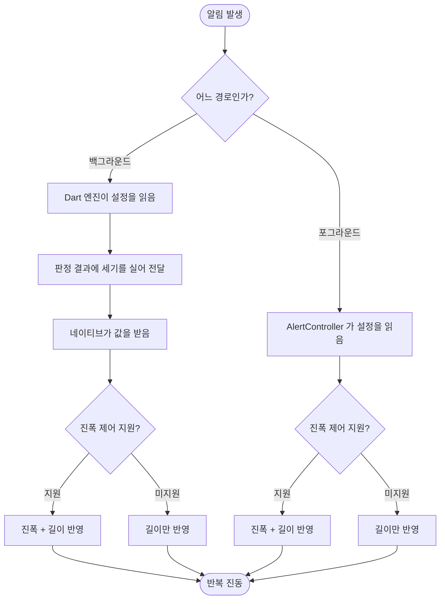

# 진동 세기를 설정에서 조절한다

## 개요

이 앱은 이어폰이 연결됐을 때만 소리를 낸다. 즉 **대부분의 알림은 진동이 전부인데**, 그 세기를 사용자가 정할 수 없었다. 알림음 크기(#86)만 설정에 있었다.

세 단계(약하게·보통·강하게)를 두고, 각 단계가 **진폭과 길이를 함께** 바꾸도록 했다.

## 기능 흐름

## 변경 사항

### 도메인 · 저장소

- `vibration_intensity.dart` — `VibrationIntensity` enum(진폭·길이 보유) + `VibrationIntensityStore` 인터페이스
- `prefs_vibration_intensity_store.dart` — SharedPreferences 구현. **이름으로 저장한다**

### 발화 경로

- `alert_effects.dart` · `vibration_service_impl.dart` — `startRepeating` 에 `intensity` 추가, `hasAmplitudeControl()` 로 분기
- `alert_controller.dart` — 설정을 읽어 진동에 반영. 읽기 실패는 기본 세기로 떨어진다
- `alert_decision.dart` · `watch_engine_host.dart` — 판정 결과에 세기를 실어 네이티브로 보낸다
- `AlertWatchService.kt` · `WatchEngine.kt` — 받은 값으로 `createWaveform(pattern, amplitudes, 0)` 구성

### 화면

- `vibration_intensity_sheet.dart` — 고르면 그 세기로 한 번 울린다
- `settings_screen.dart` · `router.dart` — 알림 섹션에 항목 추가

## 주요 구현 내용

### 진폭과 길이를 함께 바꾸는 이유

`VibrationEffect` 의 진폭 제어를 지원하지 않는 기기가 아직 많다. 진폭만 바꾸면 그런 기기에서 설정이 **아무 효과도 없고**, 사용자는 설정이 고장 났다고 판단한다. 길이는 어느 기기에서나 통하므로 폴백이 아니라 함께 가는 축으로 뒀다.

### 설정을 읽는 자리를 하나로 둔 이유

네이티브가 SharedPreferences 를 직접 읽게 하면 읽는 자리가 둘이 되어 반드시 어긋난다. 판정 결과(`AlertDecision`)에 실어 보내고 네이티브는 받은 값을 쓰기만 한다. 값이 0 이면 "설정 없음"으로 기존 기본 진동에 떨어진다.

이 방식의 부수 효과로 **채널 계약이 넓어졌다** — `AlertDecision` 의 키가 Kotlin `fromMap` 과 계약이므로 한쪽만 바꾸면 진동이 조용히 기본값이 된다. 계약 테스트가 이것을 지킨다.

### 이름으로 저장하는 이유

순서 인덱스로 저장하면 enum 에 값을 끼워 넣는 순간 기존 사용자의 설정이 조용히 다른 값으로 바뀐다.

### 기본값

`normal` 이 지금까지의 동작과 같은 세기다. 설정을 새로 만들었다고 기존 사용자의 알림이 달라지면 안 된다.

## 검증

| 항목 | 결과 |
|---|---|
| `flutter analyze` | 이슈 없음 |
| `flutter test` | 312건 통과 (진동 세기 관련 12건 신규) |
| Kotlin 컴파일 | 통과 |

추가한 테스트:

- 세기가 올라가면 진폭도 길이도 함께 올라간다
- 가장 약한 단계도 진폭이 0 이 아니다
- 알 수 없는 이름은 보통으로 떨어진다
- 설정한 세기가 판정 결과에 실린다
- **설정을 못 읽어도 알림은 나간다** — 설정 하나가 도착 알림을 삼키면 안 된다

## 주의사항

**단계별 수치가 추정치다.** 진폭 90/170/255, 길이 400/800/1200ms. 실기기에서 체감 차이가 없으면 조정해야 한다.

**진폭 제어 지원 여부는 기기마다 다르다.** 미지원 기기에서는 세 단계가 길이 차이로만 구분되므로 차이가 덜 뚜렷하다.

미리보기는 시트를 닫으면 멎는다 — 화면 없이 계속 떨리면 안 되기 때문이다.
