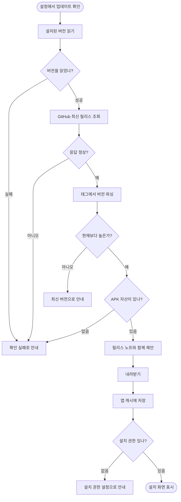

# 앱 안에서 최신 버전을 확인하고 업데이트한다

## 개요

스토어 배포 전까지 사이드로드가 유일한 배포 경로다. 새 버전이 나와도 앱 안에서 알 방법이 없어, 릴리스 페이지를 열어 APK 링크를 찾아 내려받고 설치하는 왕복이 검증마다 반복됐다.

설정 화면에서 GitHub 공개 릴리스를 조회하고, APK 를 받아 **설치 화면을 띄우는 것까지** 한다.

## 기능 흐름

## 변경 사항

### 도메인 (순수 로직)

- `app_version.dart` — 버전 파싱과 비교. `v1.7.2`·`1.7.2+84`·`v1.7.2-beta` 를 모두 받는다
- `app_update.dart` — `AppRelease`, `UpdateCheck` sealed 계층(`UpdateNotNeeded`·`UpdateAvailable`·`UpdateCheckFailed`), `AppUpdateService` 인터페이스

### 데이터

- `github_release_service.dart` — 릴리스 조회·내려받기. 응답 파싱은 순수 함수로 분리
- `app_installer_channel.dart` — 버전 읽기·설치 요청 채널

### 네이티브

- `ApkInstaller.kt` — APK 를 캐시에 쓰고 `ACTION_VIEW` 로 설치 화면 호출. 설치 권한 확인·설정 이동
- `MainActivity.kt` — `app_installer` 채널 등록, `versionName()` 추가
- `AndroidManifest.xml` — `REQUEST_INSTALL_PACKAGES` 권한, `FileProvider` 선언
- `res/xml/file_paths.xml` — 공유 범위를 캐시의 `update/` 하나로 제한

### 화면

- `update_sheet.dart` · `update_provider.dart` — 여는 순간 확인 시작, 진행률 표시
- `settings_screen.dart` · `router.dart` — "앱 정보" 섹션에 현재 버전과 함께 항목 추가

## 주요 구현 내용

### 설치를 대신 하지 않는다

앱이 하는 것은 내려받은 APK 를 OS 설치 화면에 넘기는 것까지다. 대신 눌러줄 API 도 없고, 있어도 그렇게 하면 안 된다.

### 토큰을 쓰지 않는다

공개 레포의 공개 릴리스만 읽는다. 인증을 붙이면 앱에 자격 증명을 넣어야 하고 APK 를 뜯으면 나온다.

### 실패를 "최신"으로 뭉뚱그리지 않는다

네트워크 단절·응답 이상·버전 파싱 실패를 사유와 함께 알린다. **사용자가 확인했다고 믿는데 실제로는 확인이 안 된 상태가 가장 나쁘다.**

### 버전 비교를 숫자로 하는 이유

문자열 비교면 `1.10.0 < 1.9.0` 이 되어 새 버전이 영영 보이지 않는다.

### 설정 화면을 열 때 조회하지 않는 이유

매번 조회하면 GitHub 요청 한도만 소모하고, 사용자는 확인을 누른 적이 없다. 버전 표시는 네이티브에서 읽고, 릴리스 조회는 사용자가 누를 때만 나간다.

### 캐시에 저장하는 이유

외부 저장소 권한이 필요 없고 설치가 끝나면 OS 가 정리한다. 이전 내려받기가 남아 있으면 지운다 — 버전이 섞이면 엉뚱한 것이 깔린다.

## 검증

| 항목 | 결과 |
|---|---|
| `flutter analyze` | 이슈 없음 |
| `flutter test` | 312건 통과 (업데이트 관련 10건 신규) |
| Kotlin 컴파일 | 통과 |
| 디버그 APK 빌드 | 성공 — **FileProvider 매니페스트 병합 확인** |

추가한 테스트: 태그 표기 흔들림 파싱, 자릿수 비교(`1.10.0 > 1.9.0`), 같거나 낮은 버전은 제안하지 않음, APK 아닌 자산 건너뛰기, 태그 파싱 실패 시 null.

## 주의사항

**스토어 배포 전에 걷어낸다.** `REQUEST_INSTALL_PACKAGES` 는 스토어 배포에 필요 없고 Play 가 특히 까다롭게 본다. 제거 대상 목록을 [09-RELEASE](../../09-RELEASE.md) 에 남겼다.

**Android 전용이다.** iOS 는 사이드로드 경로가 없어 항목 자체가 뜨지 않는다.

**설치 권한은 사용자가 허용해야 한다.** 권한 없이 설치 인텐트를 던지면 아무 일도 일어나지 않은 것처럼 보이므로, 미리 확인해 설정으로 안내한다.

**내려받는 중에는 시트를 닫을 수 없다.** 중간에 끊으면 반쪽 파일이 남는다.

앱이 네트워크로 나가는 대상이 하나 늘었다(광고 외에 GitHub API·릴리스 자산). 위치나 사용자 정보는 여전히 나가지 않는다.
