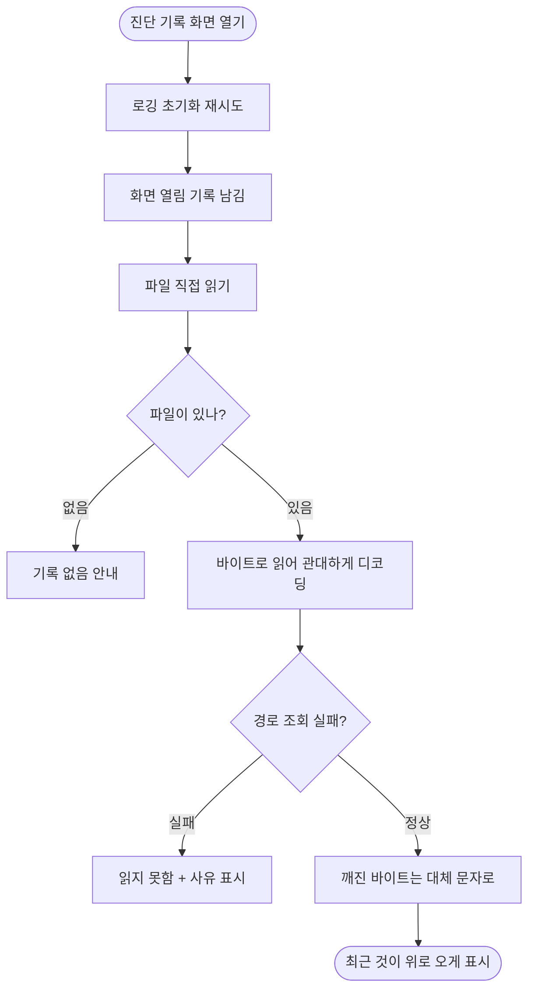

# 진단 기록이 쌓여 있어도 화면에 0건으로 보인다

## 개요

파일에 1400줄 넘게 쌓여 있는데도 진단 화면이 항상 "0건 / 아직 기록이 없습니다"였다. **원인이 둘 겹쳐 있었고, 둘 다 실패를 "기록 없음"으로 둔갑시키는 구조였다.**

화면이 파일을 직접 읽게 바꾸고, 깨진 UTF-8 바이트를 견디게 했다. 같은 파일에서 0건이던 화면이 1477건을 읽는다.

## 원인

### (1) 화면이 전역 로거를 거쳐 읽었다

```dart
final content = await Diagnostics.logger.readAll();
```

`Diagnostics.logger` 는 앱 시작 시 `init()` 이 성공해야 파일 로거가 된다. 실패하면 아무것도 하지 않는 로거로 남고, 그 `readAll()` 은 **무조건 빈 문자열**이다.

**진단 화면이 진단 대상의 초기화 성공에 의존하고 있었다** — 정확히 그것이 실패했을 때 열리는 화면인데.

Kotlin 계층은 Dart 초기화와 무관하게 파일에 직접 쓰므로, `[watch]`·`[registrar]` 기록이 잔뜩 있어도 통째로 사라졌다.

### (2) 파일이 UTF-8 로 깨져 있었다

에뮬레이터에서 화면에 그대로 떴다:

```
FileSystemException: Failed to decode data using encoding 'utf-8',
path = '/data/user/0/kr.suhsaechan.ear_loc_alert/files/diagnostic.log'
```

```dart
try {
  return await file.readAsString();
} on Object {
  return '';        // ← 읽기 실패가 "로그 없음"이 된다
}
```

**이 파일은 세 곳이 함께 append 한다** — 앱 isolate, 감시 서비스 엔진(별도 isolate), Kotlin 계층. 쓰기가 겹치면 한글 한 글자(UTF-8 3바이트)가 중간에서 잘린다. `readAsString()` 은 그 순간 통째로 예외를 던지고, 그것을 삼키면 **한 글자 때문에 수천 줄이 사라진다.**

이전 기록에 섞여 있던 정체불명의 빈 줄이 이미 그 증상이었다.

## 기능 흐름



## 변경 사항

### 읽기 경로

- `lib/core/diagnostics/diagnostic_log_reader.dart` — **신설.** 파일 직접 읽기·비우기·줄 분리. `decodeTolerant()` 가 깨진 바이트를 대체 문자로 바꾼다
- `lib/core/diagnostics/file_diagnostic_logger.dart` — `readAll()` 과 회전이 관대한 디코딩을 쓴다
- `DiagnosticLog.kt` — 회전 시 `String(readBytes(), UTF_8)` 로 바꿔 같은 문제를 피한다
- `diagnostics_screen.dart` — 로거 대신 `DiagnosticLogReader` 사용, "기록 없음"과 "읽지 못함" 구분, 화면 열림 기록

### 로그 추가

| 태그 | 남는 것 |
|---|---|
| `alert` | 세션 시작(장소·방향·진동세기·소리), 오디오 판정(이어폰 연결·장소 설정·결과), 재생 실패, 해제, 대기열 |
| `permission` | 여섯 권한 값 전부(**바뀌었을 때만**), 권한 요청 |
| `place` | 추가·수정·삭제·토글 (좌표·반경·방향 포함) |
| `app` | 생명주기 전환, 부트스트랩 각 단계, 대기 알림 승격 |
| `diag` | 진단 화면 열림 |

## 주요 구현 내용

### 동시 쓰기는 그대로 두고 읽는 쪽이 견딘다

프로세스 간 락은 Dart·Kotlin 양쪽에 걸어야 하고, **로깅이 판정 경로를 붙잡는 위험이 깨진 줄 하나보다 크다.** 백그라운드에서 로깅 때문에 알림이 늦어지면 본말이 전도된다.

`allowMalformed` 는 깨진 바이트를 U+FFFD 로 바꾼다. 그 줄만 이상해 보이고 나머지는 전부 읽힌다.

### 화면 열림을 기록하는 이유

기록이 비어 보일 때 **"안 쌓이는 것"인지 "못 읽는 것"인지를 사용자가 스스로 가릴 수 있는 가장 단순한 신호**다. 다음에 열었을 때 `[diag] 진단 기록 화면 열림` 이 보이면 로깅은 살아있다.

### 권한 로그를 변화 시에만 남기는 이유

컨트롤러가 화면 구독마다 재생성되어 **같은 줄이 0.1초 간격으로 여섯 번씩** 쌓였다. 그러면 정작 찾아야 할 발화 기록이 그 사이에 묻힌다. 마지막 기록값을 static 으로 들고 비교한다 — 인스턴스 필드에 두면 재생성될 때마다 초기화되어 의미가 없다.

## 검증

| 항목 | 결과 |
|---|---|
| `flutter analyze` | 이슈 없음 |
| `flutter test` | **320건 통과** (312 → 320) |
| Kotlin 컴파일 | 통과 |
| **에뮬레이터 실동작** | **0건 → 1477건.** 같은 깨진 파일에서 전부 읽힘 |

추가한 회귀 테스트 (`diagnostic_log_reader_test.dart`):

- **로거가 초기화되지 않았어도 파일 내용을 읽는다** — 예전 화면이 보던 빈 문자열과 대조한다
- **깨진 바이트가 섞여 있어도 나머지를 읽어낸다** — 깨진 줄 뒤의 기록까지 살아남는지 확인한다
- 깨진 파일도 로거를 통해 읽힌다
- 경로를 못 잡으면 사유를 남긴다 — 조용히 "기록 없음"이 되지 않는다

## 주의사항

**왜 이것이 안 잡혔나** — 로거 단위 테스트는 있었으나 **화면이 실제로 무엇을 읽는지 확인하는 테스트가 없었다.** 깨진 바이트 시나리오도 없었다. 이 지적을 받아 CLAUDE.md 규칙 7 에 "새 코드를 쓸 때 로그를 함께 남긴다"와 로그 없이 머지하지 않을 지점 표를 추가했다.

**동시 쓰기는 여전히 일어난다.** 깨진 줄이 가끔 섞이는 것은 정상이며, 그 줄만 이상해 보이고 나머지는 읽힌다. 락을 걸지 않은 것은 의도된 선택이다.

**로그가 5MB 를 넘으면 오래된 쪽부터 버린다.** 회전이 이제 깨진 파일에서도 동작하므로 파일이 무한히 자라지 않는다.
