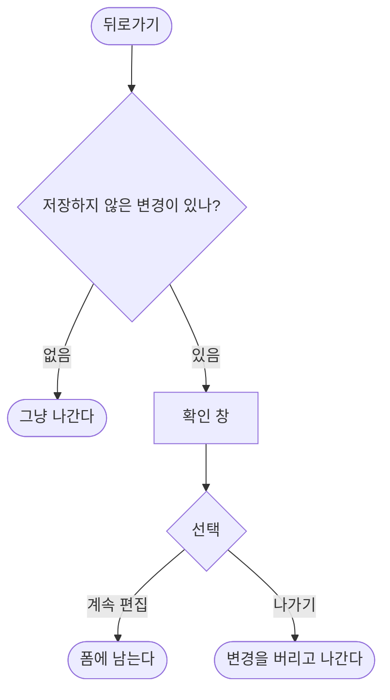

# 편집 중 뒤로가면 변경사항이 경고 없이 사라진다

## 개요

장소를 편집하고 뒤로 가면 수정 내용이 조용히 버려졌다. 사용자는 저장된 줄 알고 나가고, 다시 열어봐야 사라진 것을 안다.

저장하지 않은 변경이 있을 때만 확인을 받도록 했다. **고치는 과정에서 원인이 두 겹이라는 것이 드러났다.**

## 원인

### (1) 뒤로가기를 가로채지 않았다

`place_form_screen.dart` 에 `PopScope` 도 `WillPopScope` 도 없었다. 수정 여부와 무관하게 그냥 닫혔다.

**#97 을 고친 뒤에 더 쉽게 발생하게 됐다.** 그전에는 뒤로가기가 먹지 않아 나갈 수 없었고, 지금은 잘 나가진다.

### (2) 입력이 바뀌어도 다시 그리지 않았다

`PopScope` 를 붙였는데도 테스트가 실패했다. 이름 필드에 `onChanged` 가 없어 텍스트를 고쳐도 리빌드되지 않았고, `canPop` 은 빌드 시점에 평가되므로 **"바꾼 것 없음"으로 남아 그냥 나가버렸다.**

```dart
TextField(
  controller: _name,
  decoration: ...,     // ← onChanged 가 없다
)
```

좌표 필드에는 `onChanged: (_) => setState(() {})` 가 있었는데 이름 필드만 빠져 있었다. **테스트를 먼저 쓰지 않았다면 이 두 번째 원인을 놓쳤을 것이다.**

## 기능 흐름



## 변경 사항

- `place_form_screen.dart`
  - `PopScope` 로 이탈을 가로챈다. `canPop` 은 변경 여부로 결정된다
  - `_hasUnsavedChanges` — 편집은 원본과 비교, 신규는 입력 여부로 판정
  - `_confirmDiscard()` — 기본 선택은 "계속 편집"
  - 컨트롤러 리스너를 한 곳에서 등록해 입력 변경을 리빌드로 잇는다
  - `_leavingAfterSave` — 저장 버튼으로 나갈 때는 묻지 않는다

## 주요 구현 내용

### 편집과 신규의 판정 기준이 다르다

편집은 **원본과 달라졌는지**를 보고, 신규는 **무언가 입력했는지**를 본다. 빈 폼을 열었다 닫는 것은 버릴 것이 없으므로 묻지 않는다.

좌표는 문자열로 비교하면 `37.4` 와 `37.40` 이 다르게 잡혀 숫자로 바꿔서 본다.

### 필드마다 onChanged 를 달지 않은 이유

컨트롤러를 한 곳에서 듣게 했다.

```dart
for (final controller in [_name, _latitude, _longitude]) {
  controller.addListener(_onFieldChanged);
}
```

필드마다 `onChanged` 를 달면 **나중에 필드를 추가할 때 또 빠뜨린다.** 이번 버그가 정확히 그렇게 생겼다.

### 기본 선택을 "계속 편집"으로 둔 이유

실수로 나가려던 사용자가 확인 창에서 또 실수로 버리는 것을 막는다.

## 검증

| 항목 | 결과 |
|---|---|
| `flutter analyze` | 이슈 없음 |
| `flutter test` | **334건 통과** (329 → 334) |

추가한 회귀 테스트 5건:

- 바꾼 것이 없으면 확인 없이 나간다 — **안 바꿨는데 묻는 것은 방해다**
- 이름을 바꾸면 확인을 받는다
- "계속 편집"을 고르면 입력이 그대로 남는다
- 신규 등록의 빈 폼은 그냥 나간다
- 신규 등록에 입력했으면 확인을 받는다

**테스트를 쓸 때 `home:` 으로 띄우면 재현되지 않는다.** route 가 하나뿐이라 `maybePop` 이 아무 일도 하지 않고 `PopScope` 콜백이 불리지 않는다. 실제 앱처럼 push 한 상태로 만들어야 한다.

## 주의사항

**시스템 뒤로가기 제스처와 앱바 화살표 모두 같은 경로를 탄다.** 라우터가 `context.pop()` 을 쓰므로 `PopScope` 가 둘 다 가로챈다.

**저장 실패 시에는 확인 창이 다시 뜬다.** `_leavingAfterSave` 는 저장이 성공했을 때만 켜지므로, 검증 오류로 저장이 막힌 뒤 뒤로가면 정상적으로 묻는다.
