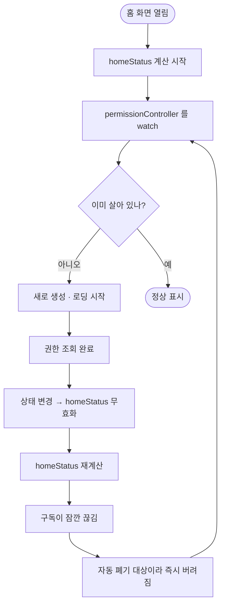

# 권한 경고 배너가 뜨지 않고 권한 조회가 무한 반복된다

## 개요

"배너를 더 눈에 띄게 해달라"는 요청에서 출발했는데, 확인해보니 **배너가 처음부터 뜨지 않고 있었다.** 원인은 Provider 두 개가 만든 무한 재계산 고리였고, 그 부작용으로 **권한 조회 채널이 초당 30회가량 불리고 있었다.**

고리를 끊어 권한 상태가 확정되게 하고, 배너를 지도 위에서 읽히도록 다시 만들었다.

## 원인

### 자동 폐기가 만든 고리



`homeStatus` 와 `permissionController` 가 **둘 다 자동 폐기(autoDispose)** 였다. `homeStatus` 가 다시 계산되는 순간 구독이 잠깐 끊기고, 그 틈에 `permissionController` 가 버려진 뒤 처음부터 다시 로딩된다.

결과적으로 권한 조회가 **영원히 "진행중"** 으로 남는다.

```dart
final reliable = ref.watch(permissionControllerProvider)
    .valueOrNull?.canAlertReliably ?? true;   // ← 항상 true
```

`?? true` 는 "모르는 상태에서 경고를 띄우지 않는다"는 의도였는데(#74), 영원히 모르는 상태가 되면서 **경고가 영영 뜨지 않는 조건**이 됐다.

### 진단 기록이 결정적이었다

추측으로는 조건을 아무리 읽어도 답이 안 나왔다. `homeStatus` 에 로그를 한 줄 넣자 바로 드러났다.

```
[home] 상태 감시=true 이어폰=false 알림신뢰=true (권한조회=진행중)
[home] 상태 감시=true 이어폰=false 알림신뢰=true (권한조회=진행중)   ← 0.03초 간격
[home] 상태 감시=true 이어폰=false 알림신뢰=true (권한조회=진행중)
```

수정 후:

```
[home] 상태 감시=true 이어폰=false 알림신뢰=false 미허용=[배터리 최적화 제외] (권한조회=완료)
```

### 배너 자체도 약했다

회색 알약에 한 줄이라 지도 위에서 묻혔고, 문구가 잘려 무엇이 문제인지 읽히지 않았다.

```
절전·다른 앱 사용 중에는 알림이 약합니다 · 눌러서 ...
```

## 변경 사항

- `permission_controller.dart` — `@riverpod` → **`@Riverpod(keepAlive: true)`**. 권한은 앱 전역 상태라 의미상으로도 맞다. 갱신은 `refresh()` 로 명시적으로 한다
- `home_status_provider.dart` — 꺼진 권한 이름 목록(`missingReliability`)을 함께 내려준다. 상태 로그 추가
- `place_map_home_screen.dart` — `_WeakAlertBanner` 재작성
- `router.dart` — 값 전달

## 주요 구현 내용

### keepAlive 가 옳은 이유

자동 폐기를 유지한 채 고치려면 `homeStatus` 쪽에서 구독을 붙잡아야 하는데, 그건 증상을 가리는 것이다. **권한 상태는 화면 하나의 수명에 묶일 값이 아니다** — 여러 화면이 읽고, 시스템 설정에서 돌아올 때마다 갱신된다. 살려두는 것이 구조에 맞다.

### 배너를 불투명하게 만든 이유

처음엔 강조색에 알파를 줘서 반투명으로 했더니 **지도의 도로와 지명이 글자 뒤로 비쳐 읽히지 않았다.** 표면색에 강조색을 섞어 불투명하게 바꿨다 — 경고 기운은 남기되 바탕은 가린다.

### 무엇이 꺼졌는지 이름으로 알린다

"알림이 약합니다"만으로는 무엇을 해야 할지 알 수 없다. 설정 화면의 항목명과 **같은 말**을 써야 사용자가 그 자리를 찾는다.

```
⚠  알림을 놓칠 수 있습니다
   배터리 최적화 제외 · 전체 화면 알림 꺼짐 — 눌러서 켜기   >
```

조사는 붙이지 않았다 — 항목 이름이 바뀔 때마다 은/는·이/가가 어긋난다.

## 검증

| 항목 | 결과 |
|---|---|
| `flutter analyze` | 이슈 없음 |
| `flutter test` | **339건 통과** (334 → 339) |
| 에뮬레이터 실동작 | 배너 표시 확인, 재계산 루프 해소 확인 |

추가한 테스트 5건은 신뢰성 권한 판정을 고정한다 — 셋 중 **하나만 꺼져도** `canAlertReliably` 가 false 이고, 그 상태에서도 `isComplete` 는 true 여야 한다(결정 006: 신뢰성 권한이 없어도 앱은 성립한다).

## 주의사항

**`?? true` 패턴은 그대로 남아 있다.** 권한 조회가 정말 오래 걸리는 기기에서는 잠깐 배너가 안 뜰 수 있다. 다만 이제 조회가 한 번에 끝나므로 그 창이 매우 짧다.

**온보딩에서 전체 화면 알림을 묻지 않는 문제는 별개다.** 설정 화면에서는 정상적으로 열리는 것을 확인했으므로 네이티브·채널은 멀쩡하고, 신뢰성 권한 3종을 연속 요청하는 온보딩 루프 쪽이 원인이다. 이 이슈에서는 다루지 않았다.
