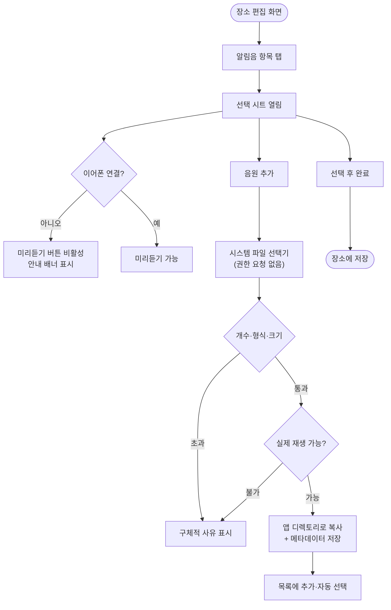
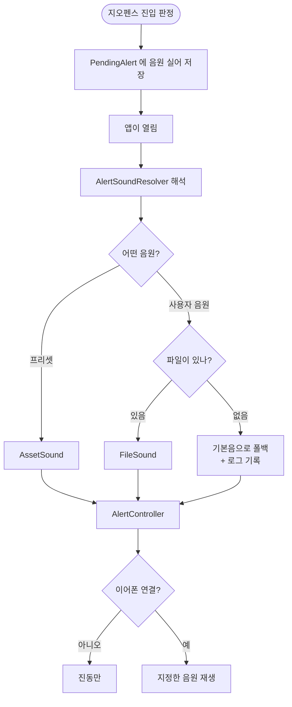

# 장소별 알림음 선택과 사용자 음원 등록

## 개요

알림음이 `assets/sounds/alert.wav` 하나뿐이라 장소를 소리로 구분할 수 없었다. 장소마다 알림음을 고르게 하고, 사용자가 자기 음원 파일을 등록해 쓸 수 있게 했다. 저장 형식은 문자열 하나(`preset:<id>` / `custom:<uuid>`)이고, 사용자 파일은 앱 전용 디렉토리로 복사해 백그라운드 재생 시점에도 접근이 보장된다.

**테스트 329건 → 417건.** `flutter analyze` 통과.

## 기능 흐름

## 변경 사항

### 공유 어휘 (core)

- `lib/core/domain/alert_sound.dart`: `AlertSound` sealed(`PresetSound`/`CustomSoundRef`)와 `SoundPreset` enum. 파싱은 절대 던지지 않고 깨진 값을 기본음으로 흡수한다
- `lib/core/audio/headphone_detector.dart`: 이어폰 판정 인터페이스
- `lib/core/audio/audio_session_headphone_detector.dart`: 허용 목록의 단일 출처. 기존에 `AlertSoundServiceImpl` 안에 있던 것을 올렸다
- `lib/core/audio/alert_sound_source.dart`: 재생 소스(`AssetSound`/`FileSound`)

### 저장소

- `lib/core/database/alert_sound_converter.dart`: `AlertSound` ↔ TEXT
- `lib/core/database/tables.dart`: `AlertPlaces.sound` 컬럼, `CustomSounds` 테이블
- `lib/core/database/app_database.dart`: schemaVersion 2 → 3, 마이그레이션
- `lib/features/sounds/data/custom_sound_file.dart`: 경로 계산 (`<applicationSupport>/sounds/<id>.<확장자>`)
- `lib/features/sounds/data/drift_custom_sound_repository.dart`: 행과 파일을 함께 다룬다

### 새 feature — `lib/features/sounds/`

| 계층 | 파일 | 역할 |
|---|---|---|
| domain | `custom_sound.dart` | 메타데이터 모델 |
| domain | `sound_validator.dart` | 상한·검증 규칙·실패 사유 |
| domain | `sound_importer.dart` | 선택 → 검증 → 등록 조율 |
| domain | `custom_sound_repository.dart` · `sound_probe.dart` · `sound_file_picker.dart` · `sound_preview_player.dart` | 인터페이스 |
| data | `file_picker_sound_source.dart` | SAF/DocumentPicker |
| data | `just_audio_sound_probe.dart` | 재생 가능성·길이 확인 |
| data | `just_audio_preview_player.dart` | 미리듣기 |
| presentation | `sound_picker_sheet.dart` | 선택 시트 |
| presentation | `sound_import_message.dart` | 실패 문구·단위 표기 |
| presentation | `sound_providers.dart` | DI |

### 발화 경로

- `lib/features/alert/domain/alert_effects.dart`: `play({volume, source})` — nullable 로 더해 기존 호출부를 깨지 않는다
- `lib/features/alert/data/alert_sound_service_impl.dart`: asset/file 분기, 허용 목록을 `core` 에 위임
- `lib/features/alert/domain/alert_controller.dart`: `AlertRequest.soundSource`, 판정 로그에 음원 추가
- `lib/app/alert_sound_resolver.dart`: `AlertSound` → `AlertSoundSource`, 파일 부재 폴백
- `lib/app/background/pending_alert.dart` · `pending_alert_store.dart` · `geofence_background_processor.dart`: 백그라운드 경로에도 음원을 싣는다

### 화면

- `lib/features/places/presentation/place_form_screen.dart`: 알림음 섹션, `onPickSound`·`onDescribeSound` 콜백, `_hasUnsavedChanges` 두 갈래 반영
- `lib/features/places/presentation/place_list_controller.dart`: `save()` 에 `sound`, 저장 로그에 `tone=`
- `lib/app/router.dart`: `_PlaceFormRoute` 로 배선

## 주요 구현 내용

**파일 경로를 DB 에 저장하지 않는다.** `id` 와 확장자만 저장하고 재생 직전에 조립한다. 절대경로를 넣으면 앱 재설치·OS 업데이트로 컨테이너 경로가 바뀌었을 때 전부 죽는다. `DiagnosticLogFile.resolve()` 와 같은 방식이다.

**원본을 참조하지 않고 복사한다.** 선택기가 준 URI 는 재부팅·재설치 후 무효가 되고, 사용자가 원본을 옮기면 소리가 사라진다. 무엇보다 재생 시점이 백그라운드라 그때 접근이 막히면 조용히 실패한다.

**파일 부재는 해석 단계에서 막는다.** 재생 단계의 실패는 "재시도 금지" 규칙(결정 007)에 걸려 진동으로 떨어지는데, 파일이 없는 것은 성격이 다른 실패다. 해석기가 미리 확인해 기본음으로 바꾼다.

**미리듣기도 이어폰 규칙을 지킨다.** 사용자가 직접 누른 것이라 예외를 두고 싶지만, 규칙에 우회 경로가 하나 생기면 그 코드가 다음에 재사용된다. 어차피 실제 알림도 이어폰 없이는 울리지 않으므로 못 들어보는 것이 정확한 재현이다.

**허용 목록을 `core/audio` 로 올렸다.** 발화와 미리듣기가 같은 판정을 써야 하는데 feature 끼리는 직접 import 할 수 없다. 목록을 복사하면 언젠가 어긋나고, 어긋나는 방향이 "새 장치가 한쪽에만 추가됨"이라 스피커로 새는 사고로 직결된다.

**권한이 하나도 안 늘어난다.** `file_picker` 패키지 매니페스트에 `uses-permission` 이 없고 `<queries>` 뿐이다. `READ_MEDIA_AUDIO` 방식이면 Play 심사에 민감 권한 선언이 하나 더 붙는다.

## 주의사항

### 실기기에서 확인해야 하는 것

- 파일 선택기가 열리고 고른 파일이 실제로 등록되는지
- 등록한 음원이 **백그라운드 도착 알림에서** 재생되는지
- 이어폰을 뺐다 꽂았을 때 시트의 미리듣기 상태가 갱신되는지
- 마이그레이션(v2 → v3)이 기존 장소를 잃지 않는지

**마이그레이션 테스트가 이 레포에 하나도 없다.** `AppDatabase.forTesting` 이 선언만 되어 있고 쓰이지 않으며, drift 스키마 덤프도 없다. 컨버터 왕복과 계약 테스트로 대신했으나 v2 → v3 자체는 실기기로만 닫힌다.

### 기존 시트 두 곳에 같은 버그가 있다

위젯 테스트가 `dispose()` 안의 `ref.read` 가 터지는 것을 잡았다. riverpod 은 unmount 시 ref 를 먼저 무효화하므로 그 시점에는 쓸 수 없고, **미리듣기가 멎지 않은 채 시트만 사라진다.**

이 작업에서는 `initState` 에서 참조를 잡아두는 것으로 고쳤으나, 같은 패턴이 남아 있다:

- `lib/features/alert/presentation/alert_volume_sheet.dart:46`
- `lib/features/alert/presentation/vibration_intensity_sheet.dart:45`

범위가 달라 손대지 않았다. 별도 이슈가 필요하다.

### 프리셋 음원이 아직 기본음 하나뿐이다

구조는 완성됐고 `SoundPreset` enum 에 한 줄, `pubspec.yaml` 의 assets 에 한 줄을 더하면 늘어난다. **CC0 또는 Public Domain 만 쓴다** — 출처는 `assets/sounds/ATTRIBUTION.md` 에 기록해야 하며, 이 파일이 나중에 분쟁 시 유일한 증거다. CC-BY 는 앱 안에 저작자 표시 화면이 필요해져 범위가 커지므로 피한다.

### 배포 시점

이 기능은 진행 중인 비공개 테스트 트랙에 올라간다. 12명·14일 카운트가 시작되기 전이라 지금 배포해도 카운트에 영향이 없다.
