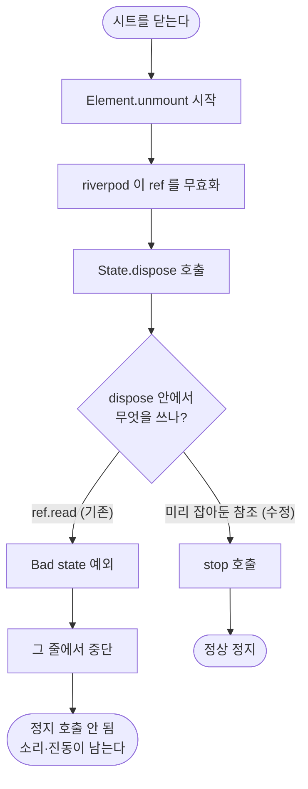

# 설정 시트를 닫아도 미리듣기 소리와 미리보기 진동이 멎지 않는다

## 개요

두 설정 시트가 `dispose()` 안에서 `ref.read` 로 정지를 불렀는데, **riverpod 은 unmount 시 `ref` 를 먼저 무효화하고 그다음 `State.dispose()` 를 부른다.** 예외가 그 줄에서 나므로 정지 호출이 아예 실행되지 않았고, 결과적으로 **화면 없이 소리·진동이 남는** 상태가 됐다 — 그 코드가 정확히 막으려던 것이다.

`initState` 에서 서비스 참조를 잡아두는 것으로 고쳤다. 이슈 #121 의 알림음 선택 시트를 만들며 위젯 테스트가 이 패턴을 잡아냈고, 같은 코드가 기존 두 곳에 남아 있었다.

## 기능 흐름



## 변경 사항

### 수정

- `lib/features/alert/presentation/alert_volume_sheet.dart`: `initState` 에서 `AlertSoundService` 참조 확보, `dispose` 에서 그것을 사용
- `lib/features/alert/presentation/vibration_intensity_sheet.dart`: `VibrationService` 에 동일 적용. 미리보기 재생부도 같은 참조를 쓰도록 정리

### 테스트

- `test/features/alert/sheet_dispose_test.dart` (신규): 두 시트를 열고 배리어를 눌러 닫은 뒤 `stop()` 이 호출되는지 확인

**이 테스트가 실제로 버그를 잡는지 검증했다.** 수정을 임시로 되돌리면 `Bad state: Cannot use "ref" after the widget was disposed.` 로 실패하고, 되돌리기를 취소하면 통과한다.

전체 417건 → **419건**, `flutter analyze` 통과.

## 주요 구현 내용

```dart
late final AlertSoundService _sound;

@override
void initState() {
  super.initState();
  _sound = ref.read(alertSoundServiceProvider);
}

@override
void dispose() {
  _sound.stop();
  super.dispose();
}
```

**`late final` 을 선언만 해두고 `initState` 에서 명시적으로 초기화한다.** 선언부에서 `= ref.read(...)` 로 초기화하면 첫 접근 시점에 평가되는데, 그 접근이 `dispose` 안이면 같은 문제가 그대로 남는다.

## 주의사항

### 왜 지금까지 드러나지 않았나

두 시트에 위젯 테스트가 없었다. 그리고 **진동 쪽은 증상이 잘 안 보인다** — `_select()` 가 짧게 울리고 곧바로 `stop()` 을 부르므로 대개 이미 멎어 있다. 시트를 아주 빠르게 닫아야 재현된다.

**소리 쪽이 실제 피해다.** 알림음 미리듣기는 반복 재생이라 시트를 닫아도 계속 난다.

### 같은 패턴을 다시 만들지 않으려면

`ConsumerState.dispose()` 안에서는 `ref` 를 쓸 수 없다. 정리해야 할 대상이 있으면 `initState` 에서 참조를 잡아둔다. 이 규칙은 `sound_picker_sheet.dart` · `alert_volume_sheet.dart` · `vibration_intensity_sheet.dart` 세 곳의 주석에 남겨뒀다.

### 함께 발견한 것 — 진동 시트가 작은 화면에서 넘친다

테스트 기본 뷰포트(800×600)에서 `RenderFlex overflowed by 63 pixels` 가 났다. 실제 휴대전화 비율(1080×2400)로 맞추면 사라진다.

세로가 짧은 기기나 큰 글꼴 설정에서는 실기기에서도 넘칠 수 있다. `_VibrationIntensitySheet` 의 `Column` 에 스크롤이 없다. **이번 범위가 아니라 손대지 않았다** — 실기기에서 확인한 뒤 필요하면 별도로 다룬다.
