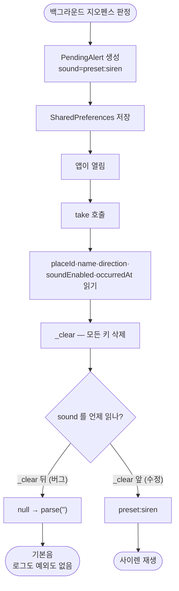

# 장소에 지정한 알림음이 백그라운드 알림에서 항상 기본음으로 재생된다

## 개요

이슈 #121 에서 `PendingAlert` 에 알림음 필드를 추가하면서, **값을 지운 뒤에 읽는 코드**를 넣었다. `PendingAlertStore.take()` 는 다른 필드를 전부 `_clear` 앞에서 지역 변수로 읽어두는데 `sound` 만 뒤에서 읽었다.

**예외도 로그도 없이 조용히 실패했다.** `AlertSound.parse('')` 가 규약대로 기본음을 돌려주기 때문이다. 그 규약 자체는 옳다 — 알림음 하나 때문에 알림 전체를 버리면 안 된다. 다만 여기서는 값이 깨진 게 아니라 **읽는 순서가 틀렸다.**

실기기 로그가 그대로 보여줬다.

```
22:31:37 [place] 장소 수정 name=소만사 출근 ... tone=preset:siren
23:03:20 [alert] 오디오 판정 이어폰=true 장소설정=true 결과=headphones 음원=assets/sounds/alert.wav
```

## 기능 흐름



## 변경 사항

### 수정

- `lib/app/background/pending_alert_store.dart`: `_keySound` 를 다른 필드와 함께 `_clear` **앞에서** 읽도록 이동. 왜 앞에서 읽어야 하는지 주석으로 남김

### 테스트

- `test/app/pending_alert_store_test.dart` (신규, 10건): 저장·복원 왕복, 모든 프리셋 왕복, 사용자 음원 왕복, 두 번째 take 는 비어 있음, 알림음 키도 함께 지워짐, 키 없음(구버전 호환), 깨진 값, 방향 깨짐

**수정 전에 3건이 실패하는 것을 확인한 뒤 고쳤다.** 테스트가 이 버그를 실제로 잡는다는 증거다.

전체 422건 → **432건**.

## 주요 구현 내용

```dart
final occurredAtRaw = prefs.getString(_keyOccurredAt);
// **_clear 앞에서 읽는다** (이슈 #125). 뒤에서 읽으면 이미 지워진
// 값을 보게 되고, 파서가 규약대로 기본음으로 흡수해 예외도 로그도
// 없이 장소별 알림음이 통째로 사라진다.
final soundRaw = prefs.getString(_keySound);

await _clear(prefs);
...
sound: AlertSound.parse(soundRaw ?? ''),
```

**필드 하나가 아니라 왕복 전체를 테스트한다.** 다음에 필드를 더할 때 같은 실수가 반복될 수 있으므로, 개별 값이 아니라 저장한 것이 전부 살아 돌아오는지를 본다.

## 주의사항

### 같은 패턴이 다른 곳에는 없다

`lib/` 전체에서 `remove()` 뒤에 `prefs.get*()` 을 호출하는 함수를 검색해 확인했다. 이 파일이 유일했다.

### 왜 이 버그가 배포까지 갔나

**`PendingAlertStore` 에 테스트가 하나도 없었다.** 다른 저장소(`prefs_alert_volume_store` 등)에는 왕복 테스트가 있는데 여기만 비어 있었고, 이슈 #121 에서 이 파일을 고치면서도 테스트를 넣지 않았다.

**로그도 도움이 안 됐다.** 파서가 조용히 기본음으로 흡수하도록 설계됐기 때문이다. 그 설계는 유지한다 — 알림이 멎는 것보다 낫다 — 대신 테스트로 막는다.

### 영향 범위

**백그라운드로 오는 모든 알림.** 이 앱의 알림은 대부분 그 경로다(#93 하이브리드 감시). 즉 이슈 #121 의 장소별 알림음이 사실상 동작하지 않았다.

포그라운드에서 앱을 켜둔 채 진입하는 경우는 별개 경로라 정상이었다.

### 실기기에서 다시 확인해야 한다

수정이 코드 수준에서는 테스트로 닫혔지만, **실제로 사이렌이 울리는지는 기기에서 봐야 한다.** 재현 절차는 이슈 본문에 적어뒀다.
