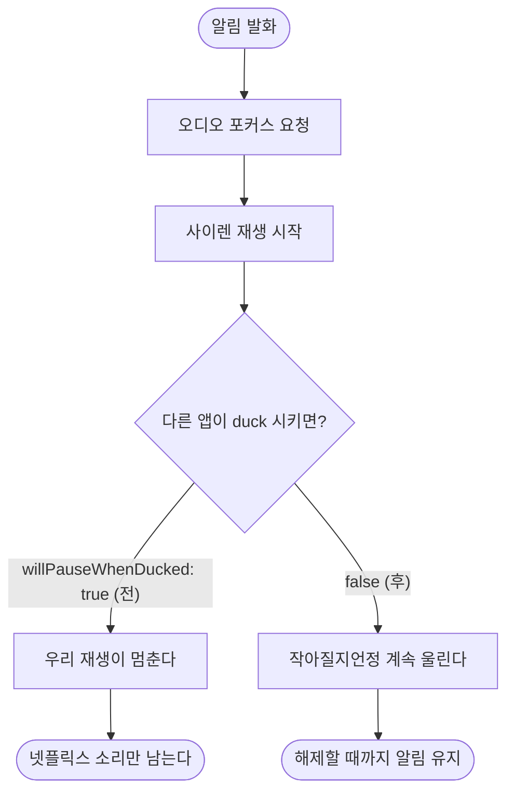

# 다른 앱이 소리를 내고 있으면 알림음이 0.5초 만에 멈춘다

## 개요

넷플릭스 재생 중 도착 알림이 울렸는데 **알림음만 잠깐 나다 사라지고 넷플릭스 소리가 계속됐다.** 오버레이와 진동은 정상이었다.

원인은 `AudioSessionConfiguration.speech()` 프리셋의 `androidWillPauseWhenDucked: true` 였다. 알림 전용 세션 설정으로 교체했다.

**작업 중 `usage: alarm` 으로 올렸다가 되돌렸다** — 스피커 유출 위험 때문이다. 그 판단이 이 작업에서 가장 중요한 부분이다.

## 기능 흐름



## 변경 사항

### 수정

- `lib/features/alert/data/alert_sound_service_impl.dart`
  - `speech()` 프리셋 대신 알림 전용 `alertSessionConfiguration` 사용
  - `setActive()` 반환값 확인 후 로그 (`오디오 포커스 획득/거부`)
  - `interruptionEventStream` 구독 — 중단 사실을 기록

| 항목 | 전 | 후 |
|---|---|---|
| `willPauseWhenDucked` | true | **false** |
| `focusGainType` | `gain` | `gainTransient` |
| `contentType` | `speech` | `sonification` |
| `usage` | `media` | **`media` 유지** |

### 테스트

- `test/features/alert/alert_audio_session_test.dart` (신규, 6건)

전체 475건 → **481건**.

## 주요 구현 내용

**`willPauseWhenDucked: false` 가 핵심이다.** 알림은 ducked 되어도 계속 울려야 한다 — 작아질지언정 멈추면 사용자가 내릴 정거장을 놓친다.

**다른 앱을 멈추는 것은 포커스 타입이 한다.** `gainTransient` 로 요청하면 상대가 `AUDIOFOCUS_LOSS_TRANSIENT` 를 받아 일시정지하고, 우리가 놓으면 재개된다. `gain` 은 영구 점유라 알림을 꺼도 넷플릭스가 돌아오지 않는다.

## 주의사항

### `usage: alarm` 을 쓰지 않는다 — 되돌린 판단

우선순위를 높이려고 알람 용도로 선언했다가 되돌렸다.

**Android 는 알람·벨소리 계열을 "놓치면 안 되는 소리"로 취급해, 이어폰이 연결돼 있어도 스피커로 함께 내보내는 기기가 있다.** 제조사 커스터마이징에서 흔하다. 이 앱에서 그것은 존재 이유를 잃는 사고다 (CLAUDE.md 금지 2).

그리고 우선순위는 `usage` 가 아니라 포커스 타입이 만든다. **유출 위험을 살 이유가 없었다.**

`test/features/alert/alert_audio_session_test.dart` 가 `usage == media` 를 검사한다 — 나중에 같은 시도를 하면 그 테스트가 막는다. 결정 배경은 `docs/10-DECISIONS.md` 032.

### 실기기 검증 필수

오디오 포커스는 자동 테스트로 확인할 수 없다. 설정 값만 고정했고 실제 동작은 기기에서 봐야 한다.

**확인 절차** — 넷플릭스·유튜브로 소리를 재생한 채(이어폰 연결) 알림이 울리는 장소로 이동한다. 알림음이 다른 앱을 멈추고 **해제할 때까지 계속 울려야 한다.** 그리고 알림을 끄면 원래 앱이 재개되어야 한다.

진단 기록에 이 줄들이 새로 남는다.

```
[alert] 오디오 포커스 획득 (거부여도 재생은 시도한다)
[alert] 오디오 중단 시작 유형=duck
[alert] 오디오 중단 종료 유형=duck
```

**이 기록이 없어서 원인을 코드에서 찾아야 했다.** 다음에 같은 일이 나면 로그만으로 보인다.
