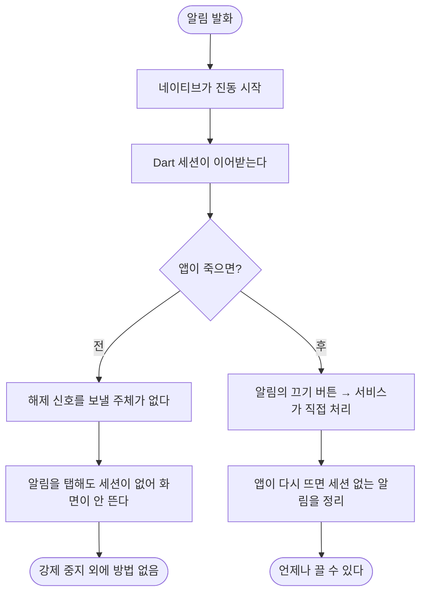

# 앱이 죽으면 울리는 알림을 끌 수 없다

## 개요

알림이 울리는 중 앱 프로세스가 죽으면 **진동은 계속되는데 끌 방법이 없다.** 사용자가 앱 설정에서 강제 중지해야 했다.

진동을 시작하는 주체(네이티브 감시 서비스)와 멈추는 주체(Dart 세션)가 다른데, 앱이 죽으면 후자가 사라지기 때문이다.

## 기능 흐름



## 변경 사항

### 네이티브

- `AlertWatchService`
  - 도착 알림에 **"알림 끄기" 액션** 추가
  - `ACTION_DISMISS_ALERT` 신설 — 진동을 멈추고 **알림까지 지운다**
  - `alertingNow` 를 companion 에 노출 — 앱이 프로세스 밖에서 상태를 볼 수 있다
- `MainActivity` — `isAlerting` 채널 메서드

### Dart

- `AlertWatchService` 인터페이스에 `isAlerting()` 추가
- `app.dart` — 앱이 뜰 때 `_stopOrphanedAlert()` 로 세션 없는 알림 정리

### 테스트

- `test/app/alert_watch_channel_test.dart` (신규, 6건)

## 주요 구현 내용

**끄기 버튼은 서비스로 직접 간다.**

```kotlin
PendingIntent.getService(this, REQ_STOP_ALERT, Intent(...).setAction(ACTION_DISMISS_ALERT), ...)
```

`getService` 라 **앱 프로세스와 무관하게** 서비스가 받는다. Dart 를 거치지 않으므로 앱이 죽어 있어도 멈춘다.

**`ACTION_STOP_ALERT` 와 의미를 나눴다.** 기존 액션은 "Dart 세션이 이어받는다"는 뜻이라 알림을 남겨두는데, 사용자가 끈 경우는 알림도 지워야 한다 — 진동만 멈추고 알림이 남으면 사용자는 여전히 "이걸 어떻게 없애지"에 머문다.

**`isAlerting()` 은 실패하면 `false` 로 본다.** `true` 로 틀리면 멀쩡히 울리는 알림을 앱이 꺼버린다 — 도착 알림이 조용해지는 것이 이 앱에서 가장 나쁜 결과다. 반대로 틀리면 정리를 한 번 건너뛸 뿐이다.

## 주의사항

### 코드 주석이 문제를 이미 알고 있었다

```kotlin
// **스와이프로 지워지지 않는다** (이슈 #84 와 같은 이유).
// 울리는 중에 알림을 잃으면 끌 방법이 사라진다.
.setOngoing(ongoing)
```

**"끌 방법이 사라진다"고 적어놓고 정작 끄는 수단은 안 넣었다.** 알림을 유지하기만 했다.

### 왜 앱이 죽었는지는 별개다

실기기 로그에 크래시 흔적이 없다. OS 메모리 회수일 수도, 화면 전환 중 예외일 수도 있다. **이 수정은 원인과 무관하게 성립한다** — 앱은 언제든 죽을 수 있고, 그때도 알림은 끌 수 있어야 한다.

### 실기기 검증 필수

Kotlin 계층이 핵심이라 자동 테스트로 닫히지 않는다.

1. 알림이 울리는 상태에서 앱을 강제 종료한다
2. 알림의 **"알림 끄기"** 버튼을 누른다
3. 진동이 멈추고 알림이 사라지는지 확인한다
4. 앱을 다시 열었을 때 `[app] 세션 없이 울리는 알림 발견 — 정리한다` 가 남는지 확인한다
