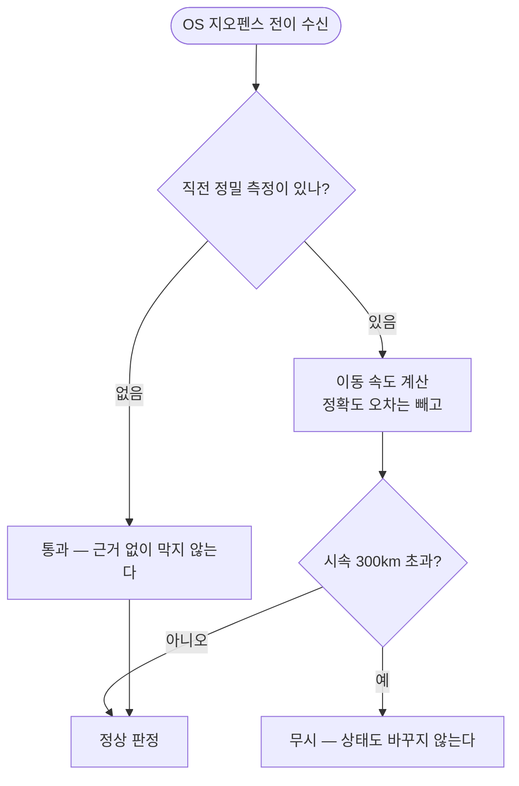

# 반경 밖인데 도착 알림이 울린다

## 개요

반경 밖에 있는데 도착 알림이 울렸다. **OS 지오펜스가 약 1km 튄 좌표를 줬고, 앱이 그것을 검증 없이 믿었다.**

실기기 로그에 왕복이 그대로 남았다.

| 시각 | 좌표 | 장소까지 |
|---|---|---|
| 23:00:59 | 37.41246, 127.09990 | 약 1,250m (반경 1,100m **밖**) |
| 23:01:05 | 37.40857, 127.08960 | 약 356m (**안**) ← 알림 발화 |
| 23:01:10 | 37.41243, 127.09960 | 약 1,250m (다시 밖) |

**6초 만에 약 1km = 시속 500km 이상.** 5초 뒤 스스로 되돌아간 것이 가짜였다는 증거다.

## 기능 흐름



## 변경 사항

### 신규

- `lib/features/geofence/domain/position_plausibility.dart` — 속도 판정 순수 함수
- `AlertSuppression.implausibleJump` (`위치튐`)

### 수정

- `GeofenceBackgroundProcessor`
  - OS 전이·정밀 측정 **양쪽에** 속도 검증
  - 마지막 정밀 측정 보관 (`_lastSample`)
  - **판정 직렬화** — 두 경로가 같은 상태를 동시에 읽는 경쟁 조건 제거

### 테스트

- `test/features/geofence/position_plausibility_test.dart` (신규, 10건)

전체 465건 → **475건**.

## 주요 구현 내용

**정확도로는 막을 수 없었다.** 튄 좌표의 정확도가 `44m` 로 멀쩡해 보였다 — 문제는 정확도가 아니라 좌표 자체가 순간이동한 것이다.

**정확도 오차만큼은 이동으로 치지 않는다.**

```dart
final moved = math.max(0.0, gap - (from.accuracyMeters + accuracyMeters));
```

GPS 오차 범위 안의 차이를 속도로 계산하면 가만히 있어도 빠르게 움직이는 것으로 잡힌다.

**임계는 시속 300km** — KTX 최고 속도(305km/h)를 겨우 넘는 값이라 실제 이동은 통과하고 측위가 튄 경우만 걸린다.

**판정할 수 없으면 통과시킨다.** 직전 측정이 없거나(프로세스가 막 뜸) 두 측정이 거의 동시면 막지 않는다 — **놓치는 쪽이 가짜로 우는 쪽보다 나쁘다.**

### 중복 발화는 경쟁 조건이었다

```
.405753  상태 전이 outside → inside  acc=44m    ← 정밀 경로
.406224  상태 전이 outside → inside  (acc 없음) ← OS 전이 경로
```

0.5ms 차이로 둘 다 같은 상태를 읽었다. 앞엣것이 저장하기 전에 뒤엣것이 읽어, 각각 알림을 냈다.

**판정을 직렬화해 해결했다.** 판정은 "직전 상태"에 의존하므로 겹쳐 돌면 그 전제가 깨진다. 로거가 쓰는 것과 같은 방식이다.

## 주의사항

### 튄 좌표를 기준으로 삼지 않는다

정밀 경로에서 튐이 걸리면 `_lastSample` 을 갱신하지 않는다. 튄 좌표를 기준으로 삼으면 다음 **진짜** 좌표가 도리어 튐으로 걸린다.

### 상태도 바꾸지 않는다

가짜 좌표로 `inside` 가 되면 다음 진짜 진입이 "이미 안에 있음"으로 걸러진다. 그래서 전이 자체를 버린다.

### 실기기 검증

의도적 재현이 어렵다 — OS 측위가 튀는 순간에 달려 있다. 로그에서 `사유=위치튐` 이 나오는지 관찰한다.

```
[engine] 판정 place=01a07917 → 알림없음 (사유=위치튐 542km/h)
```

**이번에도 로그가 원인을 직접 말해주지 못해 좌표를 눈으로 비교했다.** 이제 튐을 걸렀다는 사실이 기록된다.
