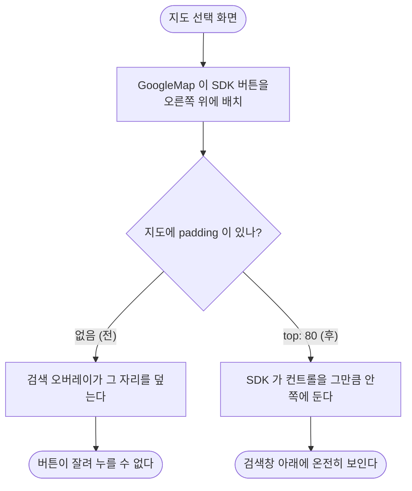

# 지도 선택 화면에서 내 위치 버튼이 검색창에 가려진다

## 개요

장소를 고르는 지도 화면에서 **오른쪽 위 "내 위치" 버튼이 검색창에 잘려** 누를 수 없었다. 지금 위치로 지도를 되돌리는 유일한 수단이라, 처음 화면이 엉뚱한 곳을 비추면 손으로 끌어서 찾아가야 했다.

## 기능 흐름

## 변경 사항

- `lib/features/places/presentation/place_map_picker_screen.dart`
  - `GoogleMap` 에 `padding: EdgeInsets.only(top: _searchOverlayHeight)`
  - `_searchOverlayHeight = 80` 상수 신설

## 주요 구현 내용

**높이 80은 실측값이다** — 상하 패딩(`AppSpacing.sm` × 2 = 32) + 입력 필드(48).

**실시간으로 따라가지 않는다.** 검색 결과가 펼쳐질 때마다 지도를 다시 배치하면 버벅인다. 접힌 높이로 고정하며, 결과가 떠 있는 동안은 사용자가 검색 중이라 버튼이 가려도 문제가 되지 않는다.

홈 화면이 시트에 대해 같은 판단을 이미 하고 있다 (이슈 #98) — 거기서도 시트 높이를 실시간으로 따라가지 않고 접힌 높이로 고정한다.

**검색 서비스가 없는 빌드에서는 패딩을 주지 않는다.** 지도 키가 없으면 오버레이 자체가 없어서 덮을 것도 없다.

## 주의사항

**실기기에서 눈으로 확인해야 한다.** 기기·해상도에 따라 SDK 버튼 크기가 달라질 수 있다. 80이 모자라면 버튼이 여전히 걸리고, 지나치면 화면 가운데로 내려온다.

같은 문제가 홈 화면에도 있었다는 점을 감안하면, **지도를 올리는 새 화면을 만들 때마다 확인해야 하는 항목**이다.
