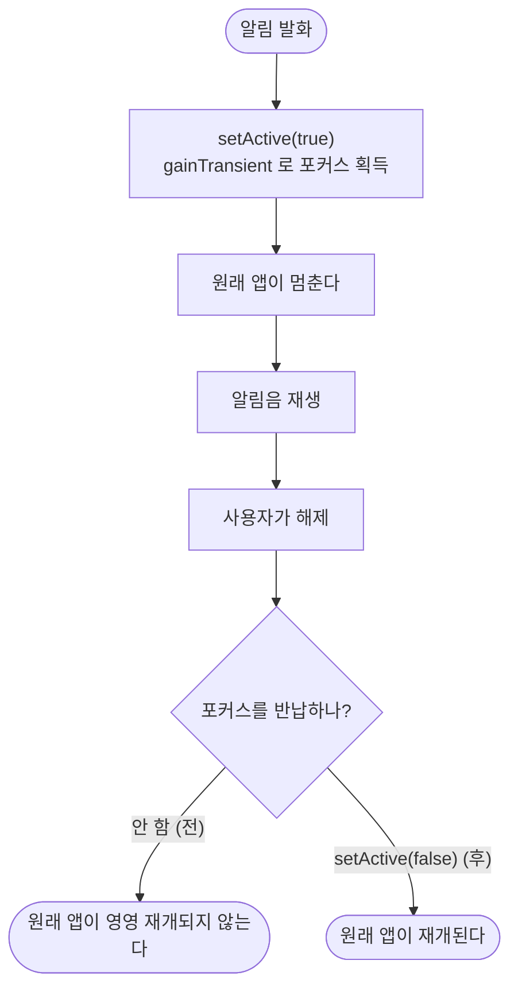

# 알림을 꺼도 오디오 포커스를 반납하지 않아 원래 앱이 재개되지 않는다

## 개요

알림을 꺼도 **넷플릭스·음악 앱이 다시 시작되지 않았다.** `setActive(true)` 는 있는데 `setActive(false)` 가 코드 어디에도 없었다.

이슈 #129 에서 `gain`(영구 점유) 대신 `gainTransient`(일시 대여)를 고른 이유가 **"알림이 끝나면 원래 앱이 재개되게"** 였는데, 빌리기만 하고 반납하지 않아 그 효과가 없었다.

## 기능 흐름



## 변경 사항

- `lib/features/alert/data/alert_sound_service_impl.dart` — `stop()` 에서 세션 비활성화
- `test/features/alert/alert_sound_focus_test.dart` (신규, 2건)

## 주요 구현 내용

```dart
Future<void> stop() async {
  try {
    await _player?.stop();
  } on Object {}

  // gainTransient 는 "잠깐 빌린다"는 뜻이라 놓아야 원래 앱이 재개된다
  try {
    final session = await AudioSession.instance;
    await session.setActive(false);
  } on Object {}
}
```

**순서가 중요하다** — 플레이어를 먼저 멈추고 세션을 놓는다. 반대면 재생 중에 포커스를 놓는 것이 된다.

**반납 실패는 삼킨다.** 해제는 무슨 일이 있어도 완료되어야 한다 — 여기서 예외가 새면 진동이 멎지 않고, 이슈 #130 에서 겪은 "끌 수 없는 알림"과 같은 상태가 된다.

## 주의사항

### 포커스 반납은 단위 테스트로 확인할 수 없다

`setActive` 는 `Platform.isAndroid` 분기 안에서 `AndroidAudioManager`(`com.ryanheise.android_audio_manager` 채널)를 부르는데, **테스트는 데스크톱 VM 에서 돌아 그 분기에 들어가지 않는다.** 채널을 모킹해도 호출이 오지 않는다.

그래서 테스트는 **해제가 예외 없이 완료되는지**만 지킨다. 반납 자체는 실기기 항목이다.

### 실기기 확인 절차

1. 넷플릭스·음악으로 소리를 재생한다 (이어폰 연결)
2. 알림이 울리는 장소로 이동 — 원래 앱이 멈추고 알림음이 울린다
3. 알림을 끈다
4. **원래 앱이 재개되는지 확인한다**
