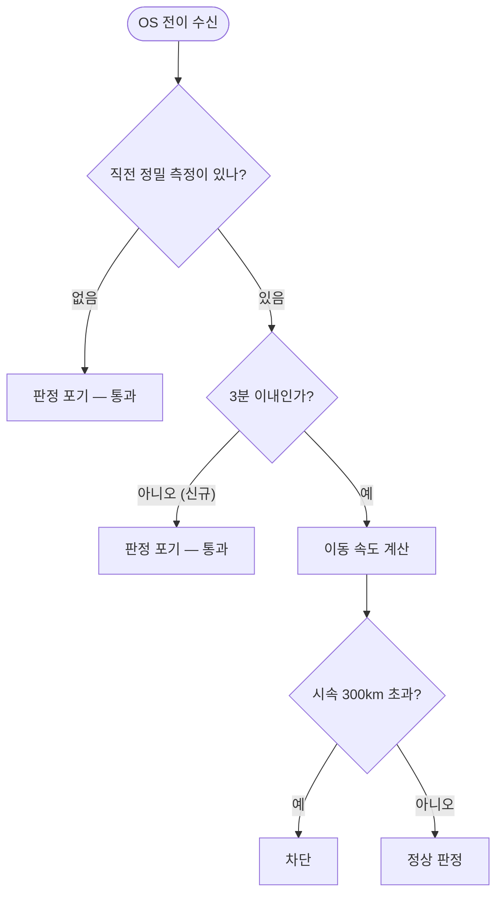

# 정밀 감시가 꺼지면 위치 튐 검증이 무력화된다

## 개요

이슈 #131 의 위치 튐 차단이 **특정 구간에서 아무것도 잡지 못했다.** 기준으로 삼는 좌표가 오래되면 어떤 튐도 느린 이동으로 계산되기 때문이다.

## 기능 흐름

## 변경 사항

- `lib/features/geofence/domain/position_plausibility.dart` — `maxSampleAge = 3분` 추가
- `test/features/geofence/position_plausibility_test.dart` — 경계값 2건 추가

전체 481건 → **485건**.

## 주요 구현 내용

**정밀 감시는 배터리 보호를 위해 30분 뒤 꺼진다** (`PRECISE_TIMEOUT_MS`). 그 뒤로는 `_lastSample` 이 갱신되지 않는다.

| 상황 | 계산 | 결과 |
|---|---|---|
| 6초 전 좌표에서 1km 튐 | 600km/h | 차단 (의도대로) |
| **30분 전 좌표에서 5km 튐** | **10km/h** | **통과** — 검증이 무의미 |

시간이 길수록 속도가 낮게 나오므로, 기준이 오래될수록 느슨해지다가 결국 아무것도 잡지 못한다.

**3분을 넘으면 판정을 포기한다.** 정밀 감시가 도는 동안에는 몇 초마다 갱신되므로 이 상한에 걸리지 않는다 — 감시가 꺼진 구간에서만 검증을 포기하는 셈이고, 그때는 애초에 판단 근거가 없다.

**근거 없이 막지 않는다**는 #131 의 원칙과 같다. 놓치는 쪽이 가짜로 우는 쪽보다 나쁘다.

## 주의사항

### 테스트 작성 중 계산 착오가 있었다

"3분 직전은 판정한다"를 확인하면서 3분에 5km(시속 100km)를 쓰고 임계 300을 넘을 것으로 기대했다. 실제로는 통과하는 값이다. 20km(시속 400km)로 고쳤다.

**경계값 테스트는 숫자를 직접 계산해서 확인해야 한다** — 의도만으로 쓰면 이런 착오가 남는다.

### 감시가 꺼진 구간은 여전히 무방비다

3분 상한은 **잘못된 차단을 막는 것**이지 그 구간에서 튐을 잡아주지는 않는다. 정밀 감시 없이 OS 전이만 오는 상황에서는 검증할 기준 자체가 없다.

이슈 #133 에서 실사용 로그를 모을 때 이 구간의 가짜 알림 빈도도 함께 본다.
