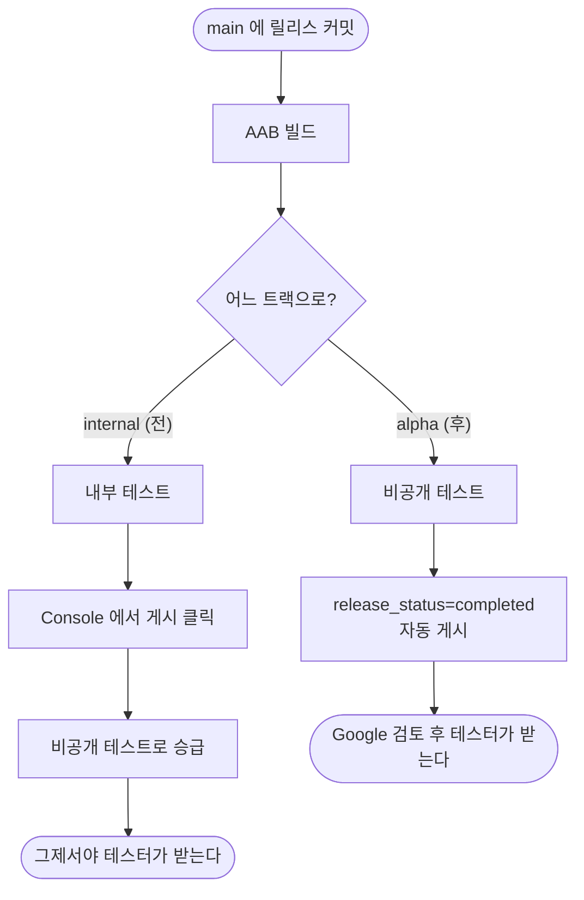

# 배포가 비공개 테스트 트랙으로 가도록 트랙을 alpha 로 바꾼다

## 개요

**배포해도 테스터에게 가지 않았다.** Play Console 에서 사람이 게시를 눌러야 했고, 그마저도 트랙이 달라 비공개 테스터에게는 닿지 않았다.

두 설정을 함께 바꿔 **배포하면 테스터가 받는 상태**로 만들었다.

## 기능 흐름

## 변경 사항

- `android/fastlane/Fastfile.playstore`
  - `track: "internal"` → `"alpha"`
  - `release_status: "draft"` → `"completed"`
  - 레인 설명·출력 문구를 실제 동작에 맞춤
- `.github/workflows/PROJECT-FLUTTER-ANDROID-PLAYSTORE-CICD.yaml`
  - 단계 이름과 성공 안내 문구 갱신 (`내부 테스트` → `비공개 테스트`)

## 주요 구현 내용

**둘을 함께 바꿔야 의미가 있었다.** 게시만 자동으로 해도 트랙이 `internal` 이면 내부 테스터에게만 가고, 비공개 테스트 테스터는 못 받는다. 반대로 트랙만 옮기고 `draft` 로 두면 여전히 게시를 눌러야 한다.

**`completed` 를 쓸 수 있는 조건이었다.** Fastfile 주석이 "첫 릴리스가 승인된 뒤 `completed` 로 변경하여 자동 배포가 가능하다"고 적어놨고, 이 앱은 v1.11.0 이 이미 비공개 테스트에서 활성이라 그 단계를 넘긴 상태였다.

**`alpha` 가 맞는 식별자인지는 배포로 확인했다.** Play Console 에서 비공개 테스트를 처음 만들면 기본 트랙 이름이 "Alpha" 이고 식별자가 `alpha` 인데, 이 앱의 트랙 이름이 정확히 그것이었다. v1.15.0 배포가 성공하면서 확정됐다.

**안내 문구도 함께 고쳤다.** 워크플로우 로그에 "Console 에서 게시하세요" 같은 낡은 안내가 남아 있으면 다음에 로그를 읽는 사람이 헷갈린다.

## 주의사항

### 자동 게시는 되돌릴 수 없다

올라가는 순간 테스터에게 배포되므로 **잘못된 빌드는 새 버전으로 덮는 수밖에 없다.** 지금까지는 Console 에서 한 번 걸러볼 수 있었다.

테스터가 12명 규모라 감당 가능하다고 봤지만, **프로덕션 트랙으로 옮길 때는 `draft` 로 되돌리는 것을 검토해야 한다.** 코드 주석에 그 판단을 남겼다.

### 검토는 여전히 거친다

`completed` 는 "게시 버튼을 대신 누르는 것"이지 심사를 건너뛰는 것이 아니다. Google 검토를 통과한 뒤에 테스터의 Play 스토어에 업데이트가 뜬다.

### 다른 레인은 그대로다

`promote_to_beta` 는 여전히 `internal` → beta 를 가정한다. 지금 배포가 alpha 로 가므로 **그 레인을 쓰려면 함께 고쳐야 한다.** 현재 쓰이지 않아 두었다.
