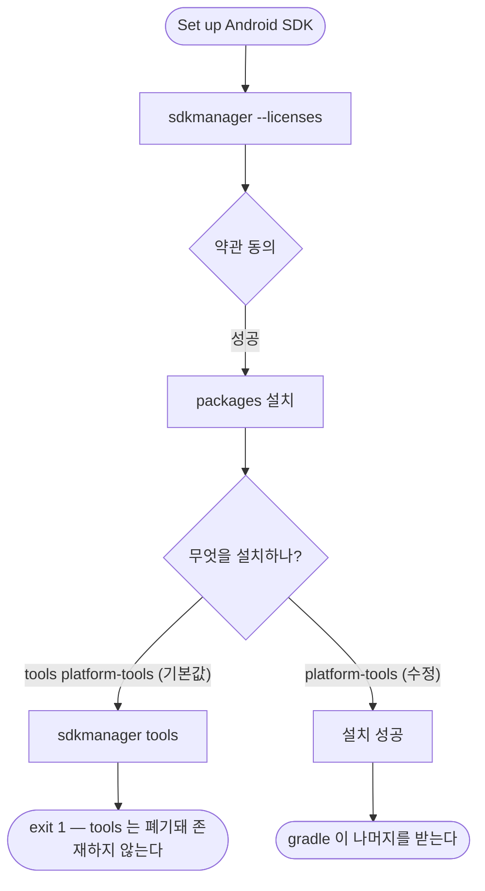

# APK 빌드가 Android SDK 설치 단계에서 실패한다

## 개요

GitHub 릴리스에 붙는 APK 를 만드는 워크플로우가 `Set up Android SDK` 단계에서 죽었다. **액션이 폐기된 `tools` 패키지를 설치하려 한 것이 원인**이다.

같은 커밋으로 도는 Play Store 워크플로우는 정상이었고, 직전 배포(v1.14.1)에서는 이 워크플로우도 성공했다 — 러너 이미지가 갱신되며 드러났다.

## 기능 흐름



## 변경 사항

- `.github/workflows/PROJECT-FLUTTER-ANDROID-SYNOLOGY-CICD.yaml`
  - `setup-android` 에 `packages: "platform-tools"` 명시
  - 앞서 임시로 껐던 `push` 자동 트리거 복구

## 주요 구현 내용

**로그가 정확히 짚어준다.**

```
[command] sdkmanager --licenses   ← 성공
[command] sdkmanager tools        ← 여기서 exit 1
```

`android-actions/setup-android@v3` 의 `packages` 기본값이 `tools platform-tools` 다. `tools` 는 Android SDK 에서 폐기·제거된 구성요소라 최신 `sdkmanager` 로는 설치할 수 없다.

이전 러너 이미지의 구버전 SDK 에는 아직 남아 있어서 통과했고, 이미지가 갱신되자 드러났다.

**`platform-tools` 만 남긴다.** platforms·build-tools 는 gradle 이 빌드 시점에 필요한 버전을 알아서 받으므로 액션이 미리 깔 이유가 없다.

## 주의사항

### 처음 판단이 틀렸다

로그 앞부분에 "Android SDK Preview... you must agree to the following terms" 가 보여서 **약관 동의 실패로 추정**했다. 실제로는 `--licenses` 단계가 성공했고 그 문구는 그 단계의 정상 출력이었다.

**증상 근처의 텍스트가 아니라 실패한 명령을 찾아야 했다.** `sdkmanager` 호출 순서를 훑고 나서야 `tools` 가 범인임이 드러났다.

### 배포 전에 수동 실행으로 검증했다

워크플로우 수정은 배포해 봐야 결과를 아는 종류라, develop 에서 `workflow_dispatch` 로 먼저 돌렸다. **SDK 설치를 통과하고 APK 까지 생성되는 것을 확인한 뒤** 자동 트리거를 되살렸다.

### APK 가 왜 필요한가

Play Store 배포와는 별개 경로지만, **배포된 빌드에 무엇이 들어갔는지 직접 열어보는 유일한 수단**이다. 실제로 이 경로로 두 번 잡았다.

- 프리셋 음원이 빠진 채 배포된 것 (이슈 #121)
- 권한이 늘지 않았는지 매니페스트 확인 (이슈 #121·#129)
