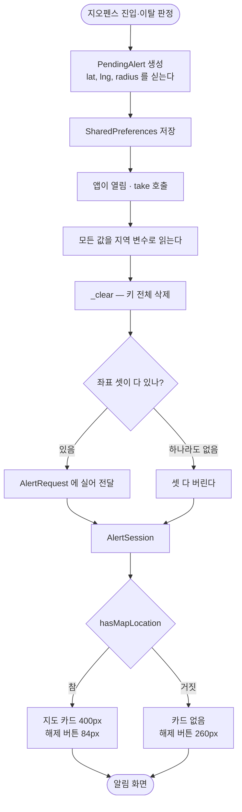

# 알림 화면 지도 카드 · 내 위치 · 지도 스타일 · Pretendard

## 개요

알림 화면이 장소명과 거대한 해제 버튼뿐이라 "어디에 도착했는지" 알 수 없다는 요청에서 시작해, 네 가지를 함께 처리했다. 가운데에 장소 지도 카드를 넣고, 거기에 내 위치를 표시하고, 지도 스타일이 조용히 실패하던 문제에 감지 장치를 달고, 앱 전체 폰트를 Pretendard 로 바꿨다.


**테스트 485건 → 496건.** `flutter analyze` 통과. 에뮬레이터(API 36) 실측 완료.

| 이슈 | 커밋 | 내용 |
|---|---|---|
| #142 | `a7d56aa` | 지도 카드 + 해제 버튼 축소 + 터치 영역 확장 |
| #144 | `c6cf487` | 지도 카드에 내 위치 표시 |
| #143 | `40eb4f3` | 지도 스타일 재적용 + 실패 기록 |
| #145 | `1dd3b5c` | Pretendard 폰트 |

## 기능 흐름

좌표가 알림 화면까지 오는 경로다. **이 경로가 이번 작업의 실제 무게중심이다** — 화면은 그 끝에 달린 것뿐이다.



**읽기가 `_clear` 보다 위에 있다는 것이 핵심이다.** 순서가 뒤집히면 이미 지워진 값을 보게 되고, 지도가 예외도 로그도 없이 사라진다.

## 변경 사항

### 공유 (core)

- `lib/core/map/radius_zoom.dart` (신규): 반경에 맞는 줌 단계. 장소 선택·지도 홈에 **같은 표가 복사되어 있던 것**을 합쳤다
- `lib/core/map/map_style_guard.dart` (신규): 지도 생성 직후 다크 스타일을 다시 적용하고 결과를 기록
- `lib/core/theme/app_typography.dart`: `alertTime` 추가 (30px)
- `lib/core/theme/app_theme.dart`: `fontFamily: 'Pretendard'`

### 좌표 경로

- `lib/features/alert/domain/alert_controller.dart`: `AlertRequest` 에 좌표·반경
- `lib/features/alert/domain/alert_session.dart`: 같은 필드 + `hasMapLocation`
- `lib/app/background/pending_alert.dart`: 저장 형식
- `lib/app/background/pending_alert_store.dart`: 저장·복원. **`_clear` 앞에서 읽는다**
- `lib/app/background/geofence_background_processor.dart`: 장소 좌표를 싣는다
- `lib/app/pending_alert_launcher.dart` · `lib/app/router.dart`: 전달

### 화면

- `lib/features/alert/presentation/alert_screen.dart`: 지도 카드, 해제 버튼 높이 분기, 터치 영역 확장, 모서리 마스크
- `lib/features/places/presentation/place_map_home_screen.dart` · `place_map_picker_screen.dart`: 공용 줌 함수 사용, 스타일 감지 연결

### 에셋

- `assets/fonts/pretendard/`: Regular·Medium·SemiBold·Bold 넷 (6.0MB) + `LICENSE.md`

### 테스트

- `test/app/pending_alert_store_test.dart`: 좌표 왕복 5건 (구버전 호환, 반쪽 좌표 폐기, 삭제 확인 포함)
- `test/features/alert/alert_screen_map_test.dart` (신규): 6건

## 주요 구현 내용

**보이는 크기와 눌리는 범위를 분리했다.**

```dart
GestureDetector(
  behavior: HitTestBehavior.opaque,
  onTap: onPressed,
  child: Padding(
    padding: const EdgeInsets.all(AppSpacing.md),
    child: SizedBox(height: height, child: FilledButton(...)),
  ),
)
```

해제 버튼을 340px 에서 84px 로 줄였다. 그 버튼은 버스에서 화면을 보지 않고 엄지로 누르는 용도라, 그냥 줄이면 급할 때 빗나간다. 주변 여백까지 탭을 받아 실제 범위를 넓혔다 — 여백에는 누를 것이 없어 오작동 위험이 없다.

**지도는 조작을 받지 않는다.** `IgnorePointer` 로 감싸고 제스처를 전부 껐다. 해제 버튼 근처에 새 터치 타겟을 만들면 급할 때 엉뚱한 것을 누른다.

**`ClipRRect` 가 네이티브 지도 뷰에는 먹지 않는다.** 실기기에서 직사각형으로 남는 것을 보고 알았다. 지도는 Flutter 가 그리는 레이어가 아니라 그 위에 합성되는 별도 표면이다. 모서리 바깥을 배경색으로 덮는 `CustomPainter` 로 우회했다.

**배경 블러 안을 버린 것이 결과적으로 이득이었다.** 처음에는 지도를 배경에 깔고 블러를 거는 안을 검토했는데, 목업에서 확인하니 정보와 어둠막에 묻혀 지도가 보이지 않았다. 독립 카드로 바꾸면서 **`BackdropFilter` 가 플랫폼 뷰 위에서 동작하는지 모른다는 위험이 통째로 사라졌다.**

## 주의사항

### 다음에 필드를 더할 때

`PendingAlertStore.take()` 에서 **값을 반드시 `_clear` 앞에서 읽어야 한다.** 이슈 #125 에서 장소별 알림음이 그 순서 때문에 통째로 사라졌고, 예외도 로그도 없어 아무도 몰랐다. 이번에 좌표를 더하면서 같은 자리를 다시 지났다.

테스트는 필드 하나가 아니라 **왕복 전체**를 본다. 실기기 로그로도 확인했다.

```
[pending] 저장 place=t1 name=도착지 ... 좌표=37.57650,126.97800/200m
[pending] 복원 place=t1 name=도착지 ... 좌표=37.57650,126.97800/200m 경과=0초
```

### 해제 버튼을 더 줄이지 않는다

`_dismissHeightWithMap = 84` 가 이 화면의 안전 하한이다. `alert_screen_map_test.dart` 가 최소 높이와 **여백 탭이 먹는지**를 지킨다. `GestureDetector` 를 걷어내면 그 테스트가 깨진다.

### #143 은 근본 원인을 고치지 못했다

홈 지도가 기본(밝은) 스타일로 뜨는 현상을 새로 부팅한 에뮬레이터에서 봤다. 같은 실행의 알림 화면 지도는 정상이었다.

```
InternalStyle with id -1 not found in namespace:
  [GMM-CLIENT-INJECTED-STYLE-NAMESPACE, 1]
```

**재현하지 못해 재적용이 실제로 살려내는지 증명하지 못했다.** 확실한 것은 이제 조용하지 않다는 것뿐이다 — 다시 나면 `[map]` 로그에 어느 화면에서 왜인지 남는다. 그 전에는 예외도 로그도 없어 제보를 받아도 추적할 수 없었다.

`setMapStyle` 은 deprecated 다. "대신 `GoogleMap.style` 을 쓰라"는 안내가 붙지만 **그것이 바로 실패한 경로라서** 의도적으로 썼다. 코드에 이유를 적어뒀다.

### 폰트가 글자를 넓혔다

Pretendard 는 시스템 기본보다 글자 폭이 넓다. **48px 장소명이 6자에 한 줄이 꽉 찬다.** `maxLines: 2` + 말줄임이 걸려 있어 깨지지는 않지만, 긴 장소명은 실기기에서 봐야 한다.

굵기는 **쓰는 넷만** 넣었다. 9종을 다 넣으면 13.5MB 가 는다. 새 굵기를 쓰려면 파일과 `pubspec.yaml` 선언을 함께 더해야 한다.

### 실기기에서 확인할 것

- [ ] **84px 해제 버튼이 급할 때 실제로 잘 눌리는지** — 이번 변경의 유일한 실질적 위험이다
- [ ] 긴 장소명이 두 줄로 어떻게 보이는지
- [ ] 지도 카드가 잠금화면 승격을 늦추지 않는지
- [ ] 지도 스타일이 밝게 뜨는 현상이 재발하는지 (`[map]` 로그를 본다)
