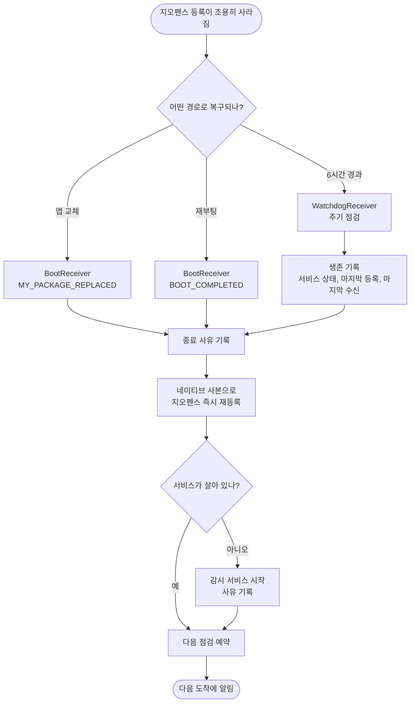

# 3일간 도착 신호가 끊겼는데 앱을 열기 전엔 알 수 없다

## 개요

OS 지오펜스가 조용히 사라져도 앱이 스스로 복구하고, 다음에 같은 일이 생기면 원인을 가릴 수 있게 했다. 앱 교체 직후 복구, 6시간 주기 재등록, 종료 사유·시작 사유·생존 기록 세 가지를 더했다.

**원인은 여전히 확정하지 못했다.** 진단 기록에는 마지막 정상 수신(9/25 13:03 KST) 이후 3일 19시간 동안 `[receiver]` 와 `[watch]` 기록이 없고, 그동안 프로세스가 언제 왜 죽었는지 남은 기록이 없었다. 그래서 원인과 무관하게 공백을 좁히는 방향을 택했다 (결정 039).

## 기능 흐름

## 변경 사항

### 복구 경로
- `android/app/src/main/AndroidManifest.xml`: `BootReceiver` 가 `MY_PACKAGE_REPLACED` 도 받게 하고, 내부 알람 전용 `WatchdogReceiver` 를 등록했다(`exported=false`).
- `BootReceiver.kt`: 재부팅과 앱 교체를 같은 경로로 처리한다. 종료 사유 기록, 사본으로 즉시 재등록, 다음 점검 예약, 서비스 시작 순이다. 서비스 시작 실패는 예전에는 조용히 삼켰으나 이제 기록한다.
- `WatchdogReceiver.kt` (신규): 6시간마다 스스로 다시 예약하는 점검. 생존 기록을 남기고, 사본으로 재등록하고, 서비스가 없으면 되살린다.
- `WatchState.kt` (신규): 마지막으로 OS 에 밀어넣은 지오펜스 목록과 마지막 등록·수신 시각의 네이티브 사본.

### 진단
- `ExitReasonLogger.kt` (신규): OS 가 보관하는 프로세스 종료 이력을 진단 기록으로 옮긴다. 이미 남긴 것은 시각 기준으로 건너뛴다. 앱 업데이트로 죽은 것을 `앱업데이트로종료` 로 따로 가른다.
- `AlertWatchService.kt`: 서비스 시작 사유, 종료 기록, 프로세스 내 생존 플래그(`isRunning`), 생성 시 종료 사유 기록과 점검 예약, 등록 시 사본 저장.
- `GeofenceReceiver.kt`: 수신할 때마다 마지막 수신 시각을 남긴다.

### 문서
- `docs/10-DECISIONS.md` 039, `docs/11-ROADMAP.md` 현황 표.

## 주요 구현 내용

**왜 이 방식인가**
- Android 는 OS 에 등록된 지오펜스를 **조회하는 API 를 주지 않는다.** 등록이 사라져도 앱은 알 수 없으므로, 원인이 무엇이든 주기적으로 다시 거는 것이 유일하게 확실한 복구다.
- 원본 목록은 Dart(Drift)에 있어 엔진이 떠야만 읽힌다. 엔진 없이도 복구하려면 네이티브 사본이 필요했다. 사본이 있어야 서비스 시작이 막혀도 등록만큼은 살아남는다.
- 재등록해도 알림이 되풀이되지 않는다. 이미 안에 있는 장소의 ENTER 는 Dart 상태 전이 규칙(`inside → inside` 는 무알림)이 흡수한다 — 실제 로그(`전이=none → 알림없음 (사유=전이없음)`)로 확인했다.

**원래 가설이 틀렸다**
- 처음에는 "자동 업데이트로 등록이 사라졌다"고 봤다. 로그가 반증했다. v1.18.2 배포 직후(9/25 10:17 KST) 앱 시작 기록 없이 `서비스 생성 → 엔진 시작 → 복원 요청 → 등록 성공` 이 찍혔고, 그 뒤 11~13시에는 정상 수신했다. 업데이트는 `START_STICKY` 재시작으로 우연히 복구됐고 공백은 **그 뒤에** 시작됐다.
- 그래서 이 수정은 "업데이트 하나를 고친 것"이 아니라 원인 불문 자가 복구와 원인 추적 수단이다. 사용자가 기억하기로 그 기간에 업데이트를 한 것 같다고 하셨으나, 로그로는 공백의 시작을 설명하지 못한다.

**검증 (에뮬레이터, API 36)**
- 앱을 다시 설치하면 `[boot] 복구 시작 사유=앱교체` → `[exit] 사유=앱업데이트로종료` → `[watchdog] 지오펜스 복구 요청 사유=앱교체 1곳` 이 순서대로 남는다.
- 점검 간격을 임시로 1분으로 줄인 빌드에서 알람이 울리고, `점검 서비스=동작중 마지막등록=… 마지막수신=…` 기록과 재등록이 남고, **스스로 다음 알람을 예약해 두 번째 주기도 도는 것**까지 확인했다. 간격은 6시간으로 되돌렸다.
- `flutter analyze` 이상 없음, 테스트 560건 통과.

## 주의사항

- **실기기(제조사 절전) 검증이 남아 있다.** 3일 공백의 진짜 원인이 절전이면 6시간 재등록이 잡아 주는지는 실기기로 며칠 써 봐야 안다. Kotlin 계층은 자동 테스트가 없다.
- **간격 6시간은 절충이다.** 재등록하면 이미 안에 있는 장소의 ENTER 가 오고, 근접 반경 안이면 정밀 감시(최대 30분)가 켜진다. 짧게 잡을수록 공백은 줄지만 집 근처에 머무는 동안 GPS 를 자주 켠다. 공백은 최대 6시간까지 남는다.
- **강제 종료하면 알람이 지워진다.** 사용자가 앱을 강제 종료한 뒤에는 앱을 다시 열기 전까지 복구되지 않는다(Android 의 설계).
- **이 수정이 처음 설치되는 순간에는 사본이 비어 있다.** 앱 교체 복구는 `복구 생략` 으로 끝나고, 서비스가 뜨며 엔진이 등록을 복원할 때 사본이 처음 생긴다. 그 이후부터 사본 경로가 동작한다.
- **`WatchState` 사본은 등록할 때마다 갱신된다.** 사본이 낡으면(장소를 지웠는데 사본이 남는 경우) 지운 장소가 다시 등록될 수 있으니, 목록이 바뀌는 모든 경로가 `applyGeofences` 를 거치는 구조를 깨지 않는다.
- **`WatchdogReceiver.INTERVAL_MS` 를 바꾸며 테스트할 때는 반드시 되돌린다.** 1분으로 남으면 배터리를 크게 먹는다.
- 다음에 신호가 끊기면 진단 기록의 `[exit]`(종료 사유), `[watch] 서비스 시작 요청 사유=`, `[watchdog] … 마지막수신=…` 으로 원인을 가른다. 관련 #134(앱이 죽는 원인 추적).
