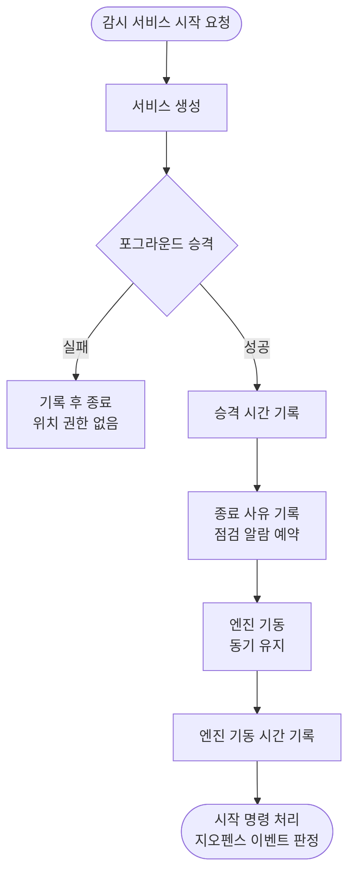

# 콜드 스타트가 느리면 포그라운드 승격 전에 크래시한다

## 개요

감시 서비스가 Flutter 엔진을 띄운 **뒤에** 포그라운드로 올라가던 순서를 **먼저 올린 뒤 엔진을 띄우는** 순서로 바꿨다. 프로세스가 콜드로 뜨는 경로(재부팅, 앱 교체, 킬, 지오펜스 신호)에서 엔진 부팅이 느리면 OS 가 `ForegroundServiceDidNotStartInTimeException` 으로 프로세스째 죽이던 결함이다. 승격까지 걸린 시간과 엔진 기동 시간, 기기 가동 시간을 진단 기록에 남기게 했다.

#159(3일간 도착 신호가 끊긴 문제)의 원인이라고 **확정하지는 못한다.** 다만 "프로세스가 죽었는데 흔적이 없다"는 증상과 맞는 후보이고, 이번에 넣은 기록으로 앞으로는 가릴 수 있다.

## 기능 흐름

## 변경 사항

### 서비스
- `android/app/src/main/kotlin/kr/suhsaechan/ear_loc_alert/AlertWatchService.kt`: 생성 단계 맨 앞에서 포그라운드로 승격한다. 실패하면(위치 권한 없음) 기록하고 종료한다. 승격 시간(`감시 서비스 생성 (승격 Nms)`)과 엔진 기동 시간(`감시 엔진 기동 Nms`)을 남긴다.
- `android/app/src/main/kotlin/kr/suhsaechan/ear_loc_alert/BootReceiver.kt`: `복구 시작 사유=… (기기 가동 N분)` 으로 가동 시간을 함께 남긴다.

### 문서
- `docs/10-DECISIONS.md` 039: 후속 내용과 측정값 추가.

## 주요 구현 내용

**왜 이 순서인가**
- `startForegroundService()` 로 시작하면 OS 는 정해진 시간 안에 승격하기를 요구하고, 넘기면 프로세스째 죽인다. 예전에는 승격이 시작 명령 처리(`onStartCommand`)에 있어서, 그 앞의 생성 단계에서 동기로 띄우는 엔진 부팅이 끝나야 도달했다.
- 크래시는 프로세스째 일어나 진단 기록에 흔적이 남지 않는다. 이번에 #159 로 넣은 종료 사유 기록(`[exit] 사유=크래시`)이 그 흔적을 다음 실행 때 잡아냈다.

**엔진 기동을 비동기로 미루지 않은 이유**
- 승격만 앞당기면 충분하다. 엔진을 비동기로 미루면 그 사이 도착한 지오펜스 이벤트가 채널 없이 "판정 없음"으로 떨어져 **도착 알림이 유실된다.** 그래서 엔진은 생성 단계에서 동기로 유지하고 승격만 앞에 뒀다.

**검증: 대조 실험 (에뮬레이터 API 36.1, 전용 인스턴스)**
- 엔진 부팅이 느린 상황을 만들려고 `WatchEngine.start()` 에 45초 지연을 임시로 넣고, 수정 전 코드(A)와 수정 후 코드(B)를 같은 절차로 콜드 스타트했다. 지연 코드는 검증 후 제거했다.

| 변형 | 결과 |
|---|---|
| A 수정 전 + 45초 지연 | `ForegroundServiceDidNotStartInTimeException` 으로 서비스가 내려지고 **프로세스가 죽음** |
| B 수정 후 + 45초 지연 | **승격 190ms**, 엔진 기동 49,696ms 에도 **크래시 없음, 프로세스 유지** |
| 최종 코드, 지연 없음 | 승격 179~389ms, 크래시 없음 |

- `flutter analyze` 이상 없음, 테스트 560건 통과. 이 앱은 Kotlin 자동 테스트가 없어 검증은 에뮬레이터 대조 실험이 전부다.

**#161 본문 정정**
- 이슈 본문에 OS 한도를 "약 10초"라고 적었으나 **이 에뮬레이터(Android 16)에서는 약 30초로 측정됐다.** 수정 전 코드에서 15.5초 지연은 살아남았고, 34초 지연과 45초 지연은 죽었다. 한도는 OS 버전마다 다르고 예전에는 5~10초였으므로, 실기기(특히 구형)에서는 더 빨리 걸릴 수 있다.

## 주의사항

- **엔진 기동을 생성 단계에서 비동기로 옮기지 않는다.** 이벤트 유실이 생긴다. 옮기려면 그 사이 도착한 이벤트를 큐에 쌓는 처리가 먼저 필요하다.
- **승격을 생성 단계 맨 앞에서 시작 명령 처리로 되돌리지 않는다.** 시작 명령 처리에서도 승격을 한 번 더 부르는 것은 남겨 두었다(이미 승격된 상태에서는 알림만 다시 게시하므로 무해하다).
- 승격 실패는 API 34+ 에서 위치 권한이 없을 때 생긴다. 이때 엔진을 띄우지 않고 서비스를 끝낸다. 권한을 받은 뒤 다음 시작 요청에서 정상적으로 뜬다.
- 실기기에서는 `[watch] 감시 서비스 생성 (승격 Nms)` 과 `감시 엔진 기동 Nms` 를 보고, 엔진 기동이 몇 초인지 확인한다. 엔진 기동이 10초를 넘는 기기가 있으면 그 기기에서는 이전 코드가 이미 크래시했을 가능성이 있다.
- `사유=재부팅` 은 가동 시간과 함께 봐야 한다. 이 에뮬레이터에서는 앱을 강제 종료했다 다시 실행할 때마다 부팅 완료 브로드캐스트가 다시 전달돼 재부팅으로 오해할 수 있었다. 실기기에서도 그런지는 미확인이다.
- 도착 알림 발화 끝에서 끝까지와 재부팅 후 복구는 이 환경에서 밟지 못했다(앱이 백그라운드일 때 에뮬레이터가 주입한 위치를 전달하지 않는다). 실기기 확인이 필요하다.
