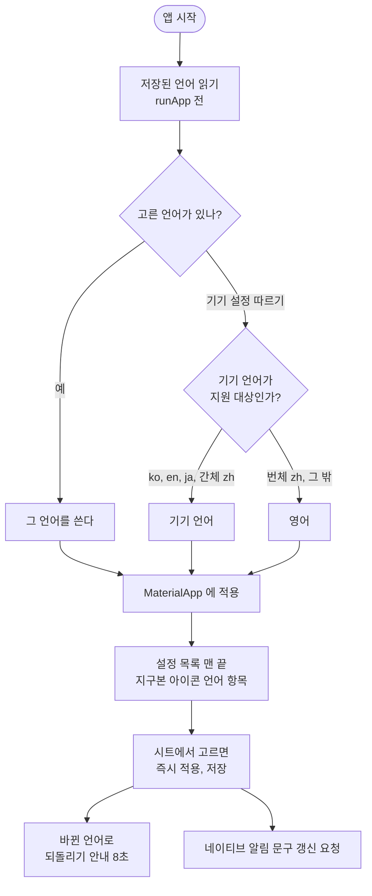

# 앱 문자열을 l10n 으로 옮기고 기기 언어를 따른다

## 개요

앱이 한국에서만 쓰였다. 화면 문자열이 전부 코드에 한국어로 박혀 있었고, 문서(`04-CONVENTIONS`)가 약속한 l10n 은 **코드에 하나도 없었다.** 한국어, 영어, 중국어(간체), 일본어 네 언어를 지원하고, 기기 언어를 따르며 설정에서 바꿀 수 있게 했다. 실수로 읽을 수 없는 언어로 바꿔도 되돌릴 수 있다.

## 기능 흐름

## 변경 사항

### 기반 (`lib/core/l10n/`)
- `app_language.dart`, `app_language_store.dart`, `locale_resolver.dart`, `l10n.dart`, `app_language_controller.dart`: 언어 값(`system`, `ko`, `en`, `zh`, `ja`), 저장, 로케일 해석, `context.l10n`, 컨텍스트 없는 조회(`AppStrings`), 상태.
- `arb/app_{ko,en,ja,zh}.arb`, `l10n.yaml`, `generated/`: 번역 파일. **한국어가 원문**이다. 키가 하나라도 빠지면 테스트가 실패한다.
- `core/text/keep_all.dart`: 낱말 보호를 **한국어에서만** 적용하는 `keepAllText`.

### 화면 문자열 이전
- 화면 문자열 약 250곳을 번역 키로 옮겼다(places, permission, alert, sounds, settings, diagnostics, app 계층).
- 값에서 문구를 만들던 곳은 값을 돌려주고 화면에서 문구로 바꾸게 했다(`SoundPreset.label` 삭제 → `localizedLabel`, 권한 안내는 단계 enum, 홈 상태는 `ReliabilityGap`).
- 백그라운드 알림 문구(`BackgroundAlertNotifier`, `alert_strings.dart`)는 `BuildContext` 없이 `AppStrings` 로 같은 번역 파일에서 찾는다. **못 구해도 알림은 반드시 나가고, 실패하면 영어다.**

### 설정 화면
- `language_sheet.dart`(신규), `settings_screen.dart`: 목록 맨 끝의 언어 항목(지구본 아이콘), 각 언어 자기 표기 목록, 바꾼 직후 8초 되돌리기(바뀐 언어로 표시).

### 테스트와 문서
- `test/core/l10n/l10n_test.dart`: 로케일 해석, 저장, 네 언어 키 일치, 낱말 보호, 컨텍스트 없는 조회.
- `test/core/l10n/no_hardcoded_korean_test.dart`(신규): `lib/` 에 한글 문자열 리터럴이 생기면 실패한다.
- `test/design_system_test.dart`: 소스의 한글 리터럴을 세던 규칙을 **번역 파일의 한국어 값**을 검사하도록 옮겼다.
- 결정 041, `docs/04-CONVENTIONS.md`, `01-REQUIREMENTS.md` F5, `09-RELEASE.md`, `CLAUDE.md`, 설계 명세.

## 주요 구현 내용

**설계 명세(`docs/superpowers/specs/2026-09-29-i18n-design.md`)의 충돌 12건을 실제로 풀었다.**
- **결정 037 `keepAll`**: 모든 글자 사이에 줄바꿈 금지 문자를 넣어 띄어쓰기가 없는 중국어와 일본어는 줄이 안 바뀌어 넘친다 → 한국어에만 적용. 일본어 설정 화면을 에뮬레이터에서 확인했고 줄이 자연스럽게 바뀐다.
- **결정 035 규칙 테스트**: 소스의 한글을 세던 방식은 문자열을 옮기면 **조용히 무력화**된다 → 번역 파일 값 기준으로 이전. **일부러 어겨서 실제로 잡는 것을 확인했다**(한글 리터럴 추가, 문장에 `keepAllText` 누락).
- **규칙 6(백그라운드에서 `BuildContext` 금지)**: 문서의 `context.l10n` 을 백그라운드에 쓸 수 없다 → 컨텍스트 없이 언어로 찾는 경로를 함께 만들었다. 백그라운드 isolate 는 저장소를 다시 읽는다(`readFresh`).
- **`context.l10n` 은 번역 위임자가 없는 환경(기존 위젯 테스트)에서 한국어로 떨어진다.** 그래서 기존 테스트가 거의 그대로 통과한다.

**정책**: 기본값은 기기 언어, 지원하지 않으면 영어. 번체 중국어(대만, 홍콩) 기기는 영어다(잘못된 자형이 오독으로 이어지므로). Android 13+ 앱별 언어 기능은 선언하지 않는다(OS 설정과 앱 설정이 두 곳에서 어긋난다).

**검증 (에뮬레이터 API 36)**: 기기 언어(영어)로 온보딩, 홈, 설정이 영어로 나온다. 언어 시트에서 日本語를 고르면 즉시 일본어가 되고 하단에 `言語を変更しました / 元に戻す`가 뜬다. 中文으로 바꾼 뒤 8초 안에 되돌리기를 누르면 이전 언어로 복구된다. `flutter analyze` 이상 없음, 테스트 583건 통과.

## 주의사항

- **번역은 기계 번역 초안이다.** 원어민 검수가 필요하다. 특히 권한 안내와 알림 문구. 알려진 어색한 곳: 영어 `Exempt from battery optimization off — tap to turn on`(문법이 어색), 일본어 `バイブのみ`(용어표는 バイブレーション).
- **일본어와 중국어 글꼴은 번들하지 않는다**(시스템 글꼴로 대체). 굵기와 자형이 어긋나는지는 실기기에서 봐야 한다.
- 새 문구는 **네 언어를 함께** 쓴다. 한 언어라도 빠지면 테스트가 실패한다.
- `keepAll` 을 `String` 확장 그대로 쓰지 않는다. 중국어와 일본어에 넣으면 줄이 안 바뀐다.
- 실기기에서 확인하지 못한 것: 글자 1.3배와 네 언어의 조합에서 알림 화면의 84px 해제 버튼과 상태 알약이 넘치는지, 지도 라벨 언어(기기 언어를 따르며 앱 언어와 어긋날 수 있다).
