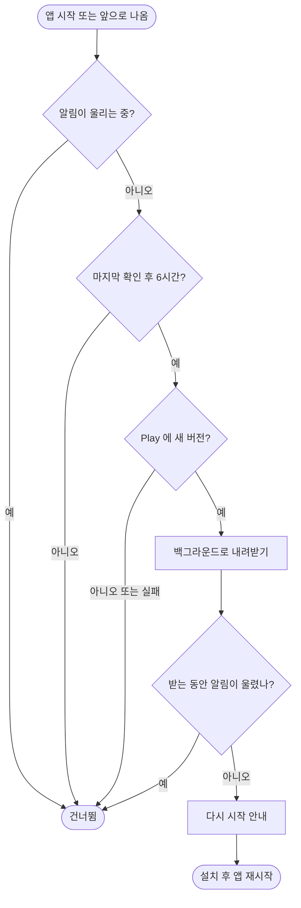

# Play 앱 내 업데이트로 새 버전을 앱 안에서 받는다

## 개요
새 버전이 나와도 사용자가 알 방법이 없던 자리를 Google Play 앱 내 업데이트로 채웠다. 백그라운드로 받고 "다시 시작"으로 적용하며, 알림이 울리는 중에는 확인도 안내도 하지 않는다. 같은 배포에 앱 이름 현지화(일본어·중국어)와 스토어 다국어 등록이 들어갔다. 1.20.0(빌드 110)으로 Play 비공개 테스트에 배포됐다.

## 기능 흐름

## 변경 사항

### 앱 내 업데이트
- `lib/features/app_update/domain/app_updater.dart`: `AppUpdater` 인터페이스와 `AppUpdateGate`. 알림 중 건너뛰기, 받은 뒤 재확인, 6시간 간격
- `lib/features/app_update/data/play_app_updater.dart`: `in_app_update` 기반 Play 구현. 실패는 삼키고 `[update]` 로그만 남긴다
- `lib/app/app.dart`: 시작·resumed 때 확인하고 SnackBar 로 안내
- `lib/core/l10n/arb/*`: 안내 문구 네 언어
- `test/features/app_update/app_update_gate_test.dart`: 게이트 6건

### 앱 이름
- 일본어 イヤホン位置通知, 중국어 耳机位置提醒, 영어는 EarLocAlert 유지(길면 런처에서 잘린다)
- Android `strings.xml`, iOS `InfoPlist.strings`, ARB

### 스토어와 배포
- Play Console 에 en-US·ja-JP·zh-CN 등록정보 추가, 구글 검토 전송
- `release-notes/<언어>/1.20.0.txt` 네 언어

## 주요 구현 내용
- 결정 043: 즉시 방식은 화면을 막아 알림 해제와 충돌하므로 쓰지 않는다. 029 가 걷어낸 것은 APK 직접 설치이지 안내 자체가 아니다
- 검증: 분석 오류 0건, 테스트 589건 통과. 배포 CI 성공, 네 언어 릴리스 노트가 직접 쓴 파일로 올라간 것을 로그로 확인

## 주의사항
- **Play 호출부와 안내 표시는 실기기 검증 전이다.** Play 에서 설치한 옛 버전 위에 새 버전이 올라간 상태에서만 동작한다. 개발 빌드는 "업데이트 없음"으로 보인다
- 번역은 기계 번역이고 원어민 검수가 남아 있다
- 스토어 그래픽·스크린샷은 한국어 자료가 그대로 쓰인다
- 비공개 테스트 국가 확대는 하지 않았다
