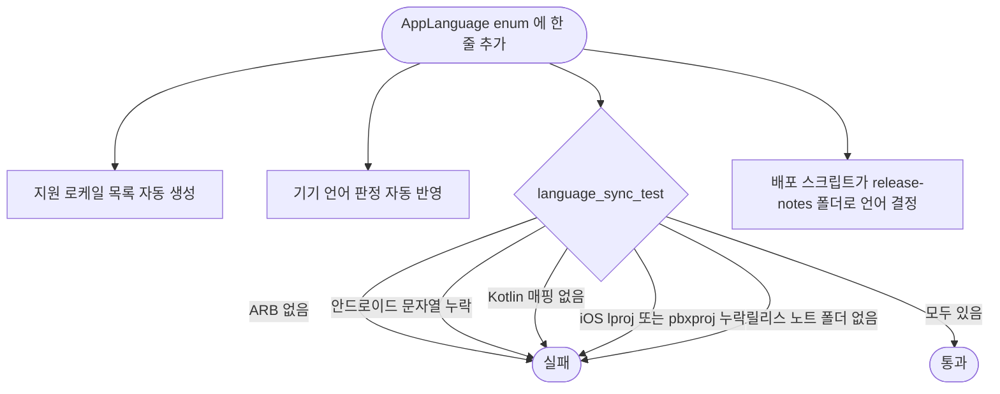

# 언어 확장 구조를 하나로 모으고 중복 코드와 군더더기 주석을 정리한다

## 개요
언어를 하나 늘릴 때 손댈 곳이 여덟 군데였고 빠뜨려도 어떤 테스트도 실패하지 않았다. 지원 언어 목록을 한 곳으로 모으고 빠진 자리를 잡는 테스트를 더했으며, 중복 코드와 군더더기를 동작 변경 없이 정리했다. 1.20.1(빌드 111)로 배포됐다.

## 기능 흐름

## 변경 사항
- `lib/core/l10n/app_language.dart`: 지원 언어의 단일 출처(`supported`, `matchesDevice`). 번체 중국어 제외 규칙이 enum 안으로 들어왔다
- `lib/core/l10n/locale_resolver.dart`: 목록과 판정을 enum 에서 만든다
- `test/core/l10n/language_sync_test.dart`: 언어마다 ARB·안드로이드·Kotlin·iOS·릴리스 노트·스토어 본문이 있는지 검사(21건). Kotlin 매핑을 빼서 실패하는 것을 직접 확인했다
- `.github/scripts/prepare_play_changelogs.sh`: 하드코딩된 언어 목록 대신 `release-notes/` 폴더로 결정(임시 작업 공간에서 fr-FR 폴더까지 처리 확인)
- `lib/core/widgets/app_feedback.dart`: 스낵바·확인 창 공통 함수(7곳 교체)
- `lib/core/platform/channel_names.dart` + 테스트: MethodChannel 이름 9곳을 상수로, Kotlin 과 같은지 검사
- `lib/core/text/two_digits.dart`, `lib/core/map/marker_hue.dart`: 중복 6곳, 2곳 정리
- 참조 0건 코드 제거(사용하지 않는 저장소 구현·getter·상수·공급자), 군더더기 주석 정리

## 주의사항
- **하지 않은 것**: 시트 공통화, 지도 배선 통합, 로케일 해석 통합(폴백 동작이 달라 동작이 바뀜), 테스트 가짜 클래스 통합. 안드로이드 감시·알림 경로는 자동 테스트가 없고 실기기 검증 전이라 건드리지 않았다
- 주석은 "왜"를 적은 것을 남기고 되풀이·낡은 계획만 지웠다
- 조사 중 발견: 광고 첫 실행 표시가 영원히 켜져 전면광고가 안 나온다 → #175
