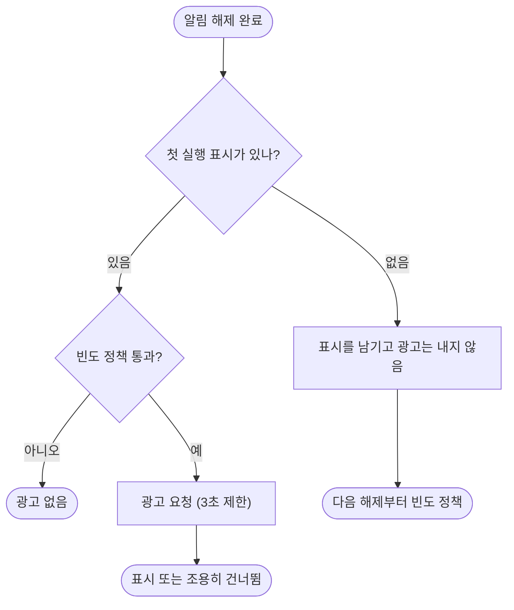

# 광고 첫 실행 표시가 영원히 켜져 전면광고가 나오지 않는다

## 개요
코드 정리 중 `markLaunched()` 를 호출하는 곳이 앱 어디에도 없어 광고 정책의 "첫 실행이면 광고 안 함" 조건이 영원히 참이라는 것을 발견했다. 고치는 과정에서 **코드에 들어 있던 AdMob ID 가 어느 계정 것인지 알 수 없다**는 문제도 드러나, chancamera123 계정으로 AdMob 을 새로 등록하고 ID 를 교체했다. 1.20.2(빌드 112)로 배포됐다.

## 기능 흐름

## 변경 사항
- `lib/app/alert_ad_coordinator.dart`: 첫 해제에서 `markLaunched()` 를 남기고 광고를 내지 않는다. 표시 저장이 실패해도 예외는 위로 나가지 않는다. 해제가 끝난 뒤의 광고 흐름 안에서만 일어나므로 해제 속도·화면 전환에 영향이 없다
- `test/features/ads/alert_ad_coordinator_test.dart`: 첫 해제는 광고 없음+표시, 두 번째부터 광고, 표시 저장 실패 시 예외 없음 (3건 추가)
- `android/app/src/main/AndroidManifest.xml`, `lib/features/ads/domain/ad_unit_ids.dart`: AdMob 앱 ID·전면광고 단위 교체
- `docs/07-MONETIZATION.md`, `docs/10-DECISIONS.md`(결정 044)

## AdMob 처리 (chancamera123@gmail.com)
- 계정이 6개월 광고 미게재로 **비활성**이어서 재활성화를 요청했다(검토 중에도 사용 가능)
- 이 계정에는 등록된 앱이 없었다 → 코드의 게시자 ID(`pub-4452677329657064`)는 이 계정 것이 아니었다
- 앱 "이어폰 위치 알림"(Android) 등록: `ca-app-pub-2025665624324395~2867273198`
- 전면광고 단위 `alert_dismissed_interstitial`: `ca-app-pub-2025665624324395/6789282892`
- 결제 프로필은 기존 기본 프로필이 자동 연결돼 "지급 프로필이 완성되었습니다"로 표시된다(결제 프로필은 프로젝트별이 아니라 계정 단위)
- ID 정리 파일: 사용자 다운로드 폴더 `EarLocAlert-AdMob-정보.md`

## 주의사항
- **실제 광고가 화면에 나오는지는 확인하지 못했다.** 새 광고 단위는 게재 시작까지 최대 1시간이 걸리고, 계정 승인·앱 인증이 끝나기 전에는 광고가 안 나올 수 있다. 광고가 없으면 조용히 건너뛰므로 알림 해제 UX에는 영향이 없다
- 남은 사용자 작업: 앱 인증(Play 게시 후 스토어 세부정보 연결), 유럽 규정(UMP) 메시지 생성, iOS 앱 등록(#51)
- 배포 빌드는 이제 실제 광고 단위를 쓴다 — 테스트 기기에서 광고를 직접 누르지 않는다(무효 트래픽)
