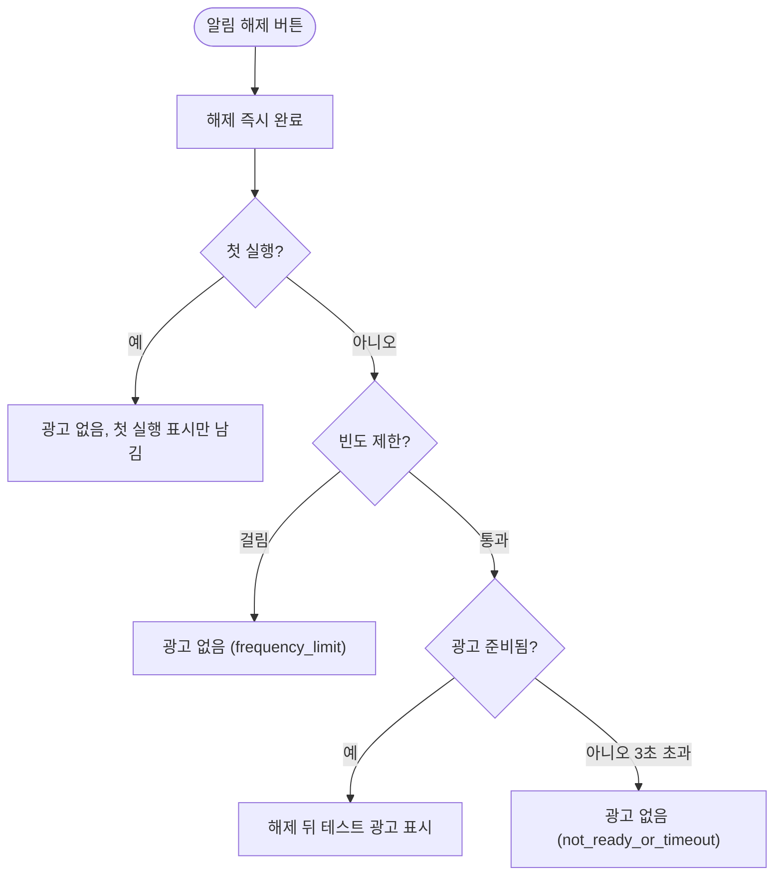

# 전면광고 흐름 에뮬레이터 e2e 검증 (2026-10-01)

## 개요
디버그 빌드에서 전면광고가 설계대로 도는지 에뮬레이터(`Medium_Phone_API_36.1`)에서 실제로 밟았다. **4개 기대 항목 모두 통과했고 결함은 없다.** 조작은 integration_test(위젯 finder)로 했고 좌표 탭은 쓰지 않았다. 실행마다 `pm clear` 로 초기 상태에서 시작했다.

## 기능 흐름

## 결과

| # | 기대 | 결과 | 근거 (로그 원문) |
|---|---|---|---|
| 1 | 디버그는 테스트 광고 ID | 통과 | `[app] app start 1.20.2(112) devBuild=true ads=test`, 화면에 "Test Ad" · "This is an interstitial test ad." |
| 2 | 첫 해제는 광고 없음 | 통과 | `[alert] session dismissed …` 직후 `[ads] interstitial skipped (reason=first_launch)` (해제→완료 260~390ms) |
| 3 | 이후 해제에서 광고, 3분 정책 | 통과 | `interstitial shown` (해제 약 1초 뒤). 직후 재해제는 `interstitial skipped (reason=frequency_limit shown_today=1 last_shown=…)`. 3분 이상 지난 뒤 해제하면 다시 표시 |
| 4 | 해제 버튼은 어떤 경우에도 즉시 동작 | 통과 | 12회 해제 모두 해제→완료 260~1941ms. 광고가 안 뜬 회차는 `reason=not_ready_or_timeout` 로 3초 안에 정상 종료 |

광고가 알림 화면 위에 겹친 사례는 없었다. 광고 액티비티는 해제와 완료 화면 전환 **뒤에만** 나타났다.

## 증거 화면 (해제 뒤 뜬 Google 테스트 전면광고)

## 검증 한계
- 알림은 설정 화면의 "Preview alert" 로 발화했다. 발화 뒤(알림 화면 → 해제 → 광고)는 지오펜스 발화와 같은 코드(`_AlertRoute.onDismiss` · `_tryShowAd`)다
- 에뮬레이터에서는 `geo fix` 위치 주입으로 백그라운드 감시(`AlertWatchService`)가 도착을 감지해 알림 화면으로 잇는 경로는 검증하지 못했다 (실기기 검증 항목으로 남는다)
- 광고를 닫을 때 `adb keyevent BACK` 만 썼다. "Viewing full screen" 안내창이 BACK 을 막아 에뮬레이터 설정(`immersive_mode_confirmations`)으로 껐다

## 관찰 (결함 아님, 기록)
- 알림 발화 직후 첫 preload 는 `[ads] preload skipped reason=consent_not_ready` 로 건너뛴다. 그래서 **첫 광고 대상 해제에서 광고가 준비되지 않을 수 있다** (해당 회차는 `not_ready_or_timeout` 로 조용히 끝남). 다음 알림부터는 정상이라 사용자 영향은 작다. 동의 준비 시점과 preload 순서를 손볼지는 별도 판단 사항이다
- 진짜 광고 ID 로 나가는 것은 CI 가 만든 릴리스 빌드뿐이다. 이 검증은 디버그(테스트 ID)만 다뤘다

## 검증 도중 발견
- `test/app/home_status_provider_test.dart` 로딩 실패는 `*.g.dart` 생성 파일이 gitignore 대상인데 생성돼 있지 않아서였다. `dart run build_runner build --delete-conflicting-outputs` 후 8건 통과
