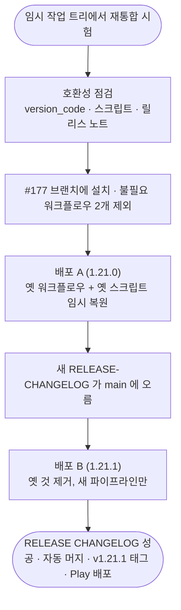

# projectops v4.27.0 재통합과 릴리스 파이프라인 전환 (2026-10-01)

## 개요
`project-auto-wizard` 템플릿 v0.1.33 에 머물던 저장소를 `npx projectops`(v4.27.0)로 다시 통합했다. 배포 파이프라인(Play 업로드·릴리스 노트·versionCode)이 깨지지 않게 **격리 작업 트리에서 먼저 돌려 호환성을 확인**하고, 실제 전환은 **두 번의 배포로 나눠** 새 릴리스 워크플로우까지 실배포로 검증했다.

## 기능 흐름

## 사전 점검에서 확인한 것
- `version.yml` 의 `version_code` · `semver_auto` · 배포 설정은 **보존**됐다 (versionCode 역행 위험 없음)
- 사용자 수정본 워크플로우 6개(Play · Firebase · TEST-APK · FLUTTER-CI · iOS 2종)는 충돌로 **스킵**되어 그대로 유지됐다 → Play 배포 경로 불변
- `changelog_manager.py export` 는 1.20.1 · 1.20.2 에서 옛 스크립트와 **출력이 동일**했다. `update-from-summary` 는 새 파서가 카테고리를 더 정확히 나눈다(옛 파서는 `summary_by_coderabbit` 찌꺼기 항목을 만들었다)
- 새 템플릿의 `SELFHOSTED-CICD`(main 푸시마다 SMB 배포, 경로 플레이스홀더)와 `PROJECTS-SYNC-MANAGER`(라벨마다 실행, 프로젝트 URL 미설정)는 **설치에서 제외**했다

## 전환에서 겪은 문제 (중요)
1. 새 `RELEASE-CHANGELOG` 는 `pull_request_target` 이라 **main 의 정의**로 돈다. 재통합 직후 첫 PR 에는 main 에 아직 없어 실행되지 않는다
2. 옛 `AUTO-CHANGELOG-CONTROL` 을 지운 채 배포하면 버전 확정·changelog 갱신이 아무 것도 안 돈다 → 옛 것을 임시 복원했더니 **`changelog_manager.py ai-summary` 가 새 스크립트에 없어 실패** (`invalid choice: 'ai-summary'`, PR #180 첫 시도)
3. 그래서 배포 A 는 옛 워크플로우 + **옛 스크립트 3개를 짝으로 복원**해 통과시켰고, 배포 B 에서 옛 워크플로우를 지우고 스크립트를 새 버전으로 돌렸다

## 배포 결과
| 배포 | PR | 버전 | 처리 | 결과 |
|---|---|---|---|---|
| 1.20.3 | #178 | 113 | 기존 파이프라인 | Play 배포 성공 |
| A | #180 | 1.21.0 (114) | 옛 워크플로우 + 옛 스크립트 | 성공. (feat 커밋 때문에 minor 로 확정) |
| B | #181 | 1.21.1 | **새 RELEASE CHANGELOG** | 성공 · 자동 머지 · `v1.21.1` 태그 · Play 배포 진행 |

## 주의사항 (다음에 건드릴 때)
- **릴리스 노트 파일은 확정될 버전 이름으로 만든다.** `feat` 커밋이 섞이면 minor 로 오른다(1.20.3 → **1.21.0**, 예측한 1.20.4 가 아니었다). 1.21.0 은 파일이 없어 한국어 자동 노트가 4개 언어에 그대로 올라갔다 — Play Console 에서 직접 고칠 수 있다
- 새 `RELEASE-CHANGELOG` 는 PR `opened` 때만 돈다. 본문이 잘못되면 PR 을 닫고 새로 연다(fix 모드)
- `.bak` 9개와 `PROJECT-FLUTTER-ANDROID-SYNOLOGY-CICD.yaml`(SELFHOSTED 로 대체된 구세대, 현역이라 마법사가 건드리지 않음)은 **삭제하지 않았다** — 정리는 사용자 확인 후
- `PROJECT-COMMON-RELEASE-PUBLISH.yaml` 은 새 패키지에 템플릿이 없는 잔존 파일이다(projectops 이슈 #661). `pr-flow` 모드라 영향은 없다
- 필요한 Secret 26개의 등록 여부는 Repository Settings 에서만 확인된다

## projectops 에 올린 이슈
- #661 템플릿에서 사라진 RELEASE-PUBLISH 가 레거시로 감지되지 않고 없어진 `ai-summary` 를 호출한다 (**이번 전환 실패로 재현됨**, 댓글 추가)
- #662 배포 옵션 없이 통합해도 플레이스홀더 상태의 자동 트리거 워크플로우가 설치된다
