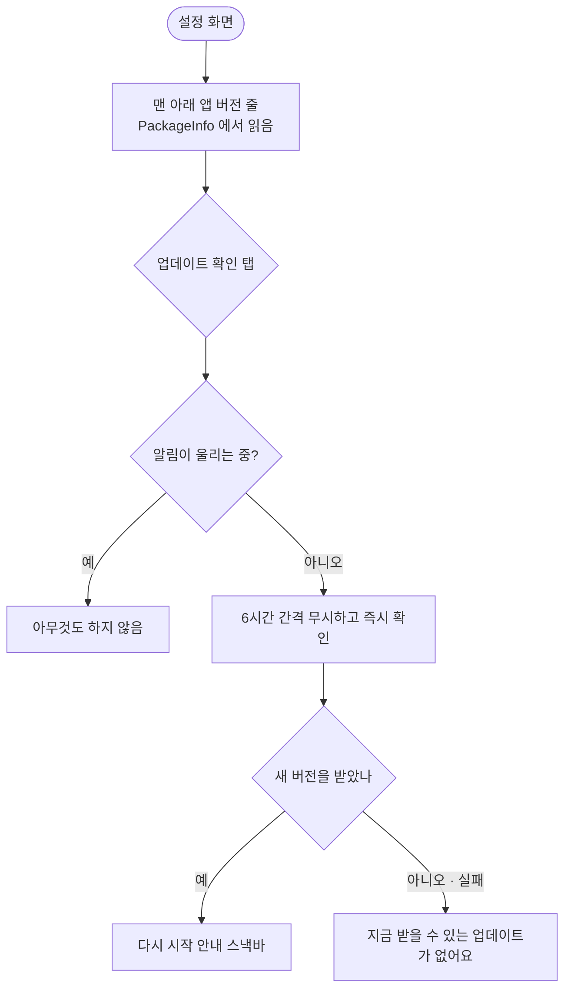

# 설정 화면에서 앱 버전을 볼 수 있게 한다 (2026-10-01)

## 개요
설정 맨 아래에 **앱 버전(`1.21.0 (114)`)** 줄과 **"업데이트 확인"** 버튼을 더했다. 문의가 왔을 때 어느 빌드인지, 인앱 업데이트가 실제로 올라왔는지를 앱 안에서 확인할 수 있다. 직접 누른 확인은 6시간 간격을 건너뛰고 바로 Play 에 묻는다.

## 기능 흐름

## 변경 사항
- `lib/app/app_version_provider.dart`: `@riverpod appVersion` — `package_info_plus` 로 `버전 (빌드번호)` 를 읽는다. **읽기 실패는 예외를 던지지 않고 `-`** 를 돌려준다 (설정 화면이 막히지 않게)
- `lib/features/settings/presentation/settings_screen.dart`: `appVersion` · `onCheckUpdate` 를 받아 맨 아래 줄을 그린다. settings 는 값만 받고 플랫폼을 직접 부르지 않는다 (feature 간 import 금지 규칙)
- `lib/features/app_update/domain/app_updater.dart`: `checkWhenIdle(force: true)` — 간격만 건너뛰고 **알림 중 차단은 그대로**
- `lib/app/router.dart`: 설정 경로에서 `_checkUpdateNow` — 결과별 스낵바
- ARB 4개(ko/en/ja/zh): `settingsVersionTitle` · `settingsVersionCheck` · `appUpdateNone`
- `docs/10-DECISIONS.md` 043: 수동 확인 추가, **자동 설치(즉시 방식)는 쓰지 않는다**는 이유 기록

## 실화면 (에뮬레이터, 디버그 빌드)

한국어:

영어:

"업데이트 확인" 탭 (개발 빌드는 Play 밖 설치라 이 결과가 정상):

## 검증
- `flutter analyze` 이상 없음, `flutter test` **619건 통과**
- 새 테스트: 버전 줄 표시 · 읽기 실패 시 `-` · 업데이트 확인 콜백 · 게이트 `force` 동작 · 알림 중에는 `force` 여도 확인 안 함
- 디자인 시스템 테스트가 `Icons.info_outline` 을 잡아 `info_outlined` 로 고쳤다 (Material 아이콘은 outlined 변형만)

## 알림 앱으로서 판단한 것 (업데이트)
- **자동 설치는 쓰지 않는다.** 즉시 방식은 화면을 막는데 이 앱은 버스·운전처럼 손을 못 쓰는 순간에 울린다. 유연한 방식(받은 뒤 재시작 안내)만 쓴다
- **알림이 울리는 중에는 확인도 안내도 없다.** 안내가 해제 버튼을 가리는 것을 막는다 (광고 동의와 같은 이유)
- 자동 확인은 앱 시작·앞으로 나올 때 6시간 간격, 수동 확인은 즉시

## 주의사항
- 받을 게 없는 경우와 확인 실패를 나누지 않는다 — Play 밖 설치본에서는 실패가 정상이라 같은 문구로 알린다
- 실제 Play 설치본에서 "다시 시작" 안내가 뜨는지는 **실기기 검증 전까지 미확인** (#104 · #170 과 같은 한계)
- 이 빌드는 1.21.0 릴리스(`feat` 로 minor 승격)에 실려 나갔다. 릴리스 노트 파일명이 예상한 1.20.4 와 달라 1.21.0 Play 노트는 한국어 자동 노트가 4개 언어에 들어갔다
