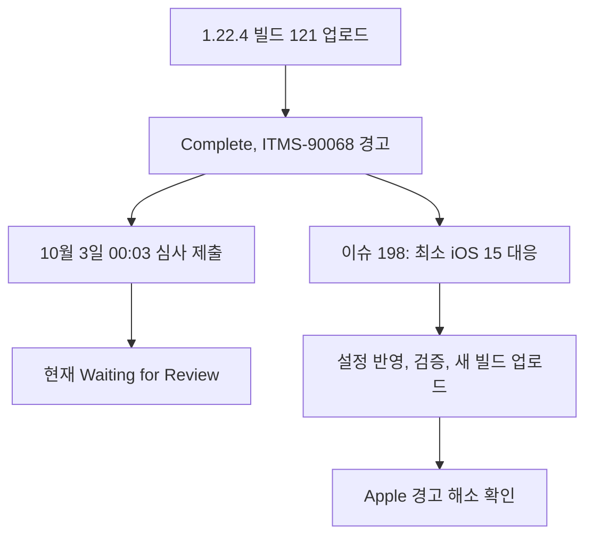

# iOS 심사 대기와 ITMS-90068 종합 점검

## 확인 결과

2026-10-04 App Store Connect에 로그인해 이어폰위치알림(App ID 6755805664)의 Distribution, App Review, App Privacy, TestFlight를 직접 확인했다. 1.22.4(121)는 업로드 Complete, App Store 심사는 Waiting for Review다. 제출 상세에는 반려 사유나 Apple 메시지가 표시되지 않는다. 제출 시각은 화면상 2026-10-03 00:03이다. 현재 심사를 통과했다는 뜻은 아니다.

사용자가 제공한 두 메일과 TestFlight의 Warnings 상세가 같은 ITMS-90068을 가리킨다. 120, 121 모두 업로드는 성공했으나 iOS 14.0 최소 지원 버전 때문에 경고를 받았다. Apple은 2027년 4월부터 최소 iOS 15.0을 요구한다고 안내한다. 현재 제출을 막는 오류와 향후 제출 제한을 구분해야 한다.

## 상태 흐름

## 항목별 점검

| 항목 | 확인 내용 | 판단 |
|---|---|---|
| 현재 심사 | 1.22.4(121), Waiting for Review | 반려 확인 없음, 결과 대기 |
| 업로드 | 120, 121 Complete에 경고 표시 | 업로드 성공, ITMS-90068 후속 대응 필요 |
| 이전 업로드 실패 | 119는 Failed | #194 권한 문구 수정 후 120, 121이 성공한 것과 구분 |
| 제출 빌드 연결 | 버전 화면 Build 121, 제출 상세 1.22.4(121) | 올바른 빌드가 연결됨 |
| 스크린샷 | 한국어 iPhone 6.5인치 네 장, iPhone 탭 | 현재 제출 단계에서는 통과; 화면의 실제 기능 적합성까지 보증하지 않음 |
| 심사 정보 | 로그인 불필요, 연락처와 영어 심사 메모 존재 | 등록됨. 연락처는 외부 증거 이미지에서 제외 |
| 출시 방식 | Automatically release this version 선택 | 심사 승인되면 자동 공개되는 설정 |
| 개인정보 | 처리방침 URL 게시, 데이터 종류 여섯 가지 신고 | 신고 내용과 SDK 실동작 대조가 남음 |
| 광고 개인정보 | 대략적 위치는 제3자 광고, 기기 ID/광고 데이터/사용 데이터/성능 데이터는 이용자 연결로 신고 | 앱 위치 자체의 로컬 처리와 광고 SDK 수집을 구분해야 함 |
| ATT | main Info.plist에 추적 문구 없음, 전면광고는 UMP 동의 확인 후 기본 AdRequest 사용 | ATT 미요청만으로 모든 SDK가 추적하지 않음을 보증할 수 없음. Apple의 지적은 현재 없음 |
| 실기기 검증 | TestFlight 121 화면의 설치/세션/크래시 값이 대시로 표시 | 이 화면으로 iOS 실기기 안정성이나 무크래시를 증명할 수 없음 |

## 원인과 대응

최신 main의 ios/Podfile은 platform 14.0, Runner Xcode 프로젝트의 Debug/Profile/Release는 IPHONEOS_DEPLOYMENT_TARGET 14.0이다. Flutter AppFrameworkInfo.plist에는 MinimumOSVersion 13.0도 남아 있다. 이 앱 설정이 경고의 직접 원인이며, Xcode SDK 버전이나 인증서 만료와는 다른 문제다.

저장소의 projectops baseline은 4.27.0이고 npm의 최신 버전 조회 결과는 4.31.5다. 템플릿 최신화는 별도로 필요하지만 앱의 최소 지원 버전까지 자동으로 수정된다고 전제하지 않는다. 업그레이드 후 지도 키 주입과 업로드 레인 등 프로젝트별 수정 보존을 검증해야 한다.

후속 작업은 https://github.com/Cassiiopeia/EarLocAlert/issues/198 에 등록했다. 새 버전은 iOS 14 기기를 지원하지 않게 된다. 새 바이너리를 올려도 기존 심사 대기 중인 빌드 121이 자동으로 교체되는 것은 아니므로, 새 빌드의 업로드 상태와 심사 제출 상태를 따로 확인해야 한다.

기존 #191(지도 키), #194(권한 문구), #196(추적 문구와 iPad 제출 요구)는 작업완료 라벨이다. #189 댓글에는 서명 복구와 빌드 121 제출이 기록되어 있다. 로컬 로드맵의 서명 만료 표시는 최신 기록과 맞지 않으므로 현재 장애 판정 근거로 쓰지 않는다.

## 검증 한계와 남은 위험

- 이 결과는 브라우저 상태, 사용자 제공 Apple 메일, 최신 main 설정의 대조 결과다. 심사 승인이나 실제 이동 중 알림 동작 검증은 아니다.
- 현재까지 Apple이 개인정보/ATT 관련 반려를 한 증거는 없다. 실제 SDK 동작과 선언이 일치하는지 확인하고 필요하면 별도 설계를 해야 한다.
- 위치, 이어폰 경로, 백그라운드 감시, 광고 배치의 iOS 실기기 검증은 별도로 필요하다.
- 원본 버전 전체 캡처에는 연락처가 있어 외부 게시하지 않았다. 로그인·다른 앱 목록 화면도 게시하지 않았다.

## 확인 화면

### 현재 버전 상태

### 심사 제출 상세

### 업로드 경고

### 빌드 처리와 테스트 상태

### 개인정보 선언

