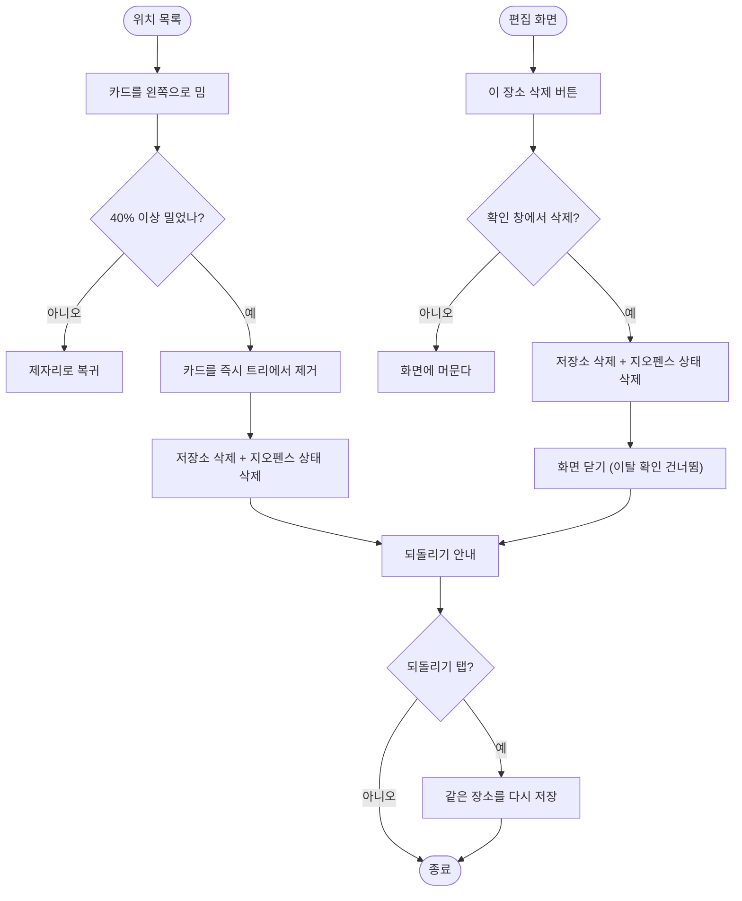

# 위치 삭제 방식 새 디자인 요청 (스와이프·버튼 등 시안)

## 개요

위치 삭제 수단이 카드 **길게 누르기 하나뿐**이라 눈에 보이는 단서가 없고 움직임도 투박했다. 디자인 요청서로 5개 안(A~E)을 비교한 뒤 추천안(B + E)으로 확정하고 구현했다. 카드를 왼쪽으로 밀어 지우고, 편집 화면 맨 아래에도 삭제 버튼을 둔다. 길게 누르기는 없앴다.

## 기능 흐름

## 변경 사항

### 카드 (스와이프 삭제)
- `lib/features/places/presentation/place_card.dart`: 길게 누르기 제거. `_SwipeToDelete`(`Dismissible` 한 방향) 추가. 미는 정도에 따라 배경이 `0.14 → 0.64` 농도로 진해지고 아이콘이 커진다. 삭제 후 안내를 `showPlaceDeletedSnack` 로 분리.

### 편집 화면 (명시적 삭제)
- `lib/features/places/presentation/place_form_screen.dart`: 편집 중일 때만 저장 버튼 아래에 `이 장소 삭제` 버튼. 누르면 확인 창, 확인하면 삭제 후 `onDeleted` 호출.
- `lib/app/router.dart`: `onDeleted` 를 `_leaveForm` 에 연결 (`onSaved` 와 같은 방식).

### 색·문구·문서
- `lib/core/theme/app_colors.dart`: 삭제 전용 `AppColors.danger` 추가 (잠정값).
- `lib/core/l10n/arb/app_{ko,en,ja,zh}.arb` + 생성 파일: 문구 5개를 4개 언어로 추가.
- `docs/10-DECISIONS.md` 결정 049, `docs/06-UX.md` 한 문단.

### 테스트
- `test/features/places/place_card_test.dart`: 길게 누르기 테스트를 스와이프 5건으로 교체.
- `test/features/places/place_form_delete_test.dart` (신규): 편집 화면 삭제 6건.

## 주요 구현 내용

**스와이프는 확인 없이 지우고, 편집 화면 버튼은 확인을 받는다.** 삭제 직후 "되돌리기"가 이미 있어 스와이프의 실수는 복구된다. 지울 때마다 묻는 것은 부드러움을 해친다. 반면 편집 화면은 수정 중인 폼과 같은 자리라 오탭하기 쉽고, 지운 뒤 화면이 닫혀 맥락이 사라지므로 한 번 묻는다.

**놓은 즉시 카드를 트리에서 뺀다.** `Dismissible` 은 `onDismissed` 뒤 같은 프레임에 트리에서 빠져야 한다. 저장소 삭제 후 목록 스트림이 다시 흘러오기를 기다리면 "dismissed widget is still part of the tree" 로 죽는다. 그래서 카드가 스스로 접는다.

**폼이 닫혀도 되돌리기 안내가 뜬다.** 편집 화면에서 지우면 화면이 먼저 닫혀 `BuildContext` 를 쓸 수 없다. 닫기 전에 `ScaffoldMessenger` 를 잡아 `showPlaceDeletedSnack` 로 넘긴다. 앱 최상단 messenger 는 화면이 닫혀도 남아 안내가 이전 화면 위에 뜬다.

**스와이프를 못 하는 사용자를 위해 접근성 액션을 연다.** `Semantics(container: true, customSemanticsActions)`. `container: true` 가 없으면 액션이 부모 노드로 합쳐져 카드 한 장이 아니라 화면 전체의 동작이 된다. 테스트로 확인했다.

## 검증

| 항목 | 결과 |
|---|---|
| `flutter analyze` | 이슈 0건 |
| 전체 테스트 | 645건 통과 (신규·교체 12건 포함) |
| `design_system_test` | 첫 실행에서 위반 2건을 잡았다. 수정 후 통과 |

`design_system_test` 가 잡은 것: ① 한 화면에 `FilledButton` 이 둘이면 위계가 갈린다 → 삭제 버튼을 `TextButton` 으로, ② 아이콘은 `_outlined` 변형만 쓴다 → `delete_outlined` 로.

## 주의사항

- **실기기 미검증.** 위젯 테스트로는 확인할 수 없는 것이 두 가지 남았다. ① 카드 안 `Switch` 의 가로 드래그와 스와이프가 겹치지 않는지, ② 지도 홈 시트(세로 드래그)와 충돌하지 않는지. 시트 안 목록에서 `Switch` 위에서 밀기 시작했을 때를 특히 본다.
- **`AppColors.danger` 는 잠정값이다.** 주색 2개에서 파생한다는 규칙의 유일한 예외이며, 삭제 동작에만 쓴다. 디자이너 확정은 이슈 #205 의 질문으로 올려 두었다. 시안이 나오면 색과 모션은 바뀔 수 있다.
- **알림음 시트·진단 화면의 삭제는 그대로 두었다.** 되돌릴 수 없는 삭제(음원 파일, 진단 기록)라 확인 창이 맞다. 앱 전체의 삭제 스타일 통일은 시안을 받은 뒤 한다.
- **시안 PNG 의 위치.** 요청서 보드는 `docs/projectops/design-brief/` 아래에 있고 추적 대상에서 제외되어 있다.
